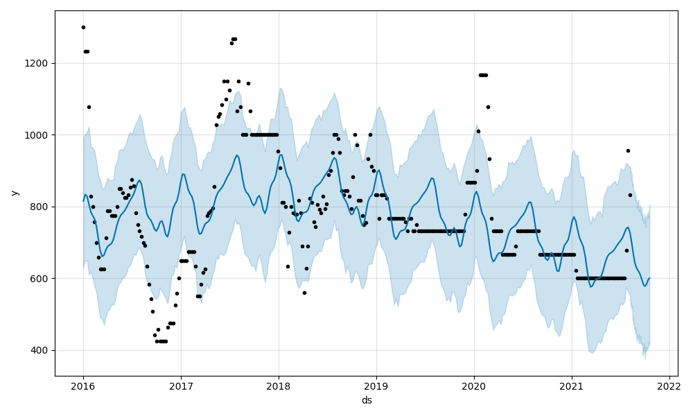
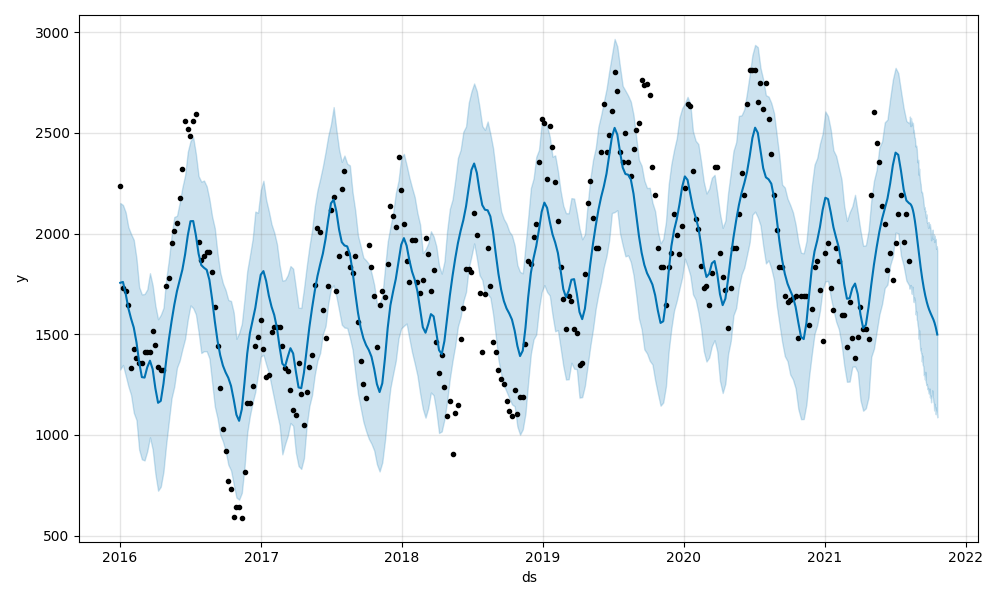
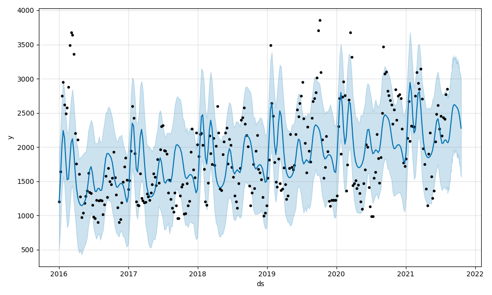
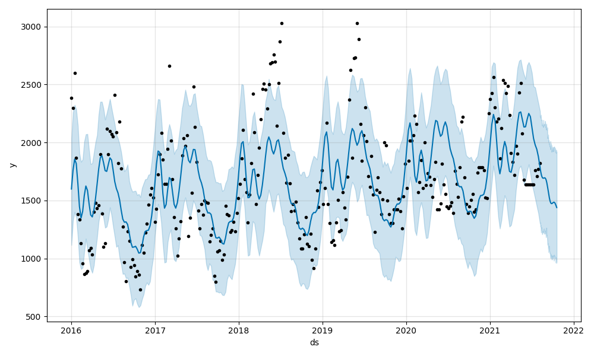
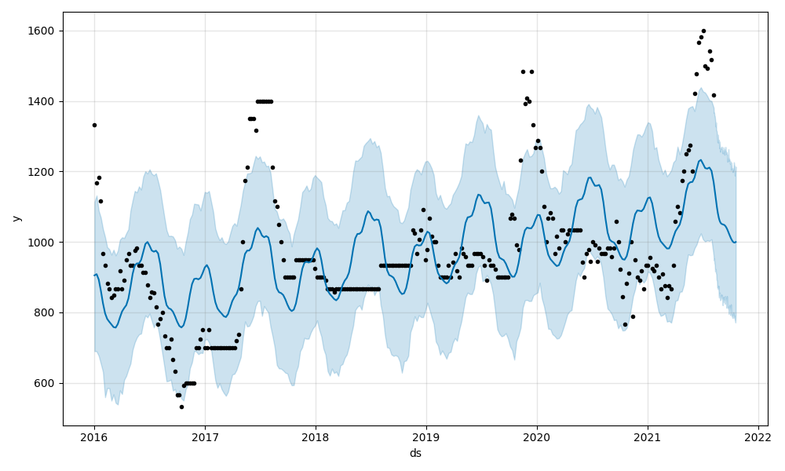
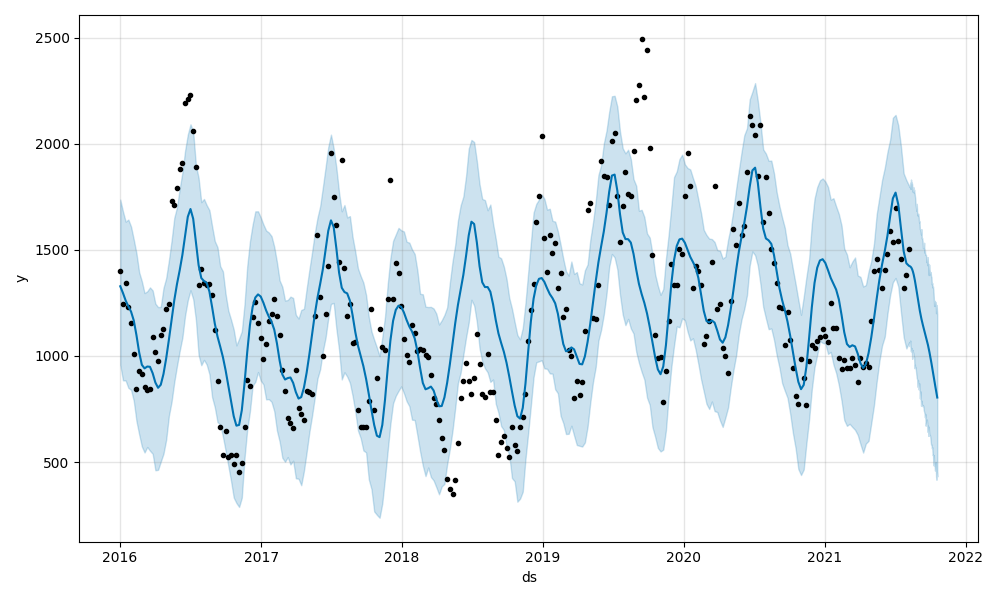
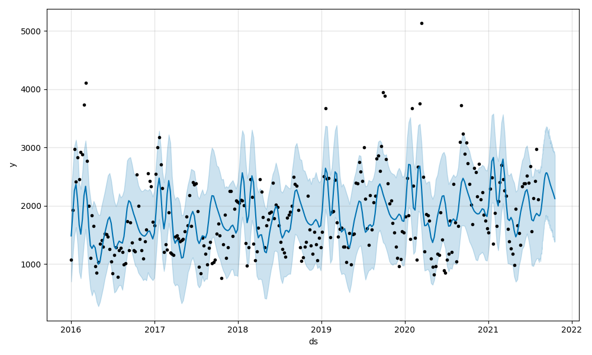
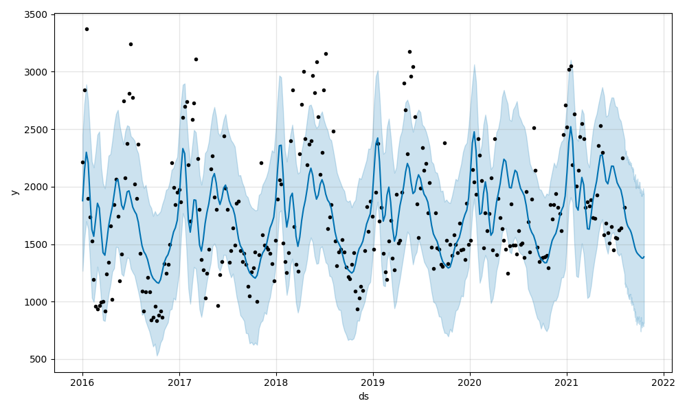
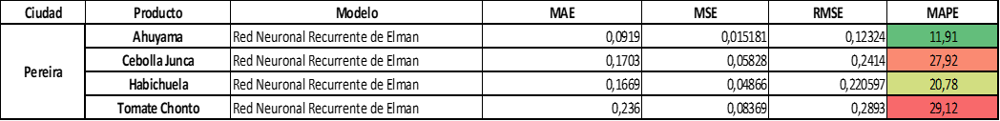

# Modelación para el pronóstico de las series de tiempo

En esta sección se explorarán diferentes modelos para plantear el pronóstico de las series de tiempo de los alimentos escogidos, cada uno de los modelos implementados tendrá un subtitulo correspondiente y al final del capitulo se resumiran los resultados de los modelos implementados de manera consolidada con el fin de determinar cual resulta ser el modelo que presenta un mejor nivel de ajuste.

## Definición de funciones base para la fase de modelación

Esta sección tiene la finalidad de definir funciones con el objetivo de simplificar la fase de modelación, en esta sección se calculan elementos como la estacionalidad, y se crean funciones que calculan métricas y gráficas de forma automática para las variantes de suavizamiento exponencial, ARIMA, y Prophet.

Adicionalmente se aclara que no se generan funciones para regresiones con especificación de errores ARIMA teniendo en cuenta que para los pronósticos aplicados no se esta considerando el uso de variables exógenas y por ende no se esta buscando conocer el grado de influencia o impacto sobre el precio futuro, seguidamente las propiedades de estacionalidad y estacionariedad de las series exceden este tipo de modelo teniendo en cuenta que para todos los casos el nivel de integración es mayor que 0 y además se aprecian patrones de estacionalidad compuesta, en este orden de ideas las exigencias de estacionariedad de todas las variables de la regresión con errores ARIMA implica múltiples transformacion que complejizan la interpretabbilidad y traslado a un pronóstico basado en la escala o medida de las variables reales de precio.

Finalmente, lo relacionado a modelos de Redes Neuronales Recurrentes (RNN) se llevan a cabo usando R pero se abordan directamente en la respectiva sección dedicada a estos modelos, por ende las funciones para la aplicación de estos modelos no es incluida en esta sección.

### Función para separación de la serie en conjunto de test y entrenamiento

```{python}

import pandas as pd
from matplotlib import pyplot as plt
import plotly.graph_objects as go
import pmdarima
from pmdarima.arima import auto_arima
from statsmodels.tsa.holtwinters import SimpleExpSmoothing, Holt, ExponentialSmoothing
import prophet
from prophet import Prophet


def train_test_ts(serie,prop_test):
    train= serie.iloc[:-int(len(serie)*prop_test)]
    test= serie.iloc[-int(len(serie)*prop_test):]
    return train, test
  
  
```

### Funciones para aplicación de modelos de suavizamiento exponencial, generación de métricas y gráfica comparativa con plotly

```{python}


def plot_fcast(series,
               alimento,
               prop_test,
               fcast1:list[float],
               fcast2:list[float],
               fcast3:list[float],
               title:str
               ):
      serie_train,serie_test= train_test_ts(series[alimento],prop_test)
      
      fig=go.Figure()
      fig.add_trace(go.Scatter(x=serie_train.index,y=serie_train,name="Train"))
      fig.add_trace(go.Scatter(x=serie_test.index,y=serie_test,name="Test"))
      fig.add_trace(go.Scatter(x=serie_test.index,y=fcast1,name="Simple"))
      fig.add_trace(go.Scatter(x=serie_test.index,y=fcast2,name="Holt's Linear"))
      fig.add_trace(go.Scatter(x=serie_test.index,y=fcast3,name="Holt Winter's"))
      fig.update_layout(template="simple_white", font=dict(size=12), title_text=title,
                      width=800, title_x=0.5, height=650, xaxis_title='Fecha',
                      yaxis_title='Precio (Pesos Colombianos)')
      
      return fig.show()


def expon_smooth_mod(serie,alimento,prop_test):
  
    serie_train,serie_test= train_test_ts(serie[alimento],prop_test)
  
    simple_exp= SimpleExpSmoothing(serie_train).fit(optimized=True)
    forecast_simple= simple_exp.forecast(len(serie_test))
    MAE1= np.mean(np.abs(serie_test-forecast_simple))
    MSE1= np.mean(np.square(serie_test-forecast_simple))
    RMSE1= np.sqrt(np.mean(np.square(serie_test-forecast_simple)))
    MAPE1= np.mean(np.abs((serie_test-forecast_simple)/serie_test)*100)
  
    double_exp= Holt(serie_train,damped_trend=True).fit(optimized=True)
    forecast_holt= double_exp.forecast(len(serie_test))
    MAE2= np.mean(np.abs(serie_test-forecast_holt))
    MSE2= np.mean(np.square(serie_test-forecast_holt))
    RMSE2= np.sqrt(np.mean(np.square(serie_test-forecast_holt)))
    MAPE2= np.mean(np.abs((serie_test-forecast_holt)/serie_test)*100)
  
    hw_exp= ExponentialSmoothing(serie_train,trend="add",seasonal="add",seasonal_periods=52,damped_trend=True).fit(optimized=True)
    forecast_hw= hw_exp.forecast(len(serie_test))
    MAE3= np.mean(np.abs(serie_test-forecast_hw))
    MSE3= np.mean(np.square(serie_test-forecast_hw))
    RMSE3= np.sqrt(np.mean(np.square(serie_test-forecast_hw)))
    MAPE3= np.mean(np.abs((serie_test-forecast_hw)/serie_test)*100)
  
    results_dict= {"Modelo":["Suavizamiento simple","Suavizamiento de Holt","Holt-Winters"],
                 "MAE":[MAE1,MAE2,MAE3],
                 "MSE":[MSE1,MSE2,MSE3],
                 "RMSE":[RMSE1,RMSE2,RMSE3],
                 "MAPE":[MAPE1,MAPE2,MAPE3]} 
                 
    results_df= pd.DataFrame.from_dict(results_dict,orient="columns")
  
    return results_df,forecast_simple,forecast_holt,forecast_hw


```

### Funciones para aplicación de modelo ARIMA, generación de métricas y gráfica comparativa con plotly

```{python}

def plot_fcas_arimat(series,
               alimento,
               prop_test,
               fcast1:list[float],
               conf_inttbl,
               title:str):
                 
      serie_train,serie_test= train_test_ts(series[alimento],prop_test)
      upper= conf_inttbl["Lower"]
      lower= conf_inttbl["Upper"]
      
      fig=go.Figure()
      fig.add_trace(go.Scatter(x=serie_train.index,y=serie_train,name="Train"))
      fig.add_trace(go.Scatter(x=serie_test.index,y=serie_test,name="Test"))
      fig.add_trace(go.Scatter(x=serie_test.index,y=upper,name="Limite superior cofint 95%",mode="lines",marker=dict(color="#444"),showlegend=False))
      fig.add_trace(go.Scatter(x=serie_test.index,y=lower,name="Limite inferior cofint 95%",mode="lines",fillcolor="rgba(68, 68, 68,           0.3)",fill='tonexty',marker=dict(color="#444"),showlegend=False))
      fig.add_trace(go.Scatter(x=serie_test.index,y=fcast1,name="Gráfica pronóstico modelo "+title))
      fig.update_layout(template="simple_white", font=dict(size=12), title_text=title,
                      width=800, title_x=0.5, height=650, xaxis_title='Fecha',
                      yaxis_title='Precio (Pesos Colombianos)')
      
      return fig.show()


def perf_auto_arima(serie,alimento,prop_test,fits):
  
    serie_train,serie_test= train_test_ts(serie[alimento].dropna(),prop_test)
  
  #mod_aut_arima= auto_arima(serie_train,start_p=0,d=None,start_q=0,test="kpss",
                 #max_p=5, max_d=2, max_q=5, start_P=0,D=None,start_Q=0,
                 #max_P=5,max_D=5,max_Q=5,m=52,seasonal=True,trace=True,supress_warnings=True,stepwise=True
                 #,n_fits=fits,information_criterion="aic",maxiter=500)
                 
    mod_aut_arima= auto_arima(serie_train,test="kpss",seasonal_test='ocsb',seasonal=True,m=52,
                            error_action='ignore',supress_warnings=True,stepwise=True,trace=True,maxiter=50,n_fits=10,method="nm",n_jobs=1,information_criterion="bic").fit(serie_train)
                            
                 
    arima_forecast,conf_int= mod_aut_arima.predict(n_periods=len(serie_test),return_conf_int=True,alpha=0.05)
    resume= mod_aut_arima.summary()
    opt_mod_name= resume.tables[0][1][1].data
    conf_int_tbl= pd.DataFrame(conf_int,columns=["Lower","Upper"],index=serie_test.index)
  
    MAE1= np.mean(np.abs(serie_test-arima_forecast))
    MSE1= np.mean(np.square(serie_test-arima_forecast))
    RMSE1= np.sqrt(np.mean(np.square(serie_test-arima_forecast)))
    MAPE1= np.mean(np.abs((serie_test-arima_forecast)/serie_test)*100)
  
    results_dict= {"Modelo":[opt_mod_name],
                 "MAE":[MAE1],
                 "MSE":[MSE1],
                 "RMSE":[RMSE1],
                 "MAPE":[MAPE1]}
                 
    results_df= pd.DataFrame.from_dict(results_dict,orient="columns")
    
    diagnosis=  mod_aut_arima.plot_diagnostics(figsize=(16, 8))
  
    return results_df,resume,arima_forecast,conf_int_tbl,opt_mod_name,diagnosis
  

```

### Funciones para aplicación de modelo Prophet

```{python}

def perf_prophet(serie,alimento,prop_test):

  prep_df= serie[[alimento]].reset_index().rename(columns={"Periodo":"ds",alimento:"y"})


  serie_train,serie_test= train_test_ts(prep_df,prop_test)

  print(serie_train)

  mod_prophet= Prophet()
  fit_prophet = mod_prophet.fit(serie_train)
  future= fit_prophet.make_future_dataframe(periods=len(serie_test))
  forecast_prophet= fit_prophet.predict(future)
  forecast_plot= fit_prophet.plot(forecast_prophet)

  MAE1= np.mean(np.abs(serie_test["y"]-forecast_prophet["yhat"]))
  MSE1= np.mean(np.square(serie_test["y"]-forecast_prophet["yhat"]))
  RMSE1= np.sqrt(np.mean(np.square(serie_test["y"]-forecast_prophet["yhat"])))
  MAPE1= np.mean(np.abs((serie_test["y"]-forecast_prophet["yhat"])/forecast_prophet["yhat"])*100)

  results_dict= {"Modelo":"Prophet",
                 "MAE":[MAE1],
                 "MSE":[MSE1],
                 "RMSE":[RMSE1],
                 "MAPE":[MAPE1]}

  results_df= pd.DataFrame.from_dict(results_dict,orient="columns")


  return fit_prophet,forecast_prophet,forecast_plot,results_df
  


```

## Modelos de suavizamiento Exponencial (Simple,Doble y Triple)

Por medio de las funciones diseñadas en la sección anterior se procede a aplicar las tre variantes de suavizamiento exponencial que corresponde a suavizamiento simple, suavizamiento de Holt y suavizamiento de Holt Winters, para cada caso se genera de manera directa la grafica de evaluación del modelo en donde se revisa el resultado del pronóstico respecto al valor presentado en el conjunto de datos de test, a partir de esto finalmente se calculan las métricas MAE, MSE, RMSE y MAPE con el fin de conocer el desempeño de cada uno de los modelos privados, para cada caso el análisis se realizará en contraste a las capacidades de cada uno de los modelos aplicados.

### Pronóstico serie de tiempo de la Ahuyama (Ciudad de Armenia)

```{python}

fr_ahuy_axm= expon_smooth_mod(series_armenia,"Ahuyama_axm_merc",0.2)

plot_fcast(series_armenia,"Ahuyama_axm_merc",0.20,fr_ahuy_axm[1],fr_ahuy_axm[2],fr_ahuy_axm[3],"Pronóstico precio Ahuyama axm (métodos de suavizamiento)")

```

Al observar el compartamiento de las tres técnicas de suavizamiento para el último 20% de información de la serie de tiempo se puede apreciar que el suavizamiento simple en este caso se comporta como una media que resulta bastante desfasada respecto al comportamiento real que toma la serie en el futuro, mientras este modelo considera un precio futuro de 833.608 pesos, la serie real toma en los periodos siguientes valores que inclusive superan los 1000 pesos; el segundo modelo correspondiente a un suavizamiento de Holt acierta al pronósticar una tendencia creciente y presenta una buena aproximación hasta mayo de 2022, no obstante al describir una tendencia lineal constante se puede apreciar que la pendiente modelada excede por mucho los valores reales del precio del producto; finalmente el suavizamiento tipo Holt-Winters toma un comportamiento tendencial y estacional coherente con la dinámica de la serie lo cual lleva a que este en general por debajo de los precios reales pero con un buen nivel de acercamiento a los mismos, en sintesis, al revisar el comportamiento de los tres modelos de suavizamiento sobre esta serie es posible apreciar que el modelo que mejor predice el comportamiento de la serie es el suavizamiento exponencial tripe (o Holt Winters)

Al comparar el desempeño de los modelos se tiene lo siguiente a nivel de indicadores:

```{python}

fr_ahuy_axm[0]

```

Las métricas generadas son consistentes con lo mencionado anteriormente, los modelos que mejor ajuste presentan corresponden al suavizamiento exponencial doble y triple, no obstante, al tomar como referencia métricas como el MAPE se puede apreciar que la desviación promedio respecto al precio resulta ser la menor aun asi presentando algunas desviaciones mayores en las demás métricas de error, en términos prácticos el suavizamiento triple resulta ser el modelo más funcional en especial porque captura de manera más conservadora la tendencia y además tambien captura los periodos de ascenso y descenso del precio, asi las cosas, aunque el suavizamiento de Holt presenta MAE,MSE y RMSE más bajos se espera que termine sobre-estimando la dinámica de precios en especial por su tendencia a considerar una linea de tendencia.

### Pronóstico serie de tiempo de la Cebolla Junca (Ciudad de Armenia)

```{python}

fr_cebollj_axm= expon_smooth_mod(series_armenia,"Cebolla junca_axm_merc",0.2)

plot_fcast(series_armenia,"Cebolla junca_axm_merc",0.20,fr_cebollj_axm[1],fr_cebollj_axm[2],fr_cebollj_axm[3],"Pronóstico precio cebolla junca axm (métodos de suavizamiento)")


```

La revisión gráfica del resultado de pronóstico sobre el conjunto de test permite apreciar que el suavizamiento exponencial simple maneja una media equivalente a 1866.47 que no presenta variaciones en el tiempo y que tiene realmente poca capacidad para capturar los movimientos dentro del periodo comprendido entre Agosto de 2021 y Dicembre de 2022; en lo que respecta al suavizamiento exponencial doble se puede apreciar que el modelo toma como refefencia una tendencia bajista no lineal que inclusive tiende a los minimos históricos presentados por el precio finales de 2016, sin embargo tal trayectoria es erronea y se aleja de manera considerable de los valores reales que toma el precio para el periodo de análisis, en consecuencia el suavizamiento exponencial doble no cumple con la necesidad de pronóstico, finalmente el suavizamiento exponencial triple presenta una dinámica un tanto más acertada capturando la estacionalidad y la estructura del movimiento, sin embargo tal dinámica se proyecta en un umbral decreciente muy por debajo, de hecho en los momentos minímos del precio pronosticado se llega a 1090 pesos mientras el precio real se encuentra en 1643 (niveles por encima de 1500), dadas las particularidades de cada pronóstico realmente a pesar de su simpleza el suavizamiento exponencial simple presenta el mejor desemepeño de las técnicas utilizadas teniendo en cuenta que para el periodo comprendido por el conjunto de test la tednencia del precio resulta ser lateral.

Al comparar el desempeño de los modelos se tiene lo siguiente a nivel de indicadores:

```{python}

fr_cebollj_axm[0]

```

Como se expresoón con anterioridad a pesar de que el suavizamiento se esta comportando practicamente como un valor medio, termina siendo mucho más efectivo en términos de error respecto a los otros dos modelos que acentuan la dinámica bajista del precio lo cual lleva a que el error final se maximice aun cuando elementos como la estacionalidad y la estructura del movimiento son captadas con mayor precisión.

### Pronóstico serie de tiempo de la Habichuela (Ciudad de Armenia)

```{python}

fr_habich_axm= expon_smooth_mod(series_armenia,"Habichuela_axm_merc",0.2)

plot_fcast(series_armenia,"Habichuela_axm_merc",0.20,fr_habich_axm[1],fr_habich_axm[2],fr_habich_axm[3],"Pronóstico precio habichuela axm (métodos de suavizamiento)")


```

Como primer elemento a resaltar el precio de la habichuela para el periodo de revisión presenta un comportamiento alcista que lleva inclusive el precio por encima de los 5000 pesos hacia Enero de 2022, y que mantiene a partir de Septiembre de 2021 el precio por encima de los 2000 pesos. Para este caso el suavizamiento exponencial simple que se presenta como un valor medio constante tiene muy proca precisión dado que la desviación del precio presenta una clara tendencia y tambien tiene un caracter de alzas explosivas hacia Enero y Marzo de 2022 lo cual amplifica el grado de error de este método; por otro lado, el suavizamiento doble demarcar una linea de tendencia creciente que resulta funcional para capturar algunos picos de precio pero que pierde efectividad en el tiempo dado que despues de Marzo de 2022 el precio del alimento entra en un periodo de corrección en donde toma un movimiento lateral que se aleja de una dinámica estrictamente creciente como la que demarca el método de Holt. Finalmente el suavizamiento exponencial triple presenta un mejor desempeño ya que captura el movimiento estacional de la serie y tambien incorpora la tendencia pero sin llevar al extremo su pendiente, las pérdidas más considerables de precisión para este método se sufren al principio de periodo en donde hay una baja sustancia el precio antes de iniciar el alza y durante la corrección del precio hacia mayo de 2022 en donde el precio alcanza niveles de 2133 mientras que el pronóstico alcanza los 3985.

En concordancia a lo anterior, al remitirse a la visualización del pronóstico se apreciar que la mayor precisión la logra el suavizamiento triple no obstante no es un modelo que capture totalmente el movimiento sino que su efectividad se ve disminuida dadas las variaciones bruscas que sufre el precio para el periodo del conjunto de test.

Al comparar el desempeño de los modelos se tiene lo siguiente a nivel de indicadores:

```{python}

fr_habich_axm[0]

```

En términos de métricas se puede apreciar que las desviaciones observadas respecto al modelo de suavizamiento triple incrementan el error observado finalmente a nivel de métricas, esto al punto de presentar métricas como el MAPE mayores al suavizamiento simple, particularmente el tramo predicho cuenta con variaciones abruptas del precio y estacionalidad irregular lo que impide un resultado final más precio.

### Pronóstico serie de tiempo del tomate chonto (Ciudad de Armenia)

```{python}

fr_tomate_axm= expon_smooth_mod(series_armenia,"Tomate chonto_axm_merc",0.2)

plot_fcast(series_armenia,"Tomate chonto_axm_merc",0.20,fr_tomate_axm[1],fr_tomate_axm[2],fr_tomate_axm[3],"Pronóstico precio tomate chonto axm (métodos de suavizamiento)")


```

El tomate chonto particularmente presenta una dinámica estacional un tanto más calra durante periodos anuales, sin embargo sufre distorsiones importantes druante 2022, por ejemplo durante Abril de 2022 la serie original presenta un aumento vertiginoso que lleva el precio hasta los 5000 y posteriormente se normaliza; para este caso puntual el suavizamiento simple demarca un punto medio bastante distante de la dinámica real de la serie, al igual que el suavizamiento doble que presenta una dinámica lateral que termina asemejandose a lo proyectado por el suavizamiento simple; finalmente el modelo Holt Winters logra capturar de mejor manera la dinámica de la serie aunque en gran parte un poco por debajo del movimiento real del precio.

Ahora veamos las métricas resultantes de estos modelos:

```{python}

fr_tomate_axm[0]


```

Al observar las métricas resultantes para los modelos se puede apreciar que los menores niveles de error son logrados por el suavizamiento exponencial triple que en términos de MAPE logra evidenciar una desviación promedio del 13,66% respecto a los valores reales lo cual es considerablemente bueno en comparación a los otros dos modelos que presentan desviaciones del 19% promedio.

### Pronóstico serie de tiempo de la Ahuyama (Ciudad de Pereira)

```{python}

fr_ahuy_per= expon_smooth_mod(series_pereira,"Ahuyama_per_merca",0.2)

plot_fcast(series_pereira,"Ahuyama_per_merca",0.20,fr_ahuy_per[1],fr_ahuy_per[2],fr_ahuy_per[3],"Pronóstico precio Ahuyama per (métodos de suavizamiento)")


```

Para el caso del precio de la Ahuyama en la ciudad de Pereira es posible apreciar que al igual que en el caso de Armenia el comportamiento del precio resulta ser mejor descrito por el suavizamiento exponencial triple, en este caso el precio de la Ahuyama tiene una volatilidad un poco menor, por lo tanto el MAPE alcanzado es mucho mejor llegando a un 8% de desviación promedio respecto a los valores reales.

```{python}

fr_ahuy_per[0]

```

### Pronóstico serie de tiempo de la Cebolla Junca (Ciudad de Pereira)

```{python}

fr_ceboll_per= expon_smooth_mod(series_pereira,"Cebolla junca_per_merca",0.2)

plot_fcast(series_pereira,"Cebolla junca_per_merca",0.20,fr_ceboll_per[1],fr_ceboll_per[2],fr_ceboll_per[3],"Pronóstico precio cebolla per (métodos de suavizamiento)")


```

En este caso particular en el plano visual se puede apreciar que el precio real presenta una volatilidad atipica que reduce la precisión final del pronóstico; el lapso entre Mayo y Octubre de 2022 presenta un movimiento alcista inusual que no logra ser capturado de manera totalmente efectiva por ninguno de los tres modelos , el suavizamiento exponencial simple solo captura un valor medio de los movimientos minimos del precio, el suavizamiento doble captura una tendencia bastante conservadora del precio que se ve desbordada por los incrementos abruptos, y finalmente el suavizamiento triple logra capturar la dinámica estacional del precio pero se termina quedando corta o reducida su efectividad frente a los incrementos vertiginosos que presenta el precio real.

En términos de métricas se tiene lo siguiente:

```{python}

fr_ceboll_per[0]


```

En este caso la demarcación acertada del suavizamiento exponencial triple presenta el valor final con mejor ajuste en lo que respecta a variaciones relativas sin embargo la desviación promedio resulta ser de 21% respecto al valor real.

### Pronóstico serie de tiempo de la Habichuela (Ciudad de Pereira)

```{python}

fr_habich_per= expon_smooth_mod(series_pereira,"Habichuela_per_merca",0.2)

plot_fcast(series_pereira,"Habichuela_per_merca",0.20,fr_habich_per[1],fr_habich_per[2],fr_habich_per[3],"Pronóstico precio habichuela per (métodos de suavizamiento)")


```

Para el caso de Pereira al igual que para el caso de Armenia la habichuela se presenta como un producto de alta volatilidad que no presenta una estacionalidad clara, sino que por el contrario presenta atributos compuestos que no son facilmente capturarables, es preciso recordar que para este caso puntual la serie mostro propiedades de nivel de integración 2, por ende es una serie con una estructura compleja, lo cual puede evidenciarse en el resultado de las trés técnicas de suavizamiento exponencial en donde se evidencia con claridad que ninguna logra una precisión alta sino que por el contrario se evidencian amplias desviaciones respecto a los precios reales, asi mismo, al suavizamiento triple no logra capturar una estacionalidad consistente y tampoco toma un componente tendencial que mejor el ajuste.

Veamos las métricas resultantes de los modelos:

```{python}

fr_habich_per[0]

```

En general se puede apreciar que las métricas de error MAE, MSE y RMSE son elevadas para todos los casos, y en lo que respecta al MAPE se puede apreciar que todos los modelos presentan una desviación promedio respecto al precio real superior al 30%, en este caso el modelo con menor MAPE es el suavizamiento exponencial triple.

### Pronóstico serie de tiempo del tomate chonto (Ciudad de Pereira)

```{python}

fr_tomat_per= expon_smooth_mod(series_pereira,"Tomate chonto_per_merca",0.2)

plot_fcast(series_pereira,"Tomate chonto_per_merca",0.20,fr_tomat_per[1],fr_tomat_per[2],fr_tomat_per[3],"Pronóstico precio tomate per (métodos de suavizamiento)")

```

Al igual que en el caso de Armenia, el tomate chonto en la ciudad de Pereira presenta una dinámica estacional más clara, bajo esta premisa, teniendo en cuenta que en general el movimiento del precio es lateral, se presenta que los valores del suavizamiento doble y triple se terminan visualizando como valores medios que al no capturar la dinámica estacional pierde considerablemente la efectividad, por ende el suavizamiento triple evidencia una dinámica mucho más acorde a la dinámica estacional dando como resultado un pronóstico que se encuentra por debajo de los precios reales pero que logra un simil bastante acertado respecto a periodos "normales" de precio.

Al revisar las métricas se tiene lo siguiente:

```{python}

fr_tomat_per[0]

```

Se puede apreciar que como se mencionaba con anterioridad el suavizamiento triple logra los mejores resultados presentando desviaciones por debajo del 20% lo cual es consistente ante la capacidad del modelo de tomar la dinámica estacional de la serie lo cual reduce en general el margen de error respecto a los datos reales.

## Modelo ARIMA

Para la estimación de los modelos ARIMA se hace uso del paquete de Python pmdarima que contiene la funcion auto.arima que esta en capacidad de calcular parámetros optimos para modelos de este tipo. Para este caso particular se abordará el análisis de los modelos de manera general, es decir, se estima el modelo optimo para cada alimento en cada ciudad y se generan pequeñas conclusiones parciales y finalmente una conclusión general por ciudad con el fin de enmarcar el comportamiento de este tipo de modelos respecto a las series de tiempo de alimentos que son objeto de análisis.

### Pronóstico serie de tiempo de la Ahuyama (Ciudad de Armenia)

```{python}

fr_arima_ahuy_axm= perf_auto_arima(series_armenia,"Ahuyama_axm_merc",0.20,50)

fr_arima_ahuy_axm[5]
plt.show()

```

```{python}

plot_fcas_arimat(series_armenia,"Ahuyama_axm_merc",0.20,fr_arima_ahuy_axm[2],fr_arima_ahuy_axm[3],fr_arima_ahuy_axm[4])

```

```{python}

fr_arima_ahuy_axm[0]

```

Se puede apreciar que el modelo óptimo es un SARIMAX (0,1,1) que visualmente se presenta como una linea recta sin pendiente definida esto en términos comparativos demarca un ajuste mucho peor al presentado por el modelo de suavizamiento exponencial simple, en este caso el valor medio resultante esta mucho más abajo que el valor reportado por el suavizamiento exponencial, asi mismo al evaluar el comportamiento de los errores es posible apreciar que violan el supuesto de normalidad al presentar una distribución notablemente leptocurtica, sin embargo en términos de correlograma se aprecia que no hay presencia de autocorrelación. La estimación de este primer modelo permite apreciar que el modelo ARIMA tiene seria dificultades para ajustarse a series con estacionalidad irregular y esto se ve reflejado en un MAPE de 30 que inclusive esta casi 20 puntos porcentuales por encima que el suavizamiento exponencial simple.

### Pronóstico serie de tiempo de la cebolla junca (Ciudad de Armenia)

```{python}

fr_arima_ceboll_axm= perf_auto_arima(series_armenia,"Cebolla junca_axm_merc",0.20,50)

fr_arima_ceboll_axm[5]
plt.show()


```

```{python}

plot_fcas_arimat(series_armenia,"Cebolla junca_axm_merc",0.20,fr_arima_ceboll_axm[2],fr_arima_ceboll_axm[3],fr_arima_ceboll_axm[4])


```

```{python}

fr_arima_ceboll_axm[0]

```

Para el caso de la cebolla junca en general se presenta una serie con unas variaciones un tanto más conservadoras respecto al set de datos de test, en este caso el modelo proyecta un precio de 1865 pesos que de hecho se comporta de manera conveniente como un promedio respecto a los precios reales, en este caso lo único que esta capturando el modelo es el nivel de integración de la serie y esta tomando un valor promedio que en este caso dado que los precios en el horizonte de los precio de test no son tan elevados resulta en un MAPE de 7 que para este caso puntual presenta un comportamiento casi identico con el suavizamiento simple cuya metríca es de 7,06. En lo que respecta al comportamiento de los errores se puede apreciar que no hay presencia de autocorrelación y que los errores se comportan de manera similar a una distribución normal.

### Pronóstico serie de tiempo de la habichuela (Ciudad de Armenia)

```{python}

fr_arima_habich_axm= perf_auto_arima(series_armenia,"Habichuela_axm_merc",0.20,50)

fr_arima_habich_axm[5]
plt.show()


```

```{python}

plot_fcas_arimat(series_armenia,"Habichuela_axm_merc",0.20,fr_arima_habich_axm[2],fr_arima_habich_axm[3],fr_arima_habich_axm[4])


```

```{python}

fr_arima_habich_axm[0]

```

Se puede apreciar que nuavamente se ha tomado como modelo optimo un SARIMAX(0,1,0) nuevamente se encuentra una métrica muy similar al suavizamiento simple, y se aprecia nuevamente la dificultad de este tipo de modelo para trabajar con estacionalidades irregulares, a pesar de que el comportamiento de los errores es consistente, conveniente resaltar que la desviación respecto a los valores reales es elevada, y además los intervalos de confianza son muy amplios.

### Pronóstico serie de tiempo del tomate chonto (Ciudad de Armenia)

```{python}

fr_arima_tomat_axm= perf_auto_arima(series_armenia,"Tomate chonto_axm_merc",0.20,50)

fr_arima_tomat_axm[5]
plt.show()


```

```{python}

plot_fcas_arimat(series_armenia,"Tomate chonto_axm_merc",0.20,fr_arima_tomat_axm[2],fr_arima_tomat_axm[3],fr_arima_tomat_axm[4])


```

```{python}

fr_arima_tomat_axm[0]

```

Para el caso de el tomate chonto el modelo optimo captura más elementos sin embargo estos terminan acotando los intervalos de confianza, pero se continua con un valor de pronóstico puntual que describe un promedio y cuya métrica resulta ser similar al MAPE del suavizamiento exponencial simple.

La revisión de los diferentes modelos para la ciudad de Armenia permiten evidenciar lo siguiente:

-   El modelo ARIMA presenta dificultades para capturar estacionalidad irregular y además su resultado termina asemejandose al suavizamiento exponencial simple teniendo inclusive valores de MAPE similares.\
-   Al momento de la estimación de los modelos el modelo de suavizamiento exponencial triple termina siendo mucho más efectivo en términos de la métrica relativa MAPE.

Para el caso de la ciudad de Pereira se estiman los respectivos modelos y se genera un comentario final, teniendo en cuenta que aunque la ciudad cuenta con dinámicas de precios distintas conserva una dinámica irregular de estacionalidad y cambios bruscos en términos de precio lo cual llevaria a esperar un comportamiento similar al presentado en la ciudad de Armenia.

### Pronóstico serie de tiempo de la Ahuyama (Ciudad de Pereira)

```{python}

fr_arima_ahuy_per= perf_auto_arima(series_pereira,"Ahuyama_per_merca",0.20,50)

fr_arima_ahuy_per[5]
plt.show()


```

```{python}

plot_fcas_arimat(series_pereira,"Ahuyama_per_merca",0.20,fr_arima_ahuy_per[2],
fr_arima_ahuy_per[3],fr_arima_ahuy_per[4])

```

```{python}

fr_arima_ahuy_per[0]

```

### Pronóstico serie de tiempo de la cebolla junca (Ciudad de Pereira)

```{python}

fr_arima_ceboll_per= perf_auto_arima(series_pereira,"Cebolla junca_per_merca",0.20,50)

fr_arima_ceboll_per[5]
plt.show()


```

```{python}

plot_fcas_arimat(series_pereira,"Cebolla junca_per_merca",0.20,fr_arima_ceboll_per[2],
fr_arima_ceboll_per[3],fr_arima_ceboll_per[4])


```

```{python}

fr_arima_ceboll_per[0]

```

### Pronóstico serie de tiempo de la habichuela (Ciudad de Pereira)

```{python}

fr_arima_habich_per= perf_auto_arima(series_pereira,"Habichuela_per_merca",0.20,50)

fr_arima_habich_per[5]
plt.show()


```

```{python}

plot_fcas_arimat(series_pereira,"Habichuela_per_merca",0.20,fr_arima_habich_per[2],
fr_arima_habich_per[3],fr_arima_habich_per[4])


```

```{python}

fr_arima_habich_per[0]

```

### Pronóstico serie de tiempo del tomate chonto (Ciudad de Pereira)

```{python}

fr_arima_tomat_per= perf_auto_arima(series_pereira,"Tomate chonto_per_merca",0.20,50)

fr_arima_tomat_per[5]
plt.show()


```

```{python}


plot_fcas_arimat(series_pereira,"Tomate chonto_per_merca",0.20,fr_arima_tomat_per[2],
fr_arima_tomat_per[3],fr_arima_tomat_per[4])


```

```{python}

fr_arima_tomat_per[0]

```

Para el caso de Pereira es posible apreciar que el comportamiento general de los mdoelos ARIMA no difiere mucho del caso de Armenia, de los modelos estimados dos de ellos son SARIMAX(0,1,0) y solo excepcionalmente para el caso de la habichuela con orden de integración 2 se presenta un modelo SARIMA con componente estacional, finalmente para el caso del tomate se genera un modelo diferente con el orden SARIMAX(1,0,0), de los 4 modelos estimados 3 de ellos tuvieron un compartmiento relativo muy similar al presentado por el suavizamiento exponencial simple, además para el caso de la habichuela el comportamiento ha tenido un margen de error muy por encima al suavizamiento exponencial.

## Modelo Prophet (Facebook)

Para ejecutar el modelo prophet de Facebook se han tenido inconvenientes con la compilación del modelo pystan basado en C++, por lo cual se ha optado por realizar el proceso en google colab con el fin de lograr la estimación efectiva del modelo. El modelo Prophet de Facebook esta en la capacidad de detectar puntos de cambio estructural e inclusive esta en la capacidad de manejar estacionalidades de carácter compuesto, se esperaria que este tipo de modelo presentará un mayor grado de acierto para la estimación de las series que han sido abordadas. Con el fin de enfatizar el desempeño del modelo en cada serie en los elementos subsiguientes se enfatizará en la estimación de prophet y finalmente se relacionará una tabla consolidada con las métricas obtenidas con el fin de analizar el desempeño general del modelo.

### Pronóstico serie de tiempo de la Ahuyama (Ciudad de Armenia)

```{python eval=FALSE, include=FALSE}

fr_ahuy_prohp_axm= perf_prophet(series_armenia,"Ahuyama_axm_merc",0.20)

fr_ahuy_prohp_axm[2]
```



```{python}

dic_output_prophet_ahuyama= {"Modelo":"Prophet",
                 "MAE":[538.732107],
                 "MSE":[315400.926538],
                 "RMSE":[561.605668],
                 "MAPE":[88.072058]}

results_ahuyama= pd.DataFrame.from_dict(dic_output_prophet_ahuyama,orient="columns")

results_ahuyama

```

### Pronóstico serie de tiempo de la Cebolla Junca (Ciudad de Armenia)

```{python eval=FALSE, include=FALSE}

fr_ceboll_prohp_axm= perf_prophet(series_armenia,"Cebolla junca_axm_merc",0.20)
fr_ceboll_prohp_axm[2]

```



```{python}

dic_output_prophet_ceboll= {"Modelo":"Prophet",
                 "MAE":[286.750398],
                 "MSE":[121114.52877],
                 "RMSE":[348.015127],
                 "MAPE":[16.500639]}

results_ceboll= pd.DataFrame.from_dict(dic_output_prophet_ceboll,orient="columns")

results_ceboll

```

### Pronóstico serie de tiempo de la Habichuela (Ciudad de Armenia)

```{python eval=FALSE, include=FALSE}

fr_habich_prohp_axm= perf_prophet(series_armenia,"Habichuela_axm_merc",0.20)
fr_habich_prohp_axm[2]

```



```{python echo=TRUE}

dic_output_prophet_habich= {"Modelo":"Prophet",
                 "MAE":[286.750398],
                 "MSE":[121114.52877],
                 "RMSE":[348.015127],
                 "MAPE":[16.500639]}

results_habich= pd.DataFrame.from_dict(dic_output_prophet_habich,orient="columns")

results_habich

```

### Pronóstico serie de tiempo del tomate chonto (Ciudad de Armenia)

```{python eval=FALSE, include=FALSE}

fr_tomat_prohp_axm= perf_prophet(series_armenia,"Tomate chonto_axm_merc",0.20)

fr_tomat_prohp_axm[2]

```



```{python}

dic_output_prophet_tomat= {"Modelo":"Prophet",
                 "MAE":[711.60695],
                 "MSE":[911478.292051],
                 "RMSE":[954.713723	],
                 "MAPE":[45.735255]}

results_tomat= pd.DataFrame.from_dict(dic_output_prophet_tomat,orient="columns")

results_tomat

```

Al finalizar las estimaciones del modelo para cada una serie los resultados consolidados son los siguientes:


Se puede apreciar que el modelo muestra un mejor desempeño para la serie de tiempo de la cebolla junca en donde el MAPE es de 16,50, el peor desempeño se presenta en la serie de tiempo de la ahuyama en donde la desviación respecto al precio real es del 88,07, en general el comportamiento del modelo no ha sido tan satisfactorio para los casos de la ahuyama, la habichuela y el tomate chonto las desviaciones estan por encima del 30%.

### Pronóstico serie de tiempo de la Ahuyama (Ciudad de Pereira)

```{python eval=FALSE, include=FALSE}

fr_ahuy_prohp_per= perf_prophet(series_pereira,"Ahuyama_per_merca",0.20)

fr_ahuy_prohp_per[2]

```



```{python}

dic_output_prophet_ahuy_per= {"Modelo":"Prophet",
                 "MAE":[307.527883],
                 "MSE":[122881.670276],
                 "RMSE":[350.544819	],
                 "MAPE":[29.782901]}

results_ahuy_per= pd.DataFrame.from_dict(dic_output_prophet_ahuy_per,orient="columns")

results_ahuy_per

```

### Pronóstico serie de tiempo de la Cebolla Junca (Ciudad de Pereira)

```{python eval=FALSE, include=FALSE}

fr_ceboll_prohp_per= perf_prophet(series_pereira,"Cebolla junca_per_merca",0.20)

fr_ceboll_prohp_per[2]

```



```{python}

dic_output_prophet_ceboll_per= {"Modelo":"Prophet",
                 "MAE":[307.527883],
                 "MSE":[122881.670276],
                 "RMSE":[350.544819	],
                 "MAPE":[29.782901]}

results_ceboll_per= pd.DataFrame.from_dict(dic_output_prophet_ceboll_per,orient="columns")

results_ceboll_per
```

### Pronóstico serie de tiempo de la Habichuela (Ciudad de Pereira)

```{python eval=FALSE, include=FALSE}

fr_habich_prohp_per= perf_prophet(series_pereira,"Habichuela_per_merca",0.20)

fr_habich_prohp_per[2]

```



```{python}

dic_output_prophet_habich_per= {"Modelo":"Prophet",
                 "MAE":[1109.12691],
                 "MSE":[1.608060e+06],
                 "RMSE":[1268.092867],
                 "MAPE":[49.357022]}

results_habich_per= pd.DataFrame.from_dict(dic_output_prophet_habich_per,orient="columns")

results_habich_per
```

### Pronóstico serie de tiempo del tomate chonto (Ciudad de Pereira)

```{python eval=FALSE, include=FALSE}

fr_tomat_prohp_per= perf_prophet(series_pereira,"Tomate chonto_per_merca",0.20)
fr_tomat_prohp_per[2]

```



```{python}

dic_output_prophet_tomat_per= {"Modelo":"Prophet",
                 "MAE":[926.268479],
                 "MSE":[1.466837e+06],
                 "RMSE":[1211.130395],
                 "MAPE":[62.819451]}

results_tomat_per= pd.DataFrame.from_dict(dic_output_prophet_tomat_per,orient="columns")

results_tomat_per

```

Al finalizar las estimaciones del modelo para cada una serie los resultados consolidados son los siguientes:


Para el caso de Pereira se puede apreciar que el MAPE para la habichuela y el tomate chonto se encuentran por encima del 40%, asi mismo se aprecia que la ahuyama y la cebolla junca han tenido valores de MAPE iguales pero aun asi elevados.

La revisión del método permite apreciar que realmente el ajuste de este modelo no ha sido tan bueno, por el contrario para el caso de ambas ciudades ha llegado a superar valores de MAPE vistos con anterioridad.

## Modelos RNN - Red Neuronal Recurrente de Elman

Finalmente en esta sección se explora la red neuronal de Elman, en un inicio tambien se validaria la arquitectura de Jordan sin embargo esta ha generado errores de computo que no han permitido desarollar arquitecturas complejas, para el caso de la red de Elman se han considerado los siguientes parametros:

Número de lags -\> 15

Primera capa -\> 25

Segunda capa -\> 10

Learn -\> 0.1

Max iterations -\> 20000

Cada una de las redes ha sido entrenada empleando los mismos parámetros, en esta ocasión se revisa de manera consolidada los resultados de las modelaciones al final de la seccion, para cada red entrenada se muestra la gráfica de error , el contraste entre valor real y predicho , y las métricas.

### Pronóstico serie de tiempo de la Ahuyama (Ciudad de Armenia)

```{r}

library(RSNNS)
library(tibble)
library(lubridate)
library(zoo)
library(quantmod)
library(reticulate)


min_max_norm <- function(x) {
    (x - min(x)) / (max(x) - min(x))
  }


ts_ahuyama_axm <- py$series_armenia["Ahuyama_axm_merc"]
ts_ahuyama_axm <- as.data.frame(lapply(ts_ahuyama_axm,min_max_norm))
ts_ahuyama_xm <- as.ts(ts_ahuyama_axm)
train<- 1:293
y<- as.zoo(ts_ahuyama_xm)
x1<- Lag(y,k=1)
x2<- Lag(y,k=2)
x3<- Lag(y,k=3)
x4<- Lag(y,k=4)
x5<- Lag(y,k=5)
x6<- Lag(y,k=6)
x7<- Lag(y,k=7)
x8<- Lag(y,k=8)
x9<- Lag(y,k=9)
x10<- Lag(y,k=10)
x11<- Lag(y,k=11)
x12<- Lag(y,k=12)
x13<- Lag(y,k=13)
x14<- Lag(y,k=14)
x15<- Lag(y,k=15) 
log_ahuyama_xm <- cbind(y,x1,x2,x3,x4,x5,x6,x7,x8,x9,x10,x11,x12,x13,x14,x15)
log_ahuyama_xm <- log_ahuyama_xm[-(1:15),]
inputs<- log_ahuyama_xm[,2:16]
outputs<- log_ahuyama_xm[,1]

fit_elman_ahuy<- elman(inputs[train],
                       outputs[train],
                       size=c(25,10),
                       learnFuncParams=c(0.1),
                       maxit=20000)


plotIterativeError(fit_elman_ahuy)
```

```{r}

y <- as.vector(outputs[-train])
plot(y,type="l")
axis(side=2, at=seq(0, 1, by=0.1))
pred <- predict(fit_elman_ahuy,inputs[-train])
lines(pred,col="red")

```

```{r}
## metricas

MAE<- mean(abs(y-pred))
MSE <- mean((y-pred)**2)
RMSE<- sqrt(mean((y-pred)**2))
MAPE <- mean(abs(y-pred)/y)*100

print("El MAE del modelo es ")
print(MAE)
print("El MSE del modelo es ")
print(MSE)
print("El RMSE del modelo es ")
print(RMSE)
print("El MAPE del modelo es ")
print(MAPE)


```

### Pronóstico serie de tiempo de la cebolla junca (Ciudad de Armenia)

```{r}

ts_ceboll_axm <- py$series_armenia["Cebolla junca_axm_merc"]
ts_ceboll_axm <- as.data.frame(lapply(ts_ceboll_axm,min_max_norm))
ts_ceboll_xm <- as.ts(ts_ceboll_axm)
train<- 1:293
y2<- as.zoo(ts_ceboll_xm)
x1<- Lag(y2,k=1)
x2<- Lag(y2,k=2)
x3<- Lag(y2,k=3)
x4<- Lag(y2,k=4)
x5<- Lag(y2,k=5)
x6<- Lag(y2,k=6)
x7<- Lag(y2,k=7)
x8<- Lag(y2,k=8)
x9<- Lag(y2,k=9)
x10<- Lag(y2,k=10)
x11<- Lag(y2,k=11)
x12<- Lag(y2,k=12)
x13<- Lag(y2,k=13)
x14<- Lag(y2,k=14)
x15<- Lag(y2,k=15) 
log_ceboll_xm <- cbind(y2,x1,x2,x3,x4,x5,x6,x7,x8,x9,x10,x11,x12,x13,x14,x15)
log_ceboll_xm <- log_ceboll_xm[-(1:15),]
inputs<- log_ceboll_xm[,2:16]
outputs<- log_ceboll_xm[,1]

fit_elman_ceboll<- elman(inputs[train],
                       outputs[train],
                       size=c(25,10),
                       learnFuncParams=c(0.1),
                       maxit=20000)


plotIterativeError(fit_elman_ceboll)

```

```{r}
y2 <- as.vector(outputs[-train])
plot(y2,type="l")
axis(side=2, at=seq(0, 1, by=0.1))
pred <- predict(fit_elman_ceboll,inputs[-train])
lines(pred,col="red")
```

```{r}

## metricas

MAE<- mean(abs(y2-pred))
MSE <- mean((y2-pred)**2)
RMSE<- sqrt(mean((y2-pred)**2))
MAPE <- mean(abs(y2-pred)/y2)*100

print("El MAE del modelo es ")
print(MAE)
print("El MSE del modelo es ")
print(MSE)
print("El RMSE del modelo es ")
print(RMSE)
print("El MAPE del modelo es ")
print(MAPE)

```

### Pronóstico serie de tiempo de la habichuela (Ciudad de Armenia)

```{r}

ts_habich_axm <- py$series_armenia["Habichuela_axm_merc"]
ts_habich_axm <- as.data.frame(lapply(ts_habich_axm,min_max_norm))
ts_habich_xm <- as.ts(ts_habich_axm)
train<- 1:293
y3<- as.zoo(ts_habich_xm)
x1<- Lag(y3,k=1)
x2<- Lag(y3,k=2)
x3<- Lag(y3,k=3)
x4<- Lag(y3,k=4)
x5<- Lag(y3,k=5)
x6<- Lag(y3,k=6)
x7<- Lag(y3,k=7)
x8<- Lag(y3,k=8)
x9<- Lag(y3,k=9)
x10<- Lag(y3,k=10)
x11<- Lag(y3,k=11)
x12<- Lag(y3,k=12)
x13<- Lag(y3,k=13)
x14<- Lag(y3,k=14)
x15<- Lag(y3,k=15) 
log_habich_xm <- cbind(y3,x1,x2,x3,x4,x5,x6,x7,x8,x9,x10,x11,x12,x13,x14,x15)
log_habich_xm <- log_habich_xm[-(1:15),]
inputs<- log_habich_xm[,2:16]
outputs<- log_habich_xm[,1]

fit_elman_habich<- elman(inputs[train],
                       outputs[train],
                       size=c(25,10),
                       learnFuncParams=c(0.1),
                       maxit=20000)


plotIterativeError(fit_elman_habich)


```

```{r}

y3 <- as.vector(outputs[-train])
plot(y3,type="l")
axis(side=2, at=seq(0, 1, by=0.1))
pred <- predict(fit_elman_habich,inputs[-train])
lines(pred,col="red")


```

```{r}

## metricas

MAE<- mean(abs(y3-pred))
MSE <- mean((y3-pred)**2)
RMSE<- sqrt(mean((y3-pred)**2))
MAPE <- mean(abs(y3-pred)/y3)*100

print("El MAE del modelo es ")
print(MAE)
print("El MSE del modelo es ")
print(MSE)
print("El RMSE del modelo es ")
print(RMSE)
print("El MAPE del modelo es ")
print(MAPE)


```

### Pronóstico serie de tiempo del tomate chonto (Armenia)

```{r}


ts_tomat_axm <- py$series_armenia["Tomate chonto_axm_merc"]
ts_tomat_axm <- as.data.frame(lapply(ts_tomat_axm,min_max_norm))
ts_tomat_xm <- as.ts(ts_tomat_axm)
train<- 1:293
y4<- as.zoo(ts_tomat_xm)
x1<- Lag(y4,k=1)
x2<- Lag(y4,k=2)
x3<- Lag(y4,k=3)
x4<- Lag(y4,k=4)
x5<- Lag(y4,k=5)
x6<- Lag(y4,k=6)
x7<- Lag(y4,k=7)
x8<- Lag(y4,k=8)
x9<- Lag(y4,k=9)
x10<- Lag(y4,k=10)
x11<- Lag(y4,k=11)
x12<- Lag(y4,k=12)
x13<- Lag(y4,k=13)
x14<- Lag(y4,k=14)
x15<- Lag(y4,k=15) 
log_tomat_xm <- cbind(y4,x1,x2,x3,x4,x5,x6,x7,x8,x9,x10,x11,x12,x13,x14,x15)
log_tomat_xm <- log_tomat_xm[-(1:15),]
inputs<- log_tomat_xm[,2:16]
outputs<- log_tomat_xm[,1]

fit_elman_tomat<- elman(inputs[train],
                       outputs[train],
                       size=c(25,10),
                       learnFuncParams=c(0.1),
                       maxit=25000)


plotIterativeError(fit_elman_tomat)


```

```{r}

y4 <- as.vector(outputs[-train])
plot(y4,type="l")
axis(side=2, at=seq(0, 1, by=0.1))
pred <- predict(fit_elman_tomat,inputs[-train])
lines(pred,col="red")


```

```{r}
## metricas

MAE<- mean(abs(y4-pred))
MSE <- mean((y4-pred)**2)
RMSE<- sqrt(mean((y4-pred)**2))
MAPE <- mean(abs(y4-pred)/y4)*100

print("El MAE del modelo es ")
print(MAE)
print("El MSE del modelo es ")
print(MSE)
print("El RMSE del modelo es ")
print(RMSE)
print("El MAPE del modelo es ")
print(MAPE)


```

### Pronóstico serie de tiempo de la Ahuyama (Pereira)

```{r}

ts_ahuyama_per <- py$series_pereira["Ahuyama_per_merca"]
ts_ahuyama_per <- as.data.frame(lapply(ts_ahuyama_per,min_max_norm))
ts_ahuyama_per <- as.ts(ts_ahuyama_per)
train<- 1:293
y5<- as.zoo(ts_ahuyama_per)
x1<- Lag(y5,k=1)
x2<- Lag(y5,k=2)
x3<- Lag(y5,k=3)
x4<- Lag(y5,k=4)
x5<- Lag(y5,k=5)
x6<- Lag(y5,k=6)
x7<- Lag(y5,k=7)
x8<- Lag(y5,k=8)
x9<- Lag(y5,k=9)
x10<- Lag(y5,k=10)
x11<- Lag(y5,k=11)
x12<- Lag(y5,k=12)
x13<- Lag(y5,k=13)
x14<- Lag(y5,k=14)
x15<- Lag(y5,k=15) 
log_ahuyama_per <- cbind(y5,x1,x2,x3,x4,x5,x6,x7,x8,x9,x10,x11,x12,x13,x14,x15)
log_ahuyama_per <- log_ahuyama_per[-(1:15),]
inputs<- log_ahuyama_per[,2:16]
outputs<- log_ahuyama_per[,1]

fit_elman_ahuy_per<- elman(inputs[train],
                       outputs[train],
                       size=c(25,10),
                       learnFuncParams=c(0.1),
                       maxit=20000)


plotIterativeError(fit_elman_ahuy_per)


```

```{r}

y5 <- as.vector(outputs[-train])
plot(y5,type="l")
axis(side=2, at=seq(0, 1, by=0.1))
pred <- predict(fit_elman_ahuy_per,inputs[-train])
lines(pred,col="red")


```

```{r}
## metricas

MAE<- mean(abs(y5-pred))
MSE <- mean((y5-pred)**2)
RMSE<- sqrt(mean((y5-pred)**2))
MAPE <- mean(abs(y5-pred)/y5)*100

print("El MAE del modelo es ")
print(MAE)
print("El MSE del modelo es ")
print(MSE)
print("El RMSE del modelo es ")
print(RMSE)
print("El MAPE del modelo es ")
print(MAPE)
```

### Pronóstico serie de tiempo de la cebolla junca (Pereira)

```{r}

ts_ceboll_per <- py$series_pereira["Cebolla junca_per_merca"]
ts_ceboll_per <- as.data.frame(lapply(ts_ceboll_per,min_max_norm))
ts_ceboll_per <- as.ts(ts_ceboll_per)
train<- 1:293
y6<- as.zoo(ts_ceboll_per)
x1<- Lag(y6,k=1)
x2<- Lag(y6,k=2)
x3<- Lag(y6,k=3)
x4<- Lag(y6,k=4)
x5<- Lag(y6,k=5)
x6<- Lag(y6,k=6)
x7<- Lag(y6,k=7)
x8<- Lag(y6,k=8)
x9<- Lag(y6,k=9)
x10<- Lag(y6,k=10)
x11<- Lag(y6,k=11)
x12<- Lag(y6,k=12)
x13<- Lag(y6,k=13)
x14<- Lag(y6,k=14)
x15<- Lag(y6,k=15) 
log_ceboll_per <- cbind(y6,x1,x2,x3,x4,x5,x6,x7,x8,x9,x10,x11,x12,x13,x14,x15)
log_ceboll_per <- log_ceboll_per[-(1:15),]
inputs<- log_ceboll_per[,2:16]
outputs<- log_ceboll_per[,1]

fit_elman_ceboll_per<- elman(inputs[train],
                       outputs[train],
                       size=c(25,10),
                       learnFuncParams=c(0.1),
                       maxit=20000)


plotIterativeError(fit_elman_ceboll_per)


```

```{r}

y6 <- as.vector(outputs[-train])
plot(y6,type="l")
axis(side=2, at=seq(0, 1, by=0.1))
pred <- predict(fit_elman_ceboll_per,inputs[-train])
lines(pred,col="red")

```

```{r}
## metricas

MAE<- mean(abs(y6-pred))
MSE <- mean((y6-pred)**2)
RMSE<- sqrt(mean((y6-pred)**2))
MAPE <- mean(abs(y6-pred)/y6)*100

print("El MAE del modelo es ")
print(MAE)
print("El MSE del modelo es ")
print(MSE)
print("El RMSE del modelo es ")
print(RMSE)
print("El MAPE del modelo es ")
print(MAPE)
```

### Pronóstico serie de tiempo de la habichuela (Pereira)

```{r}
ts_habich_per <- py$series_pereira["Habichuela_per_merca"]
ts_habich_per <- as.data.frame(lapply(ts_habich_per,min_max_norm))
ts_habich_per <- as.ts(ts_habich_per)
train<- 1:293
y7<- as.zoo(ts_ahuyama_xm)
x1<- Lag(y7,k=1)
x2<- Lag(y7,k=2)
x3<- Lag(y7,k=3)
x4<- Lag(y7,k=4)
x5<- Lag(y7,k=5)
x6<- Lag(y7,k=6)
x7<- Lag(y7,k=7)
x8<- Lag(y7,k=8)
x9<- Lag(y7,k=9)
x10<- Lag(y7,k=10)
x11<- Lag(y7,k=11)
x12<- Lag(y7,k=12)
x13<- Lag(y7,k=13)
x14<- Lag(y7,k=14)
x15<- Lag(y7,k=15) 
log_habich_per <- cbind(y7,x1,x2,x3,x4,x5,x6,x7,x8,x9,x10,x11,x12,x13,x14,x15)
log_habich_per <- log_habich_per[-(1:15),]
inputs<- log_habich_per[,2:16]
outputs<- log_habich_per[,1]

fit_elman_habich_per<- elman(inputs[train],
                       outputs[train],
                       size=c(25,10),
                       learnFuncParams=c(0.1),
                       maxit=20000)


plotIterativeError(fit_elman_habich_per)


```

```{r}

y7 <- as.vector(outputs[-train])
plot(y7,type="l")
axis(side=2, at=seq(0, 1, by=0.1))
pred <- predict(fit_elman_habich_per,inputs[-train])
lines(pred,col="red")


```

```{r}


## metricas

MAE<- mean(abs(y7-pred))
MSE <- mean((y7-pred)**2)
RMSE<- sqrt(mean((y7-pred)**2))
MAPE <- mean(abs(y7-pred)/y7)*100

print("El MAE del modelo es ")
print(MAE)
print("El MSE del modelo es ")
print(MSE)
print("El RMSE del modelo es ")
print(RMSE)
print("El MAPE del modelo es ")
print(MAPE)


```

### Pronóstico serie de tiempo del tomate (Pereira)

```{r}

ts_tomat_per <- py$series_pereira["Tomate chonto_per_merca"]
ts_tomat_per <- as.data.frame(lapply(ts_ahuyama_per,min_max_norm))
ts_tomat_per <- as.ts(ts_tomat_per)
train<- 1:293
y8<- as.zoo(ts_ahuyama_xm)
x1<- Lag(y8,k=1)
x2<- Lag(y8,k=2)
x3<- Lag(y8,k=3)
x4<- Lag(y8,k=4)
x5<- Lag(y8,k=5)
x6<- Lag(y8,k=6)
x7<- Lag(y8,k=7)
x8<- Lag(y8,k=8)
x9<- Lag(y8,k=9)
x10<- Lag(y8,k=10)
x11<- Lag(y8,k=11)
x12<- Lag(y8,k=12)
x13<- Lag(y8,k=13)
x14<- Lag(y8,k=14)
x15<- Lag(y8,k=15) 
log_tomat_per <- cbind(y8,x1,x2,x3,x4,x5,x6,x7,x8,x9,x10,x11,x12,x13,x14,x15)
log_tomat_per <- log_tomat_per[-(1:15),]
inputs<- log_tomat_per[,2:16]
outputs<- log_tomat_per[,1]

fit_elman_tomat_per<- elman(inputs[train],
                       outputs[train],
                       size=c(25,10),
                       learnFuncParams=c(0.1),
                       maxit=20000)


plotIterativeError(fit_elman_tomat_per)


```

```{r}

y8 <- as.vector(outputs[-train])
plot(y8,type="l")
axis(side=2, at=seq(0, 1, by=0.1))
pred <- predict(fit_elman_tomat_per,inputs[-train])
lines(pred,col="red")


```

```{r}

## metricas

MAE<- mean(abs(y8-pred))
MSE <- mean((y8-pred)**2)
RMSE<- sqrt(mean((y8-pred)**2))
MAPE <- mean(abs(y8-pred)/y8)*100

print("El MAE del modelo es ")
print(MAE)
print("El MSE del modelo es ")
print(MSE)
print("El RMSE del modelo es ")
print(RMSE)
print("El MAPE del modelo es ")
print(MAPE)


```

El consolidado de resultados es el siguiente:




Se logra apreciar que con los paramétros iniciales para el caso de Armenia el pronóstico con mejor ajuste corresponde a la cebolla junca y para el caso de Pereira corresponde a la Ahuyama , para los demás casos de Armenia el MAPE supera el 45 y para el caso de Pereira en promedio el valor se mantiene pordeabjo de los 30.
