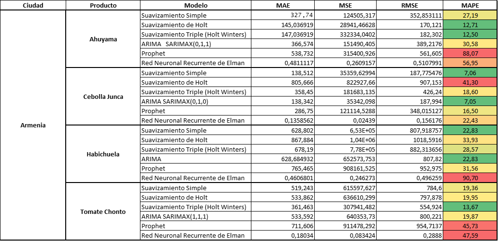

# Comparación de modelos

## Consolidado de métricas para alimentos en Armenia:

El proceso de análisis y modelación permiten evidenciar que para cada alimento en el caso de Armenia el modelo con mejor ajuste para cada alimento es:

-   Ahuyama -\> El modelo con un mejor ajuste es el suavizamiento exponencial triple.

-   Cebolla Junca -\> El modelo con un mejor ajuste es el SARIMAX(0,1,0)

-   Habichuela -\> El modelo con un mejor ajuste es el suavizamiento simple o modelo ARIMA.

-   Tomate Chonto -\> El modelo con un mejor ajuste es el suavizamiento exponencial triple.

## Consolidado de métricas para alimentos en Pereira:

El proceso de análisis y modelación permiten evidenciar que para cada alimento en el caso de Pereira el modelo con mejor ajuste para cada alimento es:

-   Ahuyama -\> El modelo con un mejor ajuste es el suavizamiento exponencial triple.

-   Cebolla Junca -\> El modelo con un mejor ajuste es el suavizamiento exponencial triple.

-   Habichuela -\> El modelo con un mejor ajuste es la red neuronal recurrente de Elman.

-   Tomate Chonto -\> El modelo con un mejor ajuste es el suavizamiento exponencial triple.
