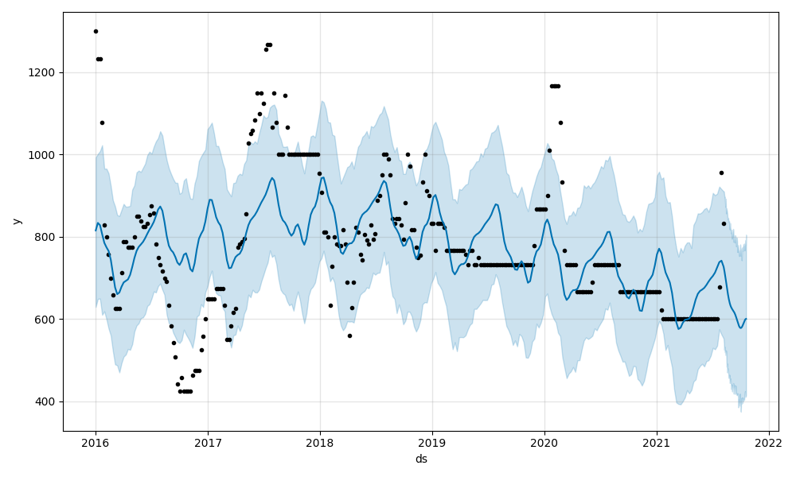
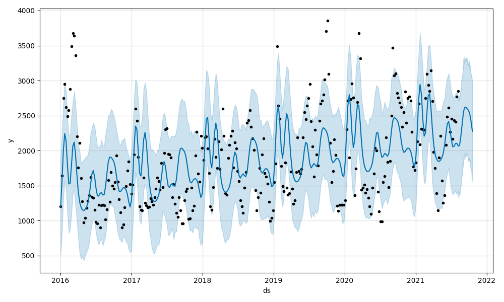
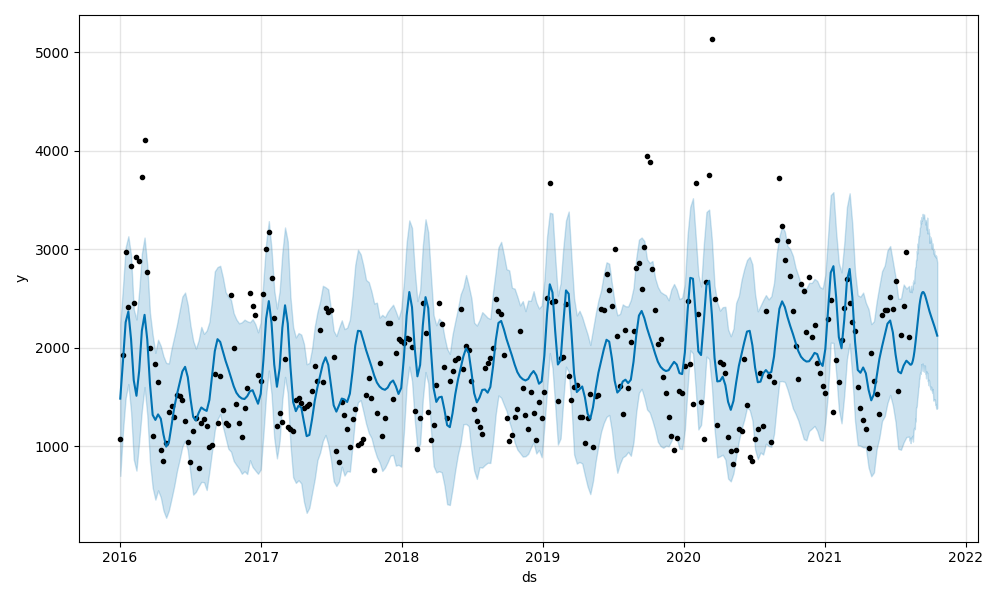
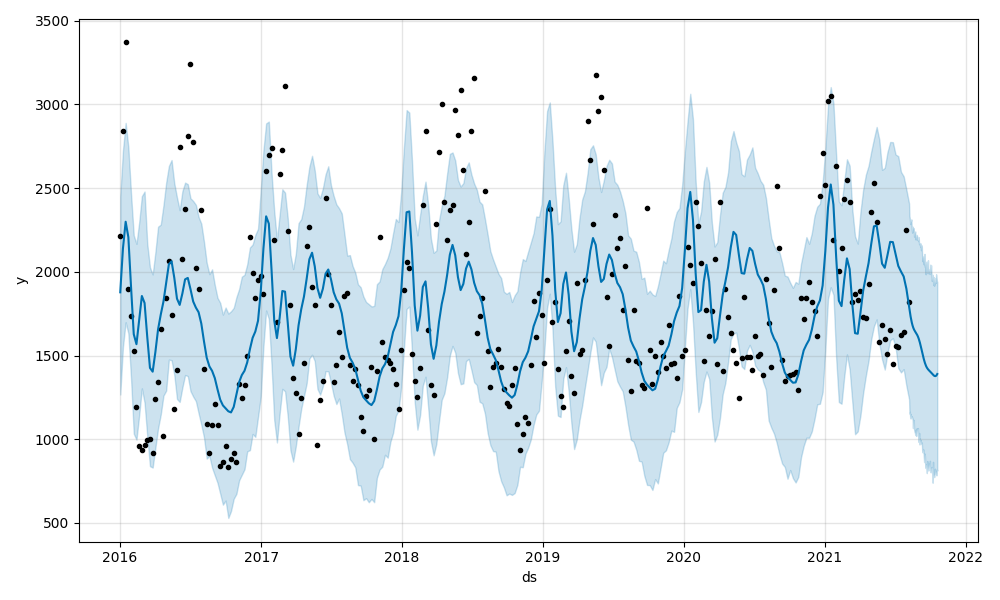

# Justificación y fuentes de información

En la actualidad conocer en detalle la dinámica del precio de los alimentos resulta ser un elemento valioso para la toma de decisiones, tanto a nivel de quienes viven del agro, como para los consumidores finales; si bien los precios mayoristas representan un eslabón de la formación del precio de los alimentos, es preciso resaltar que este valor representa el ultimo tramo de formación antes de la distribución final a nivel minorista, bajo esta lógica la posibilidad de pronosticar los precios mayoristas de los alimentos permite hacer un acercamiento a posibles escenarios de privación alimentaria futura ligada al poder adquisitivo de los hogares, esto teniendo en cuenta que para el caso de alimentos perecederos como las verduras y hortalizas el mecanismo de transmisión del mercado mayorista al mercado minorista resulta ser mucho más acelerada.

En concordancia a lo anterior, en este ejercicio se tomarán las series de tiempo de precios semanales de hortalizas basicas de consumo frecuente para los municipios de Armenia y Pereira:

-   Cebolla Junca
-   Tomate chonto
-   Habichuela
-   Ahuyama

Las series de tiempo en mención serán tomadas de los boletines semanales del SIPSA que emite el Departamento Nacional de Estadística (DANE) comprendiendo el periodo 2016-2022 buscando realizar pronósticos de las 4 semanas siguientes de los productos de referencia. Para relacionar el precio mayorista con el precio minorista se tomara como referencia la Canasta Básica de Salud Ailmentaria (CABASA) a través de la cual se proyectarán por inflación los precios minoristas con el fin de contrastarlos con la dinámica del precio mayorista mostrado por el mercado y por los periodos de pronóstico, asi mismo se proyectará el valor total de la canasta básica estándar por medio de la inflación y se validará como varia la proporción de la participación monetaria de los 4 alimentos con el fin de determinar como se ve impactado el poder adquisitivo en relación a estos alimentos de referencia tomando siempre como base la participación relativa inicial respecto a las participaciones relativas futuras respecto al precio que toman sobre el valor total de la canasta. Al final del ejercicio se podrá evidenciar que tanto ha variado el esfuerzo monetario para preservar estas hortalizas básicas en la canasta y que tanto será el esfuerzo en las semanas pronosticadas.

Conocer las variaciones de la participación monetaria de los alimentos en la canasta básica permite evidenciar que tanto menos dinero disponible tendrá el consumidor luego de comprar una cantidad "n" de un alimento, por lo tanto, si la participación de ciertos alimentos incrementa de forma desmedida la preservación de las cantidades iniciales consumidas supondrá un esfuerzo mayor y una cantidad restante menor para acceder a los demás alimentos que conforman la canasta completa, manteniendo las cantidades consumidas constantes, esto supondrá finalmente una reducción de las cantidades consumidas o inclusive la eliminación o sustitución de algunos alimentos dentro de la dieta.

El ejercicio de pronóstico y análisis propuesto representa un ejercicio por medio del cual es posible acercarse al impacto del aumento de los precios mayoristas en el consumidor final lo cual se relaciona directamente con la seguridad alimentaria ligada al acceso desde una perspectiva monetaria.

Para la ejecución de este ejercicio se llevarán a cabo los siguientes pasos que demarcarán la estructura del documento:

1.  Recolección, carga y transformación de los datos de precios semanales
2.  Análisis exploratorio de las series de tiempo
3.  Modelación para el pronóstico de las series de tiempo
4.  Evaluación y ajuste de hiperparámetros de los modelos
5.  Contraste entre series de tiempo y proyección de precios minoristas
6.  Análisis de la participación conjunta del grupo de 4 hortalizas sobre el valor total de la CABASA
7.  Conclusiones y recomendaciones


<!--chapter:end:index.Rmd-->

# Recolección, carga y transformación de los datos de precios semanales 

Para desarrollar los elementos mencionados en la sección introductoria es relevante tener en cuenta que el SIPSA presenta diferentes tipos de boletín, presenta boletines diarios para un conjunto predefinido de alimentos conformados por frutas, verduras y hortalizas, y seguidamente publica boletines semanales en donde esta presente una variedad mucho más amplia de alimentos, para el caso de este trabajo se hará uso de los boletines generados semanalmente.

Para la recolección de los boletines semanales se llevará a cabo una descarga directa de los boletines desde el portal del SIPSA en donde se encuentran los boletines publicados semanalmente desde 2012 hasta 2023, como se ha mencionado desde un inicio aqui se tomará como referencia el periodo 2016-2023 tomando como corte el mes de Junio del año en curso; el proceso de recolección de la información da como resultado múltiples archivos en formato excel (.xlsx) con diferentes formatos y disposiciones a nivel de la distribución de información, ante lo cual se hace necesario realizar un procesamiento de todos los archivos resultantes de tal manera que se logre una fuente consolidada con la cual sea mucho más sencillo trabajar.  

El análisis detallado de los archivos descargados permite evidenciar que los boletines tienen algunos atributos particulares:

- La estructura de la tabla de los boletines no contiene explicitamente una fecha,el rango de fecha del archivo se encuentra en el nombre del fichero descargado, por ejemplo "Sem_2ene_8ene_2016.xls".

- La estructura de los boletines no es uniforme a través del tiempo, entre 2016 hasta el 11 de Mayo de 2018 la estructura de los boletines resulta ser más simple ya que el archivo no contiene paginación y cuenta con titulos intermedios para separar los grupos de alimentos. Desde el 11 de Mayo la estructura cambia a documentos de excel paginados por tipo de alimento involucrando inclusive hojas adicionales relacionadas a temas de disponibilidad por asuntos de cantidades ofrecidas en la central de abastos. 

- Para lograr un procesamiento eficiente es necesario realizar operaciones en ciclo para los archivos de tal forma que se logre llegar a un set de datos consolidado.

A continuación se muestra un preview del aspecto de los sets de datos resultantes al leer un boletin tipo 1 y tipo 2:

- Ejemplo boletín tipo 1:


```python

import pandas as pd
import numpy as np 
import os 
import openpyxl
import matplotlib.pyplot as plt 
import seaborn as sns

## En este caso vamos a leer un boletin de 2016

archivo = pd.read_excel("C://Users//DAVID//Documents//SeriesDeTiempo_MCD2023//bookdown-seriesdetiempo_mcd//Bookdown_SeriesDeTiempo//Historico_Precios_SIPSA//2016//Sem_2ene_8ene_2016.xls",skiprows=1)

archivo.info()

```

```
## <class 'pandas.core.frame.DataFrame'>
## RangeIndex: 4839 entries, 0 to 4838
## Data columns (total 5 columns):
##  #   Column                Non-Null Count  Dtype 
## ---  ------                --------------  ----- 
##  0   Productos y mercados  4839 non-null   object
##  1   Precio mínimo         4478 non-null   object
##  2   Precio máximo         4478 non-null   object
##  3   Precio medio          4478 non-null   object
##  4   Tendencia             4478 non-null   object
## dtypes: object(5)
## memory usage: 189.1+ KB
```


```python

archivo.head()
```

```
##            Productos y mercados Precio mínimo  ... Precio medio Tendencia
## 0                        Acelga           NaN  ...          NaN       NaN
## 1               Armenia, Mercar          1333  ...         1400         +
## 2  Barranquilla, Barranquillita          2800  ...         3000         =
## 3      Bogotá, D.C., Corabastos           500  ...          780         -
## 4    Bucaramanga, Centroabastos          1000  ...         1000        --
## 
## [5 rows x 5 columns]
```
Como puede observarse esta primera versión de boletión solo cuenta con 5 columnas, particularmente este tipo de boletin mezcla en una misma columna los productos y los mercados, los productos aparecen una vez se han listado todos los mercados en los que están disponibles y se caracterizan por tener valores vacios en todas las columnas cuando su nombre aparece, seguidamente, como se mencionó no hay una fecha explicita por lo tanto es necesario usar la fecha que esta demarcada en el archivo para poder ubicar los datos en el tiempo. 

- Ejemplo boletín tipo 2:

Para la lectura de este boletín es necesario utilizar varios argumentos adicionales de la función pd.read_excel, de hecho para lograr una extracción completa de los datos es necesario llevar a cabo un ciclo for, no obstante en este caso solo veremos de manera general la estructura de una hoja y los argumentos que es necesario introducir: 


```python
archivo2= pd.read_excel("C://Users//DAVID//Documents//SeriesDeTiempo_MCD2023//bookdown-seriesdetiempo_mcd//Bookdown_SeriesDeTiempo//Historico_Precios_SIPSA//2018//Boletin_Tipo2//Sem_01dic__07dic_2018.xlsx",skiprows=9,sheet_name=1).dropna(axis=1,how="all")

archivo2.info()
```

```
## <class 'pandas.core.frame.DataFrame'>
## RangeIndex: 945 entries, 0 to 944
## Data columns (total 6 columns):
##  #   Column             Non-Null Count  Dtype 
## ---  ------             --------------  ----- 
##  0   Producto           945 non-null    object
##  1   Mercado mayorista  945 non-null    object
##  2   Precio mínimo      945 non-null    int64 
##  3   Precio máximo      945 non-null    int64 
##  4   Precio medio       945 non-null    int64 
##  5   Tendencia          945 non-null    object
## dtypes: int64(3), object(3)
## memory usage: 44.4+ KB
```

```python
archivo2.head()
```

```
##   Producto             Mercado mayorista  ...  Precio medio  Tendencia
## 0   Acelga               Armenia, Mercar  ...          1022         --
## 1   Acelga  Barranquilla, Barranquillita  ...          3067          +
## 2   Acelga      Bogotá, D.C., Corabastos  ...           583          +
## 3   Acelga    Bucaramanga, Centroabastos  ...          1125         ++
## 4   Acelga         Chiquinquirá (Boyacá)  ...          1067          =
## 
## [5 rows x 6 columns]
```

Se puede apreciar que a diferencia del boletin 1, este boletín separa el producto del mercado mayorista lo cual lo acerca a la estructura ideal del set de datos, no obstante la complejidad de este conjunto de información es que involucra multiples hojas por cada archivo procesado, y además cada hoja en ocasiones tiene ciertas particularidades. 

Para facilitar el ejercicio, toda la labor de pre-procesamiento y limpieza inicial han sido realizadas previamente, en esta sección se explican las funciones diseñadas para llevar a cabo este proceso, las porciones de codigo aqui mostradas no son ejecutables simplemente son ilustrativas.

Los paquetes utilizados para llevar a cabo el procesamiento de los boletines han sido pandas, numpy y os.

### Funciones para el pre-procesamiento y limpieza de los boletines para el periodo 2016 a 11 de Mayo de 2018

La primera función que se crea se denomina  bolsipsatipo1_proc(ruta)  el argumento de esta función es la ruta en la cual se encuentra el boletin a procesar, a continuación se muestra el codigo de la función:


```python

def bolsipsatipo1_proc(ruta):
    nombre=os.path.split(ruta)[1].replace(".xlsx" or ".xls","")
    boletin= pd.read_excel(ruta,skiprows=1)
    boletin["periodo"]=nombre
    boletin= boletin[(boletin["Productos y mercados"].str.find("Cuadro")==-1)\
                     & (boletin["Productos y mercados"].str.find("Productos")==-1)]
    boletin["Tendencia"]=boletin["Tendencia"].fillna("Producto")
    boletin["Producto"]=np.nan 
    
    producto=None
    
    for index in boletin.index:
        if boletin.loc[index,"Tendencia"]=="Producto":
            producto=boletin.loc[index,"Productos y mercados"]
            boletin.loc[index,"Producto"]= producto
        else:
            boletin.loc[index,"Producto"]= producto
    
    boletin= boletin[(boletin["Tendencia"]!="Producto")] 
    boletin= boletin.rename(columns={"Productos y mercados":"Mercado mayorista"})
    
    return boletin 
```

Esta primera función inicialmente captura el nombre del archivo removiendo la extensión, posteriormente realiza una lectura del archivo que hay en la ruta omitiendo la lectura de la primera fila y adicionalmente crea una columna denominada periodo en donde se coloca el nombre extraido del archivo que esta siendo procesado, seguidamente omite las filas que contengan los strings "Cuadro" y "Producto" creando una columna denominada tendencia en donde copia el contenido de la columna y lo rellena con la palabra "Producto" en los espacios en blanco, finalmente se crea una columna denominada producto con valores "nan" la finalidad de esta columna es lograr separar el nombre del mercado mayorista del producto. 

Para lograr separar el nombre del producto de la columna "Productos y mercados" se recorre el dataset y se pone el nombre del producto cada vez que aparece el nombre "Productos y mercados"  a partir de esto se comienza a poblar la columna producto en donde queda aislado el nombre del producto; finalmente se eliminan las columnas que quedaron con el nombre "Producto"  y se renombra la columna "Productos y mercados" y pasa a llamarse "Mercado mayorista", finalmente la función devuelve un dataframe denominado "boletin".  

Esta primera función representa el procesamiento de una ruta que haga referencia a un archivo, no obstante para lograr un procesamiento en serie es relevante lograr un procesamiento "por carpeta" que permita procesar directamente los archivos por año, para logra esto se crea la función proc_carpetassipsat1(ruta_carpeta) cuyo argumento es la ruta a una carpeta en particular, el código de la función es el siguiente: 


```python

def proc_carpetassipsat1(ruta_carpeta):
    ficheros=os.listdir(ruta_carpeta)
    lista_rutas=[]
    ruta_entera=None
    
    for file in ficheros:
        ruta_entera= ruta_carpeta+"\\"+file
        lista_rutas.append(ruta_entera)
    
    lista_dataframes=[]
    
    for ruta in lista_rutas:
        print(ruta)
        boletin_procesado=bolsipsatipo1_proc(ruta)
        lista_dataframes.append(boletin_procesado)
        boletin_consolidado= pd.concat(lista_dataframes)
        
    return boletin_consolidado

```

La función anterior toma la ruta de una carpeta y partir del paquete "os" genera una lista de los archivos que hay dentro de la misma, asi mismo, al inicio se crea una lista vacia de rutas y una variable denominada ruta_entera que servirá para almacenar la ruta completa de cada archivo individual que hay en la carpeta, una vez hecho esto un ciclo for recorre la lista de ficheros que hay en la carpeta y por medio de esta crea la ruta de cada archivo que es almacenada en la variable "lista_rutas" que finalmente contendrá la ruta individual de cada archivo.

Una vez se ejecuta el primer ciclo for se declara la variable lista_dataframes que almacenerá cada uno de los boletines procesados; una vez declarada la variable antes mencionada inicia un nuevo ciclo for que recorre "lista_rutas" en donde a cada archivo individual se le aplica la función bolsipsatipo1_proc() y cada dataframe resultante se almacena en la lista "lista_dataframes" que luego es concatenada dando lugar a un dataframe consolidado para los reportes que reposaban en la carpeta.        
Finalmente para optimizar aun más el procesamiento se crea la función procesamiento_carpetas_bolSIPSAT1(lista_carpetas) que tiene como argumento una lista de rutas de carpetas, la finalidad de esta función es usar de manera simultanea las funciones anteriormente creadas y acelerar el procesamiento de los archivos buscando la consolidación automatica de varios años de información ahorrando repetición de lineas de código, la función desarrollada es la siguiente:


```python

def procesamiento_carpetas_bolSIPSAT1(lista_carpetas):
    
    if type(lista_carpetas) is list:
        lista_consolidados= []
        for carpeta in lista_carpetas:
            print("se esta procesando la carpeta de boletines tipo 1: ",carpeta)
            consolidado= proc_carpetassipsat1(carpeta)
            lista_consolidados.append(consolidado)
            consolidado_carpetas_entrada= pd.concat(lista_consolidados)
        
        return consolidado_carpetas_entrada
    else:
        raise TypeError("Only list objects are accepted as input")

```

Esta función toma una lista de carpetas con boletines del SIPSA y por medio de un ciclo for aplica a cada una de las carpetas la función proc_carpetassipsat1(carpeta) a través de la aplicación de esta función de manera iterativa genera una lista de dataframes de boletines semanales consolidados por año y luego une todos los años procesados en un solo dataframe. 

Las funciones descritas en esta sección permiten hacer un procesamiento en serie de los boletines tipo 1, a continuación veremos las funciones desarrolladas para el tratamiento de los bolestines tipo 2. 

### Funciones para el pre-procesamiento y limpieza de los boletines para el periodo de  Mayo de 2018 a Diciembre de 2022

Como se mencionó con anterioridad los boletines tipo II tienen un grado mayor de complejidad al tratarse de documentos de excel paginados, en medio de esto hay una mayor cantidad de excepciones y casos a considerar que llevan a que las funciones de procesamiento sean mucho más robustas y complejas. Para este caso la dinámica de desarrollo de funciones es la misma, es decir, va de una función inicial para el procesamiento de cada boletín, luego una función para procesamiento a nivel de carpetas y finalmente una función para procesamiento de una lista de carpetas.

Veamos la función construida para la limpieza de cada boletín:


```python

def bolsipsatipo2_2018_proc(ruta):
    nombre=os.path.split(ruta)[1].replace(".xlsx" or ".xls","")
    
    if "Sem_12may__18may_2018_int" in nombre:
        boletin= pd.read_excel(ruta,sheet_name=None,usecols="B:G")
        boletin= {key:val for key,val in boletin.items() if not key.endswith("ce")}
        lista_df=[]
        
        for hoja,tabla in boletin.items():
            tabla=tabla.dropna(axis=1,how="all")
            lista_df.append(tabla)
            df_consolidado=pd.concat(lista_df)
            df_consolidado["periodo"]=nombre
            print(df_consolidado.columns)
    else:
        boletin= pd.read_excel(ruta,skiprows=9,sheet_name=None,usecols="A:F")
        boletin= {key:val for key,val in boletin.items() if not key.endswith("ce")}
    
        lista_df=[]
    
        for hoja,tabla in boletin.items():
            tabla=tabla.dropna(axis=1,how="all")
            lista_columnas=tabla.columns
            print(lista_columnas,nombre)
            
            if ('          Pesos por kilogramo' in lista_columnas) or\
            ('          Pesos por kilogramo*' in lista_columnas):
                print("variacion de nombre de columnas - inicia modificación")
                tabla.columns.values[0]='Producto'
                tabla.columns.values[1]='Mercado mayorista'
                tabla.columns.values[2]='Precio mínimo'
                tabla.columns.values[3]='Precio máximo'
                tabla.columns.values[4]='Precio medio'
                tabla.columns.values[5]='Tendencia'
                
                print(tabla.head(1))
                tabla=tabla.drop(index=0)
                
                
                #print(tabla)
                
                lista_df.append(tabla)
                df_consolidado=pd.concat(lista_df)
                df_consolidado["periodo"]=nombre
                #print(df_consolidado.columns)   
                #print(df_consolidado)
                
            
            elif ('GRUPO' in lista_columnas) or ('TOTAL MERCADOS' in lista_columnas):
                print("sección de abastecimiento semanal innecesaria - se da paso a sección siguiente")
                pass
            
            
            elif lista_columnas[5]=="Precio mínimo":
                print("sección de arroz en molino innecesaria - se da paso a sección siguiente")
                pass
            
            elif '          Pesos por tonelada' in lista_columnas:
                print("sección de arroz en molino innecesaria - se da paso a sección siguiente")
                pass
            
              
            elif 'Unnamed: 1' in lista_columnas and tabla.shape[0]>100:
                print("variacion de nombre de columnas por anomalia de fila adicional - inicia modificación")
                tabla.columns.values[0]='Producto'
                tabla.columns.values[1]='Mercado mayorista'
                tabla.columns.values[2]='Precio mínimo'
                tabla.columns.values[3]='Precio máximo'
                tabla.columns.values[4]='Precio medio'
                tabla.columns.values[5]='Tendencia'
                
                print(tabla.head(1))
                tabla=tabla.drop(index=0)
                
                
                print(tabla)
                
                lista_df.append(tabla)
                df_consolidado=pd.concat(lista_df)
                df_consolidado["periodo"]=nombre
                print(df_consolidado.columns)   
                print(df_consolidado)
         
                    
            else:
                print("sin variacion de nombre de columnas")
                      
                lista_df.append(tabla)
                df_consolidado=pd.concat(lista_df)
                df_consolidado["periodo"]=nombre
                print(df_consolidado.columns)
            
    return df_consolidado

```

La función anterior realiza tareas similares a la función para boletín tipo 1, no obstante esta considera varios escenarios condicionales, de manera general la función recorre el diccionario resultante de la lectura del archivo de excel en medio de este proceso se excluye la hoja de "Indice" para procesar unicamente hojas que contengan datos, una vez hecho esto se realizan transformaciones orientadas a tener un dataset uniforme que permita una armonización con el tipo de dataset generado en el caso de los boletines tipo 1, algunas de las condiciones que maneja la función son las siguientes: 

- Si el fichero corresponde al boletin Sem_12may__18may_2018_int  se ejecuta un procesamiento normal recorriendo las hojas del docuemento excel y generando un dataset consolidado.

- En caso de no pertenecer al caso anterior se procede a leer el excel y cada una de sus hojas pero se generan varios casos de procesamiento según los elementos que se encuentren en las columnas:
        
   - Si en las columnas aparece una columna llamada "Pesos por kilogramo" se procede a renombrar las columnas del set de datos.
   
   - Si en las columnas aparece "GRUPO" o "TOTAL MERCADOS" se omite el procesamiento de la hoja. 
   
   - Si en la columna 6 del set de datos aparece el nombre "Precio minimo"  o "Pesos por tonelada" tambien se procede a omitir el procesamiento de la hoja del libro de excel.                                
   - Si aparece el nombre de columna "Unnamed: 1" signifca que hay una fila adicional que impide que las variables queden debidamente nombradas, en este caso tambien se renombran las columnas.  
   
- Si no presenta ninguno de los casos anteriores se realiza un procesamiento normal de la hoja y se procede a añadir el dataframe resultante al consolidado del boletin.  

La aplicación de la función da como resultado un dataframe consolidado en donde se encuentra toda la información de las hojas del boletin procesadas. 

Ahora veamos la función que procesa en serie varios boletines contenidos en una carpeta: 


```python

def proc_carpetassipsat2(ruta_carpeta):
    ficheros=os.listdir(ruta_carpeta)
    lista_rutas=[]
    ruta_entera=None
    
    for file in ficheros:
        ruta_entera= ruta_carpeta+"\\"+file
        lista_rutas.append(ruta_entera)
    
    lista_dataframes=[]
    
    for ruta in lista_rutas:
        print(ruta)
        boletin_procesado=bolsipsatipo2_2018_proc(ruta)
        lista_dataframes.append(boletin_procesado)
        boletin_consolidado= pd.concat(lista_dataframes)
        
    boletin_consolidado= boletin_consolidado.reindex(columns=["Mercado mayorista","Precio mínimo","Precio máximo","Precio medio",
                                                              "Tendencia","periodo","Producto"])
    boletin_consolidado= boletin_consolidado[boletin_consolidado["Producto"].isin(["Menor a -20,01%              ---",
                                                                                   "Entre -10,01% y -20%       --",
                                                                                   "Entre - 0,01% y -10%        -",
                                                                                   "Variacion igual a 0%         =",
                                                                                   "Entre 0,01% y 10%             +",
                                                                                   "Entre 10,01% y 20%           ++",
                                                                                   "Mayor a 20,01%                 +++",
                                                                                   "n.d: no disponible",
                                                                                    "Tendencia*"])==False]
    
    boletin_consolidado= boletin_consolidado[boletin_consolidado["Producto"].str.find("precios")==-1]
        
    return boletin_consolidado

```

Esta función cumple el mismo ciclo de procesamiento que en el caso del boletín 1, no obstante presenta como excepción el hecho de que filtra o elimina algunas filas que contienen información relacionada a las "convenciones de tendencia" que tiene el boletín del SIPSA, finalmente esta función recorre los ficheros de los carpeta, genera una lista de rutas, usa la función para el procesamiento de boletines tipo 2 y concatena los dataframes resultantes en un solo dataframe.  

Finalmente veamos la función para el procesamiento de un listado de carpetas: 


```python

def procesamiento_carpetas_bolSIPSAT2(lista_carpetas):
    
    if type(lista_carpetas) is list:
        lista_consolidados= []
        for carpeta in lista_carpetas:
            print("se esta procesando la carpeta de boletines tipo 2: ",carpeta)
            consolidado= proc_carpetassipsat2(carpeta)
            lista_consolidados.append(consolidado)
            consolidado_carpetas_entrada= pd.concat(lista_consolidados)
        
        return consolidado_carpetas_entrada
    else:
        raise TypeError("Only list objects are accepted as input")
 
```

Esta función en términos de pasos de procesamiento no tiene grandes diferencias al proceso realizado para boletines tipo 1, la única variación que presenta es el uso de las funciones especificas para este tipo de boletín.  

El uso de los conjuntos de funciones mencionados en cada carpeta en donde se alojan los boletines descargados del SIPSA dan lugar a dos sets de datos consolidados que luego se concatenan para dar lugar a un conjunto de datos que consolida los boletines desde 2016 hasta 2022.  

El conjunto de datos consolidado final se denomina "SIPSA_2016to2022.csv" y contiene las siguientes columnas:

- Mercado mayorista
- Precio mínimo
- Precio máximo
- Precio medio
- Tendencia
- periodo
- Producto


### Limpieza de set de datos consolidado de boletines SIPSA 2016 a 2022 

Para este proceso de limpieza se hace uso del set de datos "SIPSA_2016to2022.csv" que es el resultado del procesamiento previo realizado con las funciones explicadas en la sección anterior del documento, la limpieza de este dataset comprende la eliminación de registros inusuales producto de la consolidación, y tiene como objetivo principal normalizar las fechas, es decir, poder pasar las mismas de un "nombre de archivo" a una fecha que sea efectivamente manejable y permita un proceso posterior exitoso a nivel de análisis.

Como primer paso se cargan algunas librerias y el dataset que se almacenará en la variable "df_sipsa" :


```python

from datetime import datetime, timedelta
import re 

df_sipsa= pd.read_csv("C://Users//DAVID//Documents//SeriesDeTiempo_MCD2023//bookdown-seriesdetiempo_mcd//Bookdown_SeriesDeTiempo//FuenteConsolidadaSIPSA//SIPSA_2016to2022.csv",sep="|",low_memory=False)
df_sipsa.drop(columns={"Unnamed: 0"},inplace=True)

print(f"El set de datos cuenta con {df_sipsa.shape[0]} registros y {df_sipsa.shape[1]} columnas \n")
```

```
## El set de datos cuenta con 1658625 registros y 7 columnas
```

```python
df_sipsa.head()

```

```
##               Mercado mayorista  ... Producto
## 0               Armenia, Mercar  ...   Acelga
## 1  Barranquilla, Barranquillita  ...   Acelga
## 2      Bogotá, D.C., Corabastos  ...   Acelga
## 3    Bucaramanga, Centroabastos  ...   Acelga
## 4         Chiquinquirá (Boyacá)  ...   Acelga
## 
## [5 rows x 7 columns]
```
Como se puede apreciar el set de datos consolidado producto del procesamiento contiene más de un millón de registros y cuenta con las columnas que se habian mencionado al final de la sección anterior, la información aqui consolidada cuenta con información de 140 mercados mayoristas correspondientes a varios municipios del pais, y información relacionada a 672 productos en diversas frecuencias y disponibilidades según la central de abastos.  

Para iniciar este proceso de limpieza primero se procederá a limpiar registros inusuales en las columnas diferentes a "Periodo, para facilitar este proceso se hará uso del método unique() con el fin de conocer los registros únicos que hay en cada columna y a partir de esto determinar que debe eliminarse u omitirse en caso de ser necesario.


```python

df_sipsa["Mercado mayorista"].unique()
```

```
## array(['Armenia, Mercar', 'Barranquilla, Barranquillita',
##        'Bogotá, D.C., Corabastos', 'Bucaramanga, Centroabastos',
##        'Chiquinquirá (Boyacá)', 'Duitama (Boyacá)', 'Florencia (Caquetá)',
##        'Ibagué, Plaza La 21', 'Ipiales (Nariño), Ipiales somos todos',
##        'Medellín, Central Mayorista de Antioquia', 'Neiva, Surabastos',
##        'Pamplona (Norte de Santander)', 'Pasto, El Potrerillo',
##        'Sogamoso (Boyacá)', 'Tunja, Complejo de Servicios del Sur',
##        'Ubaté (Cundinamarca)', 'Villavicencio, CAV', 'Yopal (Casanare)',
##        'Arauca (Arauca)', 'Barranquilla, Granabastos',
##        'Buenaventura (Valle del Cauca)', 'Cali, Cavasa',
##        'Cali, Santa Helena', 'Cartagena, Bazurto',
##        'Cartago (Valle del Cauca)', 'Cúcuta, Cenabastos',
##        'Manizales (Caldas)', 'Montería (Córdoba)',
##        'Palmira (Valle del Cauca)', 'Pereira, La 41', 'Pereira, Mercasa',
##        'Popayán (Cauca)', 'Rionegro (Antioquia)', 'San Gil (Santander)',
##        'Santa Marta (Magdalena)', 'Sincelejo (Sucre)',
##        'Socorro (Santander)', 'Tuluá (Valle del Cauca)',
##        'Valledupar, Mercabastos', 'Valledupar, Mercado Nuevo',
##        'Túquerres (Nariño)', 'San Andrés de Tumaco (Nariño)',
##        'Marinilla (Antioquia)',
##        'Medellín, Plaza Minorista "José María Villa"',
##        'El Carmen de Viboral (Antioquia)', 'El Santuario (Antioquia)',
##        'La Ceja (Antioquia)', 'San Vicente (Antioquia)',
##        'Sonsón (Antioquia)', 'La Unión (Nariño)', 'Armenia, Retiro',
##        'Peñol (Antioquia)', 'Santa Bárbara (Antioquia)',
##        'Cúcuta, La Nueva Sexta', 'Bucaramanga, Mercados del centro',
##        'Ipiales (Nariño), Centro de acopio', 'La Unión (Antioquia)',
##        'Bogotá, D.C., Paloquemao', 'Bogotá, D.C., Plaza España',
##        'Cali, La Floresta', 'Cali, Siloé',
##        'Bogotá, D.C., Plaza Las Flores', 'Cali, Galeria Alameda',
##        'Bogotá, D.C., Frigorífico Ble Ltda.',
##        'Bogotá, D.C., Frigorífico Guadalupe', 'Bucaramanga, Frigoríficos',
##        'Armenia, Frigocafé', 'Malambo (Atlántico), Carnes y carnes',
##        'Ibagué, Frigorífico Carlima', 'Montería, Frigosinú',
##        'Charalá (Santander)', 'Güepsa (Santander)', 'Moniquirá (Boyacá)',
##        'San Gil (Santander), panela', 'Santana (Boyacá)',
##        'Vélez (Santander)', 'Ancuyá (Nariño)', 'Caparrapí (Cundinamarca)',
##        'Consacá (Nariño)', 'Nocaima (Cundinamarca)', 'Sandoná (Nariño)',
##        'Villeta (Cundinamarca)', 'Yolombó (Antioquia)', 'Pasto (Nariño)',
##        'Tunja (Boyacá)', 'San Marcos, Arrocera Formosa',
##        'Ancuya (Nariño)', 'Producto', 'Pasto (Nariño), El Potrerillo',
##        'Cali, Galería Alameda', 'Manizales, Centro Galerías',
##        'Montería, Mercado del Sur',
##        'Popayán, Plaza de mercado del barrio Bolívar',
##        'Sincelejo, Nuevo Mercado', 'San Gil (Santander) ', nan,
##        'Bogotá, D.C., Frigorífico Ble Ltda,',
##        'Tibasosa (Boyacá), Coomproriente',
##        'San Sebastián de Mariquita (Tolima)', 'Aguazul (Casanare)',
##        'Alvarado (Tolima)', 'Bucaramanga (Santander)',
##        'Campoalegre (Huila)', 'Cúcuta (Norte de Santander)',
##        'Espinal (Tolima)', 'Granada (Meta)', 'Ibagué (Tolima)',
##        'Lérida (Tolima)', 'Neiva (Huila)', 'Purificación (Tolima)',
##        'Rivera (Huila)', 'Sahagún (Córdoba)', 'San Martín (Meta)',
##        'Venadillo (Tolima)', 'Villanueva (Casanare)',
##        'Villavicencio (Meta)', 'Acacías (Meta)',
##        'Barranquilla (Atlántico)', 'Magangué (Bolívar)',
##        'Planeta Rica (Córdoba)', 'San Bernardo del Viento (Córdoba)',
##        'San Marcos (Sucre)', 'Valledupar (Cesar)', 'Cali, Santa Elena',
##        'Popayán, Plaza de Mercado del Barrio Bolívar',
##        'San Sebastián de Mariquita (Tolima), panela',
##        'Duitama (Boyacá), Mercaplaza',
##        'Ipiales (Nariño), Ipiales Somos Todos',
##        'Bucaramanga, Mercados del Centro',
##        'Ipiales (Nariño), Centro de Acopio', 'Malambo, Atlantico',
##        'San Gil (Santander), Panela', 'San Gil (Santander)panela',
##        'Bogotá, D,C,, Corabastos', 'Bogotá, D,C,, Paloquemao',
##        'Bogotá, D,C,, Plaza España', 'Bogotá, D,C,, Plaza Las Flores',
##        'Bogotá, D,C,, Frigorífico Ble Ltda,',
##        'Bogotá, D,C,, Frigorífico Guadalupe',
##        'Malambo (Atlántico), Carnes y Carnes'], dtype=object)
```

Al revisar el listado de registros se puede apreciar que el contenido de la columna es consistente, todos los registros únicos disponibles corresponden a centrales de abasto, por lo tanto no es necesario en este caso realizar alguna operación de limpieza. 

Ahora procedamos a revisar las columnas de "precio" con el fin de identificar si tienen algun inconveniente: 


```python

df_sipsa["Precio mínimo"].unique()
```

```
## array(['1067', '2400', '800', ..., '12627', '13966', '51994'],
##       dtype=object)
```

```python
df_sipsa["Precio máximo"].unique()
```

```
## array(['1200', '2500', '1000', ..., '6318', '14137', '12637'],
##       dtype=object)
```

```python
df_sipsa["Precio medio"].unique()

```

```
## array(['1089', '2458', '957', ..., '14032', '53181', '43204'],
##       dtype=object)
```
Al revisar las variables se puede apreciar que los precios tienen un error de formateo dado que están en formato de "string", lo cual indica que es necesario posteriormente llevar a cabo una operación de casteo que lleve estos valores precio a valores númericos.  

Ahora se procede a revisar la columna de tendencia: 


```python

df_sipsa["Tendencia"].unique()
```

```
## array(['++', '+', '-', '=', '+++', 'n.d.', '--', '---', 'Tend', nan,
##        'n,d,'], dtype=object)
```
Para el caso de esta columna se pueden apreciar valores inusuales como 'Tend' y 'n,d,' lo cual hace necesario validar las columnas con estos registros con el fin si es necesario eliminar filas o simplemente reformatear registros. 

Ahora procedamos a revisar la columna "Producto"


```python

df_sipsa["Producto"].unique()
```

```
## array(['Acelga', 'Ahuyama', 'Ahuyamín (Sakata)', 'Ají topito dulce',
##        'Ajo', 'Ajo importado', 'Apio', 'Arveja verde en vaina',
##        'Arveja verde en vaina pastusa', 'Berenjena', 'Brócoli',
##        'Calabacín', 'Calabaza', 'Cebolla cabezona blanca',
##        'Cebolla cabezona blanca bogotana',
##        'Cebolla cabezona blanca importada',
##        'Cebolla cabezona blanca pastusa', 'Cebolla cabezona roja',
##        'Cebolla cabezona roja importada', 'Cebolla cabezona roja ocañera',
##        'Cebolla cabezona roja peruana', 'Cebolla junca',
##        'Cebolla junca Aquitania', 'Cebolla junca Berlín',
##        'Cebolla junca pastusa', 'Cebolla junca Tenerife',
##        'Cebolla puerro', 'Cebollín chino', 'Chócolo mazorca', 'Cidra',
##        'Cilantro', 'Coles', 'Coliflor', 'Espinaca', 'Fríjol verde bolo',
##        'Fríjol verde cargamanto', 'Fríjol verde en vaina', 'Haba verde',
##        'Habichuela', 'Habichuela larga', 'Lechuga Batavia',
##        'Lechuga crespa morada', 'Lechuga crespa verde', 'Pepino cohombro',
##        'Pepino de rellenar', 'Perejil', 'Pimentón', 'Pimentón verde',
##        'Rábano rojo', 'Remolacha', 'Remolacha bogotana',
##        'Remolacha regional', 'Repollo blanco', 'Repollo blanco bogotano',
##        'Repollo morado', 'Repollo verde', 'Tomate chonto',
##        'Tomate chonto regional', 'Tomate larga vida', 'Tomate riñón',
##        'Tomate riñón valluno', 'Tomate Riogrande',
##        'Tomate Riogrande bumangués', 'Tomate Riogrande ocañero',
##        'Zanahoria', 'Zanahoria bogotana', 'Zanahoria larga vida',
##        'Aguacate común', 'Aguacate Hass', 'Aguacate papelillo', 'Badea',
##        'Banano bocadillo', 'Banano criollo', 'Banano Urabá', 'Borojó',
##        'Breva', 'Ciruela importada', 'Ciruela roja', 'Coco', 'Curuba',
##        'Durazno importado', 'Durazno nacional', 'Feijoa', 'Fresa',
##        'Granadilla', 'Guanábana', 'Guayaba agria', 'Guayaba Atlántico',
##        'Guayaba común', 'Guayaba manzana', 'Guayaba pera',
##        'Guayaba pera valluna', 'Gulupa', 'Higo', 'Kiwi', 'Limón común',
##        'Limón común Ciénaga', 'Limón común valluno', 'Limón mandarino',
##        'Limón Tahití', 'Lulo', 'Mandarina Arrayana', 'Mandarina común',
##        'Mandarina Oneco', 'Mango común', 'Mango de azúcar',
##        'Mango manzano', 'Mango reina', 'Mango Tommy', 'Mango Yulima',
##        'Manzana nacional', 'Manzana roja importada',
##        'Manzana royal gala importada', 'Manzana verde importada',
##        'Maracuyá', 'Maracuyá antioqueño', 'Maracuyá huilense',
##        'Maracuyá santandereano', 'Maracuyá valluno', 'Melón Cantalup',
##        'Mora de Castilla', 'Naranja común', 'Naranja Sweet',
##        'Naranja Valencia', 'Papaya hawaiana', 'Papaya Maradol',
##        'Papaya melona', 'Papaya redonda', 'Papaya tainung', 'Patilla',
##        'Patilla baby', 'Pera importada', 'Pera nacional', 'Piña gold',
##        'Piña manzana', 'Piña perolera', 'Pitahaya', 'Tangelo',
##        'Tomate de árbol', 'Uchuva con cáscara', 'Uva importada',
##        'Uva Isabela', 'Uva negra', 'Uva red globe nacional', 'Uva roja',
##        'Uva verde', 'Zapote', 'Arracacha amarilla', 'Arracacha blanca',
##        'Ñame criollo', 'Ñame diamante', 'Ñame espino', 'Papa Betina',
##        'Papa capira', 'Papa criolla limpia', 'Papa criolla sucia',
##        'Papa ICA-Huila', 'Papa Morasurco', 'Papa nevada',
##        'Papa parda pastusa', 'Papa Puracé', 'Papa roja peruana',
##        'Papa rubí', 'Papa R-12 negra', 'Papa R-12 roja', 'Papa sabanera',
##        'Papa San Félix', 'Papa superior', 'Papa suprema',
##        'Papa tocarreña', 'Papa única', 'Plátano comino',
##        'Plátano dominico hartón maduro', 'Plátano dominico hartón verde',
##        'Plátano dominico verde', 'Plátano guineo',
##        'Plátano hartón maduro', 'Plátano hartón verde',
##        'Plátano hartón verde ecuatoriano',
##        'Plátano hartón verde Eje Cafetero',
##        'Plátano hartón verde llanero', 'Ulluco', 'Yuca chirosa',
##        'Yuca criolla', 'Yuca ICA', 'Yuca llanera',
##        'Arroz blanco importado', 'Arroz de primera', 'Arroz de segunda',
##        'Arroz excelso', 'Arroz sopa cristal',
##        'Arveja amarilla seca importada', 'Arveja verde seca importada',
##        'Cuchuco de cebada', 'Cuchuco de maíz', 'Fríjol bolón',
##        'Fríjol cabeza negra importado', 'Fríjol cabeza negra nacional',
##        'Fríjol calima', 'Fríjol cargamanto blanco',
##        'Fríjol cargamanto rojo', 'Fríjol nima calima',
##        'Fríjol palomito importado', 'Fríjol radical',
##        'Fríjol Uribe rosado', 'Fríjol Zaragoza', 'Garbanzo importado',
##        'Lenteja importada', 'Maíz amarillo cáscara',
##        'Maíz amarillo cáscara importado', 'Maíz amarillo trillado',
##        'Maíz blanco cáscara', 'Maíz blanco retrillado',
##        'Maíz blanco trillado', 'Maíz pira', 'Huevo blanco A',
##        'Huevo blanco AA', 'Huevo blanco B', 'Huevo blanco extra',
##        'Huevo rojo A', 'Huevo rojo AA', 'Huevo rojo B',
##        'Huevo rojo extra', 'Leche en polvo', 'Queso campesino',
##        'Queso Caquetá', 'Queso costeño', 'Queso cuajada',
##        'Queso doble crema', 'Alas de pollo con costillar',
##        'Alas de pollo sin costillar', 'Carne de cerdo, brazo con hueso',
##        'Carne de cerdo, brazo sin hueso',
##        'Carne de cerdo, cabeza de lomo', 'Carne de cerdo, costilla',
##        'Carne de cerdo en canal', 'Carne de cerdo, espinazo',
##        'Carne de cerdo, lomo con hueso', 'Carne de cerdo, lomo sin hueso',
##        'Carne de cerdo, pernil con hueso',
##        'Carne de cerdo, pernil sin hueso',
##        'Carne de cerdo, tocineta plancha',
##        'Carne de cerdo, tocino barriga', 'Carne de cerdo, tocino papada',
##        'Carne de res, bola de brazo', 'Carne de res, bola de pierna',
##        'Carne de res, bota', 'Carne de res, cadera',
##        'Carne de res, centro de pierna', 'Carne de res, chatas',
##        'Carne de res, cogote', 'Carne de res, costilla',
##        'Carne de res en canal', 'Carne de res, falda',
##        'Carne de res, lomo de brazo', 'Carne de res, lomo fino',
##        'Carne de res molida, murillo', 'Carne de res, morrillo',
##        'Carne de res, muchacho', 'Carne de res, murillo',
##        'Carne de res, paletero', 'Carne de res, pecho',
##        'Carne de res, punta de anca', 'Carne de res, sobrebarriga',
##        'Menudencias de pollo', 'Muslos de pollo con rabadilla',
##        'Muslos de pollo sin rabadilla', 'Pechuga de pollo',
##        'Pierna pernil con rabadilla', 'Pierna pernil sin rabadilla',
##        'Piernas de pollo', 'Pollo entero congelado sin vísceras',
##        'Pollo entero fresco con vísceras',
##        'Pollo entero fresco sin vísceras', 'Rabadillas de pollo',
##        'Almejas con concha', 'Almejas sin concha',
##        'Bagre rayado en postas congelado',
##        'Bagre rayado entero congelado', 'Bagre rayado entero fresco',
##        'Blanquillo entero fresco', 'Bocachico criollo fresco',
##        'Bocachico importado congelado', 'Cachama de cultivo fresca',
##        'Calamar anillos', 'Calamar blanco entero',
##        'Calamar morado entero', 'Camarón tigre precocido seco',
##        'Camarón tití precocido seco', 'Capaz Magdalena fresco',
##        'Cazuela de mariscos (paquete)',
##        'Corvina, filete congelado nacional', 'Langostino U12',
##        'Langostino 16-20', 'Merluza, filete importado',
##        'Merluza, filete nacional', 'Mojarra lora entera congelada',
##        'Mojarra lora entera fresca', 'Nicuro fresco', 'Palmitos de mar',
##        'Pargo rojo entero congelado', 'Pargo rojo entero fresco',
##        'Pargo rojo platero', 'Pescado cabezas',
##        'Róbalo, filete congelado', 'Salmón, filete congelado',
##        'Sierra entera congelada', 'Tilapia, filete congelado',
##        'Tilapia, lomitos', 'Tilapia roja entera congelada',
##        'Tilapia roja entera fresca', 'Toyo blanco, filete congelado',
##        'Trucha en corte mariposa', 'Trucha entera fresca',
##        'Aceite girasol', 'Aceite soya', 'Aceite vegetal mezcla',
##        'Arveja enlatada', 'Avena en hojuelas', 'Avena molida',
##        'Azúcar morena', 'Azúcar refinada', 'Azúcar sulfitada',
##        'Bocadillo veleño', 'Café instantáneo', 'Café molido',
##        'Chocolate amargo', 'Chocolate dulce', 'Chocolate instantáneo',
##        'Color (bolsita)', 'Fécula de maíz', 'Fríjol enlatado',
##        'Galletas dulces redondas con crema', 'Galletas saladas',
##        'Gelatina', 'Harina de trigo', 'Harina precocida de maíz',
##        'Jugo de frutas', 'Jugo instantáneo (sobre)',
##        'Lomitos de atún en lata', 'Maíz enlatado', 'Manteca', 'Margarina',
##        'Mayonesa doy pack', 'Mostaza doy pack', 'Panela cuadrada blanca',
##        'Panela cuadrada morena', 'Panela en pastilla',
##        'Panela redonda blanca', 'Panela redonda morena',
##        'Pastas alimenticias', 'Sal yodada', 'Salsa de tomate doy pack',
##        'Sardinas en lata', 'Sopa de pollo (caja)', 'Vinagre',
##        'Mango costeño', 'Mango Kent', nan,
##        'Basa, filete congelado importado',
##        'Basa, entero congelado importado',
##        'Menor a -12%                    ---',
##        'Entre -12% y -7%               --',
##        'Entre -6,99% y -3%            -',
##        'Entre -2,99% y 3%              =',
##        'Entre 3,01% y 7%               +',
##        'Entre 7,01% y 12%             ++',
##        'Mayor a 12%                      +++', 'c',
##        'Arroz blanco empacado', 'Arroz blanco en bulto', 'Arroz cristal',
##        'Arroz granza', 'Arroz paddy verde', 'Harina de arroz',
##        'Menor a -12,01%              ---',
##        'Entre -7,01% y -12%         --', 'Entre -3,01% y -7%           -',
##        'Entre 3% y -3%                 =',
##        'Entre 3,01% y 7%             +', 'Entre 7,01% y 12%           ++',
##        'Mayor a 12,01%               +++', 'Papaya Paulina',
##        'Mandarina arrayana', 'Aceite de palma', 'Ají Topito Dulce',
##        'Ajo Importado', 'Arveja Verde en Vaina',
##        'Arveja Verde en Vaina Pastusa', 'Cebolla Cabezona Blanca',
##        'Cebolla Cabezona Blanca Bogotana',
##        'Cebolla Cabezona Blanca Importada',
##        'Cebolla Cabezona Blanca Pastusa', 'Cebolla Cabezona Roja',
##        'Cebolla Cabezona Roja Importada', 'Cebolla Cabezona Roja Ocañera',
##        'Cebolla Cabezona Roja Peruana', 'Cebolla Junca',
##        'Cebolla Junca Aquitania', 'Cebolla Junca Berlín',
##        'Cebolla Junca Pastusa', 'Cebolla Junca Tenerife',
##        'Cebolla Puerro', 'Cebollín Chino', 'Chócolo Mazorca',
##        'Fríjol Verde Bolo', 'Fríjol Verde Cargamanto',
##        'Fríjol Verde en Vaina', 'Haba Verde', 'Habichuela Larga',
##        'Lechuga Crespa Verde', 'Pepino Cohombro', 'Pepino de Rellenar',
##        'Pimentón Verde', 'Rábano Rojo', 'Remolacha Bogotana',
##        'Remolacha Regional', 'Repollo Blanco', 'Repollo Blanco Bogotano',
##        'Repollo Blanco Valluno', 'Repollo Morado', 'Repollo Verde',
##        'Tomate Chonto', 'Tomate Chonto Regional', 'Tomate Chonto Valluno',
##        'Tomate Larga Vida', 'Tomate Riñón', 'Tomate Riñón Valluno',
##        'Tomate Riogrande Bumangués', 'Tomate Riogrande Ocañero',
##        'Zanahoria Bogotana', 'Zanahoria Larga Vida', 'Aguacate Común',
##        'Aguacate Papelillo', 'Banano Bocadillo', 'Banano Criollo',
##        'Ciruela Importada', 'Ciruela Roja', 'Durazno Nacional',
##        'Guayaba Agria', 'Guayaba Común', 'Guayaba Manzana',
##        'Guayaba Pera', 'Guayaba Pera Valluna', 'Limón Común',
##        'Limón Común Ciénaga', 'Limón Común Valluno', 'Limón Mandarino',
##        'Mandarina Común', 'Mango Común', 'Mango de Azúcar',
##        'Mango Manzano', 'Mango Reina', 'Manzana Nacional',
##        'Manzana Roja Importada', 'Manzana Royal Gala Importada',
##        'Manzana Verde Importada', 'Maracuyá Antioqueño',
##        'Maracuyá Huilense', 'Maracuyá Santandereano', 'Maracuyá Valluno',
##        'Naranja Común', 'Papaya Hawaiana', 'Papaya Tainung',
##        'Patilla Baby', 'Pera Importada', 'Pera Nacional', 'Piña Gold',
##        'Piña Manzana', 'Piña Perolera', 'Tomate de Árbol',
##        'Uchuva con Cáscara', 'Uva Importada', 'Uva Red Globe Nacional',
##        'Uva Roja', 'Uva Verde', 'Arracacha Amarilla', 'Arracacha Blanca',
##        'Ñame Criollo', 'Ñame Diamante', 'Ñame Espino', 'Papa Capira',
##        'Papa Criolla Limpia', 'Papa Criolla Sucia', 'Papa Ica-Huila',
##        'Papa Nevada', 'Papa Parda Pastusa', 'Papa R-12 Negra',
##        'Papa R-12 Roja', 'Papa Roja Peruana', 'Papa Rubí',
##        'Papa Sabanera', 'Papa Superior', 'Papa Suprema', 'Papa Única',
##        'Plátano Comino', 'Plátano Dominico Hartón Maduro',
##        'Plátano Dominico Hartón Verde', 'Plátano Dominico Verde',
##        'Plátano Guineo', 'Plátano Hartón Maduro', 'Plátano Hartón Verde',
##        'Plátano Hartón Verde Ecuatoriano',
##        'Plátano Hartón Verde Eje Cafetero',
##        'Plátano Hartón Verde Llanero', 'Yuca Chirosa', 'Yuca Criolla',
##        'Yuca Ica', 'Yuca Llanera', 'Arroz Blanco Importado',
##        'Arroz de Primera', 'Arroz de Segunda', 'Arroz Excelso',
##        'Arroz Sopa Cristal', 'Arveja Amarilla Seca Importada',
##        'Arveja Enlatada', 'Arveja Verde Seca Importada',
##        'Cuchuco de Cebada', 'Cuchuco de Maíz', 'Fríjol Bolón',
##        'Fríjol Cabeza Negra Importado', 'Fríjol Cabeza Negra Nacional',
##        'Fríjol Calima', 'Fríjol Cargamanto Blanco',
##        'Fríjol Cargamanto Rojo', 'Fríjol Enlatado', 'Fríjol Nima Calima',
##        'Fríjol Palomito Importado', 'Fríjol Radical',
##        'Fríjol Uribe Rosado', 'Garbanzo Importado', 'Lenteja Importada',
##        'Maíz Amarillo Cáscara', 'Maíz Amarillo Cáscara Importado',
##        'Maíz Amarillo Trillado', 'Maíz Blanco Cáscara',
##        'Maíz Blanco Retrillado', 'Maíz Blanco Trillado', 'Maíz Pira',
##        'Huevo Blanco A', 'Huevo Blanco AA', 'Huevo Blanco B',
##        'Huevo Blanco Extra', 'Huevo Rojo A', 'Huevo Rojo AA',
##        'Huevo Rojo B', 'Huevo Rojo Extra', 'Leche en Polvo',
##        'Queso Campesino', 'Queso Costeño', 'Queso Cuajada',
##        'Queso Doble Crema', 'Alas de Pollo con Costillar',
##        'Alas de Pollo sin Costillar', 'Carne de Cerdo en Canal',
##        'Carne de Cerdo, Brazo con Hueso',
##        'Carne de Cerdo, Brazo sin Hueso',
##        'Carne de Cerdo, Cabeza de Lomo', 'Carne de Cerdo, Costilla',
##        'Carne de Cerdo, Espinazo', 'Carne de Cerdo, Lomo con Hueso',
##        'Carne de Cerdo, Lomo sin Hueso',
##        'Carne de Cerdo, Pernil con Hueso',
##        'Carne de Cerdo, Pernil sin Hueso',
##        'Carne de Cerdo, Tocineta Plancha',
##        'Carne de Cerdo, Tocino Barriga', 'Carne de Cerdo, Tocino Papada',
##        'Carne de Res en Canal', 'Carne de Res Molida, Murillo',
##        'Carne de Res, Bola de Brazo', 'Carne de Res, Bola de Pierna',
##        'Carne de Res, Bota', 'Carne de Res, Cadera',
##        'Carne de Res, Centro de Pierna', 'Carne de Res, Chatas',
##        'Carne de Res, Cogote', 'Carne de Res, Costilla',
##        'Carne de Res, Falda', 'Carne de Res, Lomo de Brazo',
##        'Carne de Res, Lomo Fino', 'Carne de Res, Morrillo',
##        'Carne de Res, Muchacho', 'Carne de Res, Murillo',
##        'Carne de Res, Paletero', 'Carne de Res, Pecho',
##        'Carne de Res, Punta de Anca', 'Carne de Res, Sobrebarriga',
##        'Menudencias de Pollo', 'Muslos de Pollo con Rabadilla',
##        'Muslos de Pollo sin Rabadilla', 'Pechuga de Pollo',
##        'Pierna Pernil con Rabadilla', 'Pierna Pernil sin Rabadilla',
##        'Piernas de Pollo', 'Pollo Entero Congelado sin Vísceras',
##        'Pollo Entero Fresco sin Vísceras', 'Rabadillas de Pollo',
##        'Almejas con Concha', 'Almejas sin Concha',
##        'Bagre Rayado en Postas Congelado',
##        'Bagre Rayado Entero Congelado', 'Bagre Rayado Entero Fresco',
##        'Basa, Entero Congelado Importado',
##        'Basa, Filete Congelado Importado', 'Blanquillo Entero Fresco',
##        'Bocachico Criollo Fresco', 'Bocachico Importado Congelado',
##        'Cachama de Cultivo Fresca', 'Calamar Anillos',
##        'Calamar Blanco Entero', 'Calamar Morado Entero',
##        'Camarón Tigre Precocido Seco', 'Camarón Tití Precocido Seco',
##        'Capaz Magdalena Fresco', 'Cazuela de Mariscos (Paquete)',
##        'Corvina, Filete Congelado Nacional', 'Merluza, Filete Importado',
##        'Merluza, Filete Nacional', 'Mojarra Lora Entera Congelada',
##        'Mojarra Lora Entera Fresca', 'Nicuro Fresco', 'Palmitos de Mar',
##        'Pargo Rojo Entero Congelado', 'Pargo Rojo Platero',
##        'Pescado Cabezas', 'Róbalo, Filete Congelado',
##        'Salmón, Filete Congelado', 'Sierra Entera Congelada',
##        'Tilapia Roja Entera Congelada', 'Tilapia Roja Entera Fresca',
##        'Tilapia, Filete Congelado', 'Trucha en Corte Mariposa',
##        'Trucha Entera Fresca', 'Aceite Girasol', 'Aceite Soya',
##        'Aceite de Palma', 'Aceite Vegetal Mezcla', 'Avena en Hojuelas',
##        'Avena Molida', 'Azúcar Morena', 'Azúcar Refinada',
##        'Azúcar Sulfitada', 'Bocadillo Veleño', 'Café Instantáneo',
##        'Café Molido', 'Chocolate Amargo', 'Chocolate Dulce',
##        'Chocolate Instantáneo', 'Color (Bolsita)', 'Fécula de Maíz',
##        'Galletas Dulces Redondas con Crema', 'Galletas Saladas',
##        'Harina de Trigo', 'Harina Precocida de Maíz', 'Jugo de Frutas',
##        'Jugo Instantáneo (Sobre)', 'Lomitos de Atún en Lata',
##        'Maíz Enlatado', 'Mayonesa Doy Pack', 'Mostaza Doy Pack',
##        'Panela Cuadrada Blanca', 'Panela Cuadrada Morena',
##        'Panela en Pastilla', 'Panela Redonda Blanca',
##        'Panela Redonda Morena', 'Pastas Alimenticias', 'Sal Yodada',
##        'Salsa de Tomate Doy Pack', 'Sardinas en Lata',
##        'Sopa de Pollo (Caja)', 'Repollo blanco valluno',
##        'Tomate chonto valluno'], dtype=object)
```

Se identifican registros intrusos que no lograron ser depurados totalmente en la consolidación, estos corresponden a secciones de explicación de convenciones de tendencia: 

Menor a -12%                    ---',
       'Entre -12% y -7%               --',
       'Entre -6,99% y -3%            -',
       'Entre -2,99% y 3%              =',
       'Entre 3,01% y 7%               +',
       'Entre 7,01% y 12%             ++',
       'Mayor a 12%                      +++', 'c',

'Menor a -12,01%              ---',
       'Entre -7,01% y -12%         --', 'Entre -3,01% y -7%           -',
       'Entre 3% y -3%                 =',
       'Entre 3,01% y 7%             +', 'Entre 7,01% y 12%           ++',
       'Mayor a 12,01%               +++',
       
Se hace necesario limpiar estos registros ya que generan espacios con "nan" en las demás columnas, además no aportan a los datos.  


A partir de los hallazgos realizados en la exploración de los registros en cada columna se crean las siguientes lineas de código con el fin de corregir los errores identificados:


```python

# se procede a eliminar los registros de la columna tendencia con valor "Tend"

df_sipsa= df_sipsa[df_sipsa["Tendencia"]!="Tend"]

# se procede a reemplazar los registros de la columna tendencia con valor "n,d"

df_sipsa.loc["Tendencia"]= df_sipsa["Tendencia"].replace('n,d,',"n.d")

# Se eliminan los registros intrusos que quedaron producto de convenciones que quedaron 
# residualmente en el set de datos consolidado

lista_anomalias=['Menor a -12%                    ---',
                'Entre -12% y -7%               --',
                'Entre -6,99% y -3%            -',
                 'Entre -2,99% y 3%              =',
                 'Entre 3,01% y 7%               +',
                 'Entre 7,01% y 12%             ++',
                 'Mayor a 12%                      +++',
                 'Menor a -12,01%              ---',
                 'Entre -7,01% y -12%         --',
                 'Entre -3,01% y -7%           -',
                 'Entre 3% y -3%                 =',
                 'Entre 3,01% y 7%             +',
                 'Entre 7,01% y 12%           ++',
                 'Mayor a 12,01%               +++',
                 'c']

df_sipsa= df_sipsa[df_sipsa["Producto"].isin(lista_anomalias)==False]


df_sipsa.shape
```

```
## (1657994, 7)
```
Despues de aplicar las operaciones de limpieza anteriores el set de datos queda con un total de 1'657.994 registros.

Dado que se ha finalizado la revisión de las columnas diferentes a periodo, ahora se procede a revisar el estado de los registros de la columna "Periodo" los cuales corresponden a los nombres de los ficheros que fueron procesados, de estos nombre se deberá extraer una fecha de referencia que sirva como base para la serie de tiempo:


```python

df_sipsa["periodo"].unique()
```

```
## array(['Sem_10dic_16dic_2016.xls', 'Sem_10sep_16sep_2016.xls',
##        'Sem_11jun_17jun_2016.xls', 'Sem_12mar_18mar_2016.xls',
##        'Sem_12nov_18nov_2016.xls', 'Sem_13ago_19ago_2016.xls',
##        'Sem_13feb_19feb_2016.xls', 'Sem_14may_20may_2016.xls',
##        'Sem_15oct_21oct_2016.xls', 'Sem_16abr_22abr_2016.xls',
##        'Sem_16ene_22ene_2016.xls', 'Sem_16jul_22jul_2016.xls',
##        'Sem_17dic_23dic_2016.xls', 'Sem_17sep_23sept_2016.xls',
##        'Sem_18jun_24jun_2016.xls', 'Sem_19mar_23mar_2016.xls',
##        'Sem_19nov_25nov_2016.xls', 'Sem_1oct_7oct_2016.xls',
##        'Sem_20ago_26ago_2016.xls', 'Sem_20feb_26feb_2016.xls',
##        'Sem_21may_27may_2016.xls', 'Sem_22oct_28oct_2016.xls',
##        'Sem_23abr_29abr_2016.xls', 'Sem_23ene_29ene_2016.xls',
##        'Sem_23jul_29jul_2016.xls', 'Sem_24dic_30dic_2016.xls',
##        'Sem_24jun_1jul_2016.xls', 'Sem_24sep_30sep_2016.xls',
##        'Sem_26mar_1abr_2016.xls', 'Sem_26nov_2dic_2016.xls',
##        'Sem_27ago_2sep_2016.xls', 'Sem_27feb_4mar_2016.xls',
##        'Sem_28may_3jun_2016.xls', 'Sem_29oct_04nov_2016.xls',
##        'Sem_2abr_8abr_2016.xls', 'Sem_2ene_8ene_2016.xls',
##        'Sem_2jul_8jul_2016.xls', 'Sem_30abr_06may_2016.xls',
##        'Sem_30ene_5feb_2016.xls', 'Sem_30jul_5ago_2016.xls',
##        'Sem_3dic_9dic_2016.xls', 'Sem_3sep_9sep_2016.xls',
##        'Sem_4jun_10jun_2016.xls', 'Sem_5mar_11mar_2016.xls',
##        'Sem_5nov_11nov_2016.xls', 'Sem_6ago_12ago_2016.xls',
##        'Sem_6feb_12feb_2016.xls', 'Sem_7may_13may_2016.xls',
##        'Sem_8oct_14oct_2016.xls', 'Sem_9abr_15abr_2016.xls',
##        'Sem_9ene_15ene_2016.xls', 'Sem_9jul_15jul_2016.xls',
##        'Sem_10jun_16jun_2017.xls', 'Sem_11feb_17feb_2017.xls',
##        'Sem_11mar_17mar_2017.xls', 'Sem_11nov_17nov_2017.xls',
##        'Sem_12ago_18ago_2017.xls', 'Sem_13abr_21abr_2017.xls',
##        'Sem_13may_19may_2017.xls', 'Sem_14ene_2017_20ene_2017.xls',
##        'Sem_14oct_2017_20oct_2017', 'Sem_15jul_21jul_2017.xls',
##        'Sem_16dic_22dic_2017.xls', 'Sem_16sep_22sep_2017',
##        'Sem_17jun_23jun_2017.xls', 'Sem_18feb_24feb_2017.xls',
##        'Sem_18mar_24mar_2016.xls', 'Sem_18nov_24nov_2017.xls',
##        'Sem_19ago_25ago_2017.xls', 'Sem_1abr_7abr_2017.xls',
##        'Sem_1jul_7jul_2017.xls', 'Sem_20may_26may_2017.xls',
##        'Sem_21ene_27ene_2017.xls', 'Sem_21oct_27oct_2017.xls',
##        'Sem_22abr_28abr_2017.xls', 'Sem_22jul_28jul_2017.xls',
##        'Sem_23dic_29dic_2017.xls', 'Sem_23sep_29sep_2017.xls',
##        'Sem_24jun_30jun_2017.xls', 'Sem_25feb_3mar_2017.xls',
##        'Sem_25mar_31mar_2017.xls', 'Sem_25nov_1dic_2017.xls',
##        'Sem_26ago_1sep_2017.xls', 'Sem_27may_2jun_2017.xls',
##        'Sem_28ene_3feb_2017.xls', 'Sem_28oct_3nov_2017.xls',
##        'Sem_29abr_5may_2017.xls', 'Sem_29jul_4ago_2017.xls',
##        'Sem_2dic_7dic_2017.xls', 'Sem_2sep_8sep_2017.xls',
##        'Sem_30sep_6oct_2017.xls', 'Sem_31dic_2016_6ene_2017.xls',
##        'Sem_3jun_9jun_2017.xls', 'Sem_4feb_10feb_2017.xls',
##        'Sem_4mar_10mar_2017.xls', 'Sem_4nov_2017_10nov_2017',
##        'Sem_5ago_11ago_2017.xls', 'Sem_6may_12may_2017.xls',
##        'Sem_7ene_2017_13ene_2017.xls', 'Sem_7oct_13oct_2017.xls',
##        'Sem_8abr_12abr_2017.xls', 'Sem_8jul_14jul_2017.xls',
##        'Sem_9dic_15dic_2017.xls', 'Sem_9sep_15sep_2017.xls',
##        'Sem_03mar__09mar_2018', 'Sem_05may__11may_2018',
##        'Sem_07abr__13abr_2018', 'Sem_10feb_16feb_2018.xls',
##        'Sem_10mar__16mar_2018', 'Sem_13ene_19ene_2018.xls',
##        'Sem_14abr__20abr_2018', 'Sem_17feb_23feb_2018.xls',
##        'Sem_17mar__23mar_2018', 'Sem_20ene_26ene_2018.xls',
##        'Sem_21abr__27abr_2018', 'Sem_24feb__02mar_2018',
##        'Sem_24mar__28mar_2018', 'Sem_27ene_2feb_2018.xls',
##        'Sem_28abr__04may_2018', 'Sem_30dic_5ene_2018.xls',
##        'Sem_31mar__06abr_2018', 'Sem_3feb_9feb_2018.xls',
##        'Sem_6ene_12ene_2018.xls', 'Sem_01dic__07dic_2018',
##        'Sem_01sep__07sep_2018', 'Sem_02jun__08jun_2018',
##        'Sem_03nov__09nov_2018', 'Sem_04ago__10ago_2018',
##        'Sem_06oct__12oct_2018', 'Sem_07jul__13jul_2018',
##        'Sem_08dic__14dic_2018', 'Sem_08sep__14sep_2018',
##        'Sem_09jun__15jun_2018', 'Sem_10nov__16nov_2018',
##        'Sem_11ago__17ago_2018', 'Sem_12may__18may_2018_int',
##        'Sem_13oct__19oct_2018', 'Sem_14jul__19jul_2018',
##        'Sem_15dic__21dic_2018', 'Sem_15sep__21sep_2018',
##        'Sem_16jun__22jun_2018', 'Sem_17nov__23nov_2018',
##        'Sem_18ago__24ago_2018', 'Sem_19may__25may_2018',
##        'Sem_20jul__27jul_2018', 'Sem_20oct__26oct_2018',
##        'Sem_22dic__28dic_2018', 'Sem_22sep__28sep_2018',
##        'Sem_23jun__29jun_2018', 'Sem_24nov__30nov_2018',
##        'Sem_25ago__31ago_2018', 'Sem_26may__01jun_2018',
##        'Sem_27oct__02nov_2018', 'Sem_28jul__03ago_2018',
##        'Sem_29sep__05oct_2018', 'Sem_30jun__06jul_2018',
##        'Sem_01jun_2019__07jun_2019', 'Sem_02feb_2019__08feb_2019',
##        'Sem_02mar_2019__08mar_2019', 'Sem_02nov_2019__08nov_2019',
##        'Sem_03ago_2019__09ago_2019', 'Sem_04may_2019__10may_2019',
##        'Sem_05oct_2019__11oct_2019', 'Sem_06abr_2019__12abr_2019',
##        'Sem_06jul_2019__12jul_2019', 'Sem_07dic_2019__13dic_2019',
##        'Sem_07sep_2019__13sep_2019', 'Sem_08jun_2019__14jun_2019',
##        'Sem_09feb_2019__15feb_2019', 'Sem_09mar_2019__15mar_2019',
##        'Sem_09nov_2019__15nov_2019', 'Sem_10ago_2019__16ago_2019',
##        'Sem_11may_2019__17may_2019', 'Sem_12ene_2019_18ene_2019',
##        'Sem_12oct_2019__18oct_2019', 'Sem_13abr_2019__17abr_2019',
##        'Sem_13jul_2019__19jul_2019', 'Sem_14dic_2019__20dic_2019',
##        'Sem_14sep_2019__20sep_2019', 'Sem_15jun_2019__21jun_2019',
##        'Sem_16feb_2019__22feb_2019', 'Sem_16mar_2019__22mar_2019',
##        'Sem_16nov_2019__22nov_2019', 'Sem_17ago_2019__23ago_2019',
##        'Sem_18may_2019_24may_2019', 'Sem_19ene_2019__25ene_2019',
##        'Sem_19oct_2019__25oct_2019', 'Sem_20abr_2019__26abr_2019',
##        'Sem_20jul_2019__26jul_2019', 'Sem_21dic_2019__27dic_2019',
##        'Sem_21sep_2019__27sep_2019', 'Sem_22jun_2019__28jun_2019',
##        'Sem_23feb_2019__01mar_2019', 'Sem_23mar_2019__29mar_2019',
##        'Sem_23nov_2019__29nov_2019', 'Sem_24ago_2019__30ago_2019',
##        'Sem_25may_2019__31may_2019', 'Sem_26ene_2019__01feb_2019',
##        'Sem_26oct_2019__01nov_2019', 'Sem_27abr_2019__03may_2019',
##        'Sem_27jul_2019__02ago_2019', 'Sem_28sep_2019__04oct_2019',
##        'Sem_29dic_2018_4ene_2019', 'Sem_29jun_2019__05jul_2019',
##        'Sem_30mar_2019__05abr_2019', 'Sem_30nov_2019__06dic_2019',
##        'Sem_31ago_2019__06sep_2019', 'Sem_5ene_2019_11ene_2019',
##        'Sem_01ago_2020__06ago_2020', 'Sem_01feb_2020__07feb_2020',
##        'Sem_01may_2020__08may_2020', 'Sem_04abr_2020__08abr_2020',
##        'Sem_04ene_2020__10ene_2020', 'Sem_04jul_2020__10jul_2020',
##        'Sem_05dic_2020__11dic_2020', 'Sem_05oct_2020__090ct_2020',
##        'Sem_05sep_2020__11sep_2020', 'Sem_06jun_2020__12jun_2020',
##        'Sem_07ago_2020__14ago_2020', 'Sem_07mar_2020__13mar_2020',
##        'Sem_07nov_2020__13nov_2020', 'Sem_08feb_2020__14feb_2020',
##        'Sem_09may_2020__15may_2020', 'Sem_11abr_2020__17abr_2020',
##        'Sem_11ene_2020__17ene_2020', 'Sem_11jul_2020__17jul_2020',
##        'Sem_12dic_2020__18dic_2020', 'Sem_12oct_2020__16oct_2020',
##        'Sem_12sep_2020__18sep_2020', 'Sem_13jun_2020__19jun_2020',
##        'Sem_14mar_2020__20mar_2020', 'Sem_14nov_2020__20nov_2020',
##        'Sem_15ago_2020__21ago_2020', 'Sem_15feb_2020__21feb_2020',
##        'Sem_16may_2020__22may_2020', 'Sem_17oct_2020__23oct_2020',
##        'Sem_18abr_2020__24abr_2020', 'Sem_18ene_2020__24ene_2020',
##        'Sem_18jul_2020__24jul_2020', 'Sem_19dic_2020__24dic_2020',
##        'Sem_19sep_2020__25sep_2020', 'Sem_20jun_2020__26jun_2020',
##        'Sem_21mar_2020__27mar_2020', 'Sem_21nov_2020__27nov_2020',
##        'Sem_22ago_2020__28ago_2020', 'Sem_22feb_2020__28feb_2020',
##        'Sem_23may_2020__29may_2020', 'Sem_24oct_2020__30oct_2020',
##        'Sem_25abr_2020__30abr_2020', 'Sem_25ene_2020__31ene_2020',
##        'Sem_25jul_2020__31jul_2020', 'Sem_26dic_2020__31dic_2020',
##        'Sem_26sep_2020__02oct_2020', 'Sem_27jun_2020__03jul_2020',
##        'Sem_28dic_2019__03ene_2020', 'Sem_28mar_2020__03abr_2020',
##        'Sem_28nov_2020__04dic_2020', 'Sem_29ago_2020__04sep_2020',
##        'Sem_29feb_2020__06mar_2020', 'Sem_30may_2020__05jun_2020',
##        'Sem_31oct_2020__06nov_2020', 'Sem_01may_2021_07may_2021.xls',
##        'Sem_02ene_2021__08ene_2021', 'Sem_02oct_2021_08oct_2021.xls',
##        'Sem_03abr_2021_09abr_2021.xls', 'Sem_03jul_2021_09jul_2021.xls',
##        'Sem_04dic_2021__10dic_2021', 'Sem_04sep_2021_10sep_2021.xls',
##        'Sem_05jun_2021_11jun_2021.xls', 'Sem_06feb_2021__12feb_2021',
##        'Sem_06mar_2021_12mar_2021.xls', 'Sem_07ago_2021_13ago_2021.xls',
##        'Sem_08may_2021_14may_2021.xls', 'Sem_09ene_2021__15ene_2021',
##        'Sem_09oct_2021_15oct_2021.xls', 'Sem_10abr_2021_16abr_2021.xls',
##        'Sem_10jul_2021_16jul_2021.xls', 'Sem_11dic_2021_17dic_2021',
##        'Sem_11sep_2021_17sep_2021.xls', 'Sem_12jun_2021_18jun_2021.xls',
##        'Sem_13feb_2021__19feb_2021', 'Sem_13mar_2021_19mar_2021.xls',
##        'Sem_13nov_2021__19nov_2021', 'Sem_14ago_2021_20ago_2021.xls',
##        'Sem_15may_2021_21may_2021.xls', 'Sem_16ene_2021__22ene_2021',
##        'Sem_16oct_2021_22oct_2021.xls', 'Sem_17abr_2021_23abr_2021.xls',
##        'Sem_17jul_2021_23jul_2021.xls', 'Sem_18dic_2021_24dic_2021',
##        'Sem_18sep_2021_24sep_2021.xls', 'Sem_19jun_2021_25jun_2021.xls',
##        'Sem_20feb_2021__26feb_2021', 'Sem_20mar_2021_26mar_2021.xls',
##        'Sem_20nov_2021__26nov_2021', 'Sem_21ago_2021_27ago_2021.xls',
##        'Sem_22may_2021_28may_2021.xls', 'Sem_23ene_2021__29ene_2021',
##        'Sem_23oct_2021_29oct_2021.xls', 'Sem_24abr_2021_30abr_2021.xls',
##        'Sem_24jul_2021_30jul_2021.xls', 'Sem_25dic_2021_31dic_2021',
##        'Sem_25sep_2021_01oct_2021.xls', 'Sem_26jun_2021_02jul_2021.xls',
##        'Sem_27feb_2021_05mar_2021', 'Sem_27mar_2021_31mar_2021.xls',
##        'Sem_27nov_2021__03dic_2021', 'Sem_28ago_2021_03sep_2021.xls',
##        'Sem_29may_2021_04jun_2021.xls', 'Sem_30ene_2021__05feb_2021',
##        'Sem_30oct_2021__05nov_2021.xls', 'Sem_31jul_2021_06ago_2021.xls',
##        'anex_01oct_al_07oct_2022', 'anex_02abr_al_08abr_2022',
##        'anex_02jul_al_08jul_2022', 'anex_03sep_al_08sep_2022',
##        'anex_04jun_al_10jun_2022', 'anex_05nov_al_11nov_2022',
##        'anex_06ago_al_12ago_2022', 'anex_07may_al_13may_2022',
##        'anex_08oct_al_14oct_2022', 'anex_09abr_al_13abr_2022',
##        'anex_09jul_al_15jul_2022', 'anex_10dic_al_16dic_2022',
##        'anex_10sep_al_16sep_2022', 'anex_11jun_al_17jun_2022',
##        'Anex_12mar_al_18mar_2022', 'anex_12nov_al_18nov_2022',
##        'anex_13ago_al_19ago_2022', 'anex_14may_al_20may_2022',
##        'anex_15oct_al_21oct_2022 (1)', 'anex_15oct_al_21oct_2022',
##        'anex_16abr_al_22abr_2022', 'anex_16jul_al_22jul_2022',
##        'anex_17dic_al_23dic_2022', 'anex_17sep_al_23sep_2022',
##        'anex_18jun_al_24jun_2022', 'anex_19mar_al_25mar_2022',
##        'anex_19nov_al_25nov_2022', 'anex_20ago_al_26ago_2022',
##        'anex_21may_al_27may_2022', 'anex_22oct_al_28oct_2022',
##        'anex_23abr_al_29abr_2022', 'anex_23jul_al_29jul_2022',
##        'anex_24dic_al_30dic_2022', 'anex_24sep_al_30sep_2022',
##        'anex_25jun_al_01jul_2022', 'anex_26mar_al_01abr_2022',
##        'anex_26nov_al_2dic_2022', 'anex_27ago_al_02sep_2022',
##        'anex_28may_al_03jun_2022', 'anex_29oct_al_04nov_2022',
##        'anex_30abr_al_06may_2022', 'anex_30jul_al_05ago_2022',
##        'anex_31dic_al_06ene_2023', 'anex_3dic_al_9dic_2022',
##        'Sem_01ene_2022_07ene_2022', 'Sem_05feb_2022_11feb_2022',
##        'Sem_05mar_2022_11mar_2022', 'Sem_08ene_2022_14ene_2022',
##        'Sem_12feb_2022_18feb_2022', 'Sem_15ene_2022_21ene_2022',
##        'Sem_19feb_2022_25feb_2022', 'Sem_22ene_2022_28ene_2022',
##        'Sem_26feb_2022_04mar_2022', 'Sem_29ene_2022_04feb_2022', nan],
##       dtype=object)
```

Al observar el contenido de la columna se puede aprecicar lo siguiente:

- Hay cuatro tipos de codificación de semana:
  - Sem_10sep_16sep_2016.xls -> El elemento inicial es Sem y demarca los dias referenciando una vez el año, algunos aun contienen la extensión del archivo.
  - 'Sem_02feb_2019__08feb_2019' -> El elemento inicial es Sem, en este caso el año se referencia dos veces cada vez que se referencia el dia de la semana. 
  - 'anex_02abr_al_08abr_2022' -> Se cambia el término Sem por anex y nuevamente el año aparece solo una vez. 
  - Sem_22sep__28sep_2018' -> caso similar al número 1 pero no cuenta con extensión. 

- Adicionalmente se logra apreciar que las semanas se codifican de sábado a viernes teniendo inicio el sábado 02 de Enero de 2016 y finalizando el sábado 31 de 2022. 

- Hay diferentes carácteres a en los rangos establecidos lo cual implica aplicar varias operaciones de limpieza para llegar a extraer fechas.  

Dado que a partir de la revisión del listado de fechas se ha logrado establecer el rango del periodo semanal y tambien encontrar generalidades de los formatos a nivel de semana, se seguirá la siguiente estrategia de trasnformación:

- Se eliminarán los ceros a la izquierda.  
- Se eliminarán las extensiones de archivo y tambien se eliminarán componentes iniciales como las particulas "Sem","Anex","Al","int" con el fin de dejar unicamente fechas y años.
- Se generará temporalmente una variable longitud con el fin de conocer la variabilidad de carácteres y orientar el proceso de limpieza. 
- Se cambiarán las iniciales de los meses por su respectivo número. 
- Se realizará un split por medio del simbolo de separación "_" con el fin de tener listas en la columna periodo que permitan extraer elementos particulares para estructurar fechas. 
- Se crearán funciones con elementos condicionales según la longitud del string con el fin de extraer la fecha inicial de la semana.  

Como primer paso se creará la función quitarcerosiniciales() la cual tendrá como objetivo remover los ceros a la izquierda que existan en los nombres de la columna: 


```python

def quitarcerosiniciales(string):
    
    regex= "^0+(?!$)"
    string_salida= re.sub(regex,"",string)
    
    return string_salida
```

Seguidamente con la función anteriormente creada se aplicarán operaciones con funciones tipo lambda para remover partes de los strings de la columna que no sean relevantes para la extracción de la fecha: 


```python

df_sipsa["periodo"]= df_sipsa["periodo"].apply(lambda x:str(x).replace(".xls","").replace(".xlsx","").replace("__","_").replace("Sem_","").replace("anex_","").replace("Anex_","").replace(" (1)","").replace("_int","").replace("_al",""))

df_sipsa["periodo"]=df_sipsa["periodo"].apply(lambda x:quitarcerosiniciales(x))

df_sipsa= df_sipsa[df_sipsa["periodo"]!="nan"]
```

Al aplicar estas operaciones los registros de la columna periodo se ven de la siguiente manera: 


```python

df_sipsa["periodo"].unique()
```

```
## array(['10dic_16dic_2016', '10sep_16sep_2016', '11jun_17jun_2016',
##        '12mar_18mar_2016', '12nov_18nov_2016', '13ago_19ago_2016',
##        '13feb_19feb_2016', '14may_20may_2016', '15oct_21oct_2016',
##        '16abr_22abr_2016', '16ene_22ene_2016', '16jul_22jul_2016',
##        '17dic_23dic_2016', '17sep_23sept_2016', '18jun_24jun_2016',
##        '19mar_23mar_2016', '19nov_25nov_2016', '1oct_7oct_2016',
##        '20ago_26ago_2016', '20feb_26feb_2016', '21may_27may_2016',
##        '22oct_28oct_2016', '23abr_29abr_2016', '23ene_29ene_2016',
##        '23jul_29jul_2016', '24dic_30dic_2016', '24jun_1jul_2016',
##        '24sep_30sep_2016', '26mar_1abr_2016', '26nov_2dic_2016',
##        '27ago_2sep_2016', '27feb_4mar_2016', '28may_3jun_2016',
##        '29oct_04nov_2016', '2abr_8abr_2016', '2ene_8ene_2016',
##        '2jul_8jul_2016', '30abr_06may_2016', '30ene_5feb_2016',
##        '30jul_5ago_2016', '3dic_9dic_2016', '3sep_9sep_2016',
##        '4jun_10jun_2016', '5mar_11mar_2016', '5nov_11nov_2016',
##        '6ago_12ago_2016', '6feb_12feb_2016', '7may_13may_2016',
##        '8oct_14oct_2016', '9abr_15abr_2016', '9ene_15ene_2016',
##        '9jul_15jul_2016', '10jun_16jun_2017', '11feb_17feb_2017',
##        '11mar_17mar_2017', '11nov_17nov_2017', '12ago_18ago_2017',
##        '13abr_21abr_2017', '13may_19may_2017', '14ene_2017_20ene_2017',
##        '14oct_2017_20oct_2017', '15jul_21jul_2017', '16dic_22dic_2017',
##        '16sep_22sep_2017', '17jun_23jun_2017', '18feb_24feb_2017',
##        '18mar_24mar_2016', '18nov_24nov_2017', '19ago_25ago_2017',
##        '1abr_7abr_2017', '1jul_7jul_2017', '20may_26may_2017',
##        '21ene_27ene_2017', '21oct_27oct_2017', '22abr_28abr_2017',
##        '22jul_28jul_2017', '23dic_29dic_2017', '23sep_29sep_2017',
##        '24jun_30jun_2017', '25feb_3mar_2017', '25mar_31mar_2017',
##        '25nov_1dic_2017', '26ago_1sep_2017', '27may_2jun_2017',
##        '28ene_3feb_2017', '28oct_3nov_2017', '29abr_5may_2017',
##        '29jul_4ago_2017', '2dic_7dic_2017', '2sep_8sep_2017',
##        '30sep_6oct_2017', '31dic_2016_6ene_2017', '3jun_9jun_2017',
##        '4feb_10feb_2017', '4mar_10mar_2017', '4nov_2017_10nov_2017',
##        '5ago_11ago_2017', '6may_12may_2017', '7ene_2017_13ene_2017',
##        '7oct_13oct_2017', '8abr_12abr_2017', '8jul_14jul_2017',
##        '9dic_15dic_2017', '9sep_15sep_2017', '3mar_09mar_2018',
##        '5may_11may_2018', '7abr_13abr_2018', '10feb_16feb_2018',
##        '10mar_16mar_2018', '13ene_19ene_2018', '14abr_20abr_2018',
##        '17feb_23feb_2018', '17mar_23mar_2018', '20ene_26ene_2018',
##        '21abr_27abr_2018', '24feb_02mar_2018', '24mar_28mar_2018',
##        '27ene_2feb_2018', '28abr_04may_2018', '30dic_5ene_2018',
##        '31mar_06abr_2018', '3feb_9feb_2018', '6ene_12ene_2018',
##        '1dic_07dic_2018', '1sep_07sep_2018', '2jun_08jun_2018',
##        '3nov_09nov_2018', '4ago_10ago_2018', '6oct_12oct_2018',
##        '7jul_13jul_2018', '8dic_14dic_2018', '8sep_14sep_2018',
##        '9jun_15jun_2018', '10nov_16nov_2018', '11ago_17ago_2018',
##        '12may_18may_2018', '13oct_19oct_2018', '14jul_19jul_2018',
##        '15dic_21dic_2018', '15sep_21sep_2018', '16jun_22jun_2018',
##        '17nov_23nov_2018', '18ago_24ago_2018', '19may_25may_2018',
##        '20jul_27jul_2018', '20oct_26oct_2018', '22dic_28dic_2018',
##        '22sep_28sep_2018', '23jun_29jun_2018', '24nov_30nov_2018',
##        '25ago_31ago_2018', '26may_01jun_2018', '27oct_02nov_2018',
##        '28jul_03ago_2018', '29sep_05oct_2018', '30jun_06jul_2018',
##        '1jun_2019_07jun_2019', '2feb_2019_08feb_2019',
##        '2mar_2019_08mar_2019', '2nov_2019_08nov_2019',
##        '3ago_2019_09ago_2019', '4may_2019_10may_2019',
##        '5oct_2019_11oct_2019', '6abr_2019_12abr_2019',
##        '6jul_2019_12jul_2019', '7dic_2019_13dic_2019',
##        '7sep_2019_13sep_2019', '8jun_2019_14jun_2019',
##        '9feb_2019_15feb_2019', '9mar_2019_15mar_2019',
##        '9nov_2019_15nov_2019', '10ago_2019_16ago_2019',
##        '11may_2019_17may_2019', '12ene_2019_18ene_2019',
##        '12oct_2019_18oct_2019', '13abr_2019_17abr_2019',
##        '13jul_2019_19jul_2019', '14dic_2019_20dic_2019',
##        '14sep_2019_20sep_2019', '15jun_2019_21jun_2019',
##        '16feb_2019_22feb_2019', '16mar_2019_22mar_2019',
##        '16nov_2019_22nov_2019', '17ago_2019_23ago_2019',
##        '18may_2019_24may_2019', '19ene_2019_25ene_2019',
##        '19oct_2019_25oct_2019', '20abr_2019_26abr_2019',
##        '20jul_2019_26jul_2019', '21dic_2019_27dic_2019',
##        '21sep_2019_27sep_2019', '22jun_2019_28jun_2019',
##        '23feb_2019_01mar_2019', '23mar_2019_29mar_2019',
##        '23nov_2019_29nov_2019', '24ago_2019_30ago_2019',
##        '25may_2019_31may_2019', '26ene_2019_01feb_2019',
##        '26oct_2019_01nov_2019', '27abr_2019_03may_2019',
##        '27jul_2019_02ago_2019', '28sep_2019_04oct_2019',
##        '29dic_2018_4ene_2019', '29jun_2019_05jul_2019',
##        '30mar_2019_05abr_2019', '30nov_2019_06dic_2019',
##        '31ago_2019_06sep_2019', '5ene_2019_11ene_2019',
##        '1ago_2020_06ago_2020', '1feb_2020_07feb_2020',
##        '1may_2020_08may_2020', '4abr_2020_08abr_2020',
##        '4ene_2020_10ene_2020', '4jul_2020_10jul_2020',
##        '5dic_2020_11dic_2020', '5oct_2020_090ct_2020',
##        '5sep_2020_11sep_2020', '6jun_2020_12jun_2020',
##        '7ago_2020_14ago_2020', '7mar_2020_13mar_2020',
##        '7nov_2020_13nov_2020', '8feb_2020_14feb_2020',
##        '9may_2020_15may_2020', '11abr_2020_17abr_2020',
##        '11ene_2020_17ene_2020', '11jul_2020_17jul_2020',
##        '12dic_2020_18dic_2020', '12oct_2020_16oct_2020',
##        '12sep_2020_18sep_2020', '13jun_2020_19jun_2020',
##        '14mar_2020_20mar_2020', '14nov_2020_20nov_2020',
##        '15ago_2020_21ago_2020', '15feb_2020_21feb_2020',
##        '16may_2020_22may_2020', '17oct_2020_23oct_2020',
##        '18abr_2020_24abr_2020', '18ene_2020_24ene_2020',
##        '18jul_2020_24jul_2020', '19dic_2020_24dic_2020',
##        '19sep_2020_25sep_2020', '20jun_2020_26jun_2020',
##        '21mar_2020_27mar_2020', '21nov_2020_27nov_2020',
##        '22ago_2020_28ago_2020', '22feb_2020_28feb_2020',
##        '23may_2020_29may_2020', '24oct_2020_30oct_2020',
##        '25abr_2020_30abr_2020', '25ene_2020_31ene_2020',
##        '25jul_2020_31jul_2020', '26dic_2020_31dic_2020',
##        '26sep_2020_02oct_2020', '27jun_2020_03jul_2020',
##        '28dic_2019_03ene_2020', '28mar_2020_03abr_2020',
##        '28nov_2020_04dic_2020', '29ago_2020_04sep_2020',
##        '29feb_2020_06mar_2020', '30may_2020_05jun_2020',
##        '31oct_2020_06nov_2020', '1may_2021_07may_2021',
##        '2ene_2021_08ene_2021', '2oct_2021_08oct_2021',
##        '3abr_2021_09abr_2021', '3jul_2021_09jul_2021',
##        '4dic_2021_10dic_2021', '4sep_2021_10sep_2021',
##        '5jun_2021_11jun_2021', '6feb_2021_12feb_2021',
##        '6mar_2021_12mar_2021', '7ago_2021_13ago_2021',
##        '8may_2021_14may_2021', '9ene_2021_15ene_2021',
##        '9oct_2021_15oct_2021', '10abr_2021_16abr_2021',
##        '10jul_2021_16jul_2021', '11dic_2021_17dic_2021',
##        '11sep_2021_17sep_2021', '12jun_2021_18jun_2021',
##        '13feb_2021_19feb_2021', '13mar_2021_19mar_2021',
##        '13nov_2021_19nov_2021', '14ago_2021_20ago_2021',
##        '15may_2021_21may_2021', '16ene_2021_22ene_2021',
##        '16oct_2021_22oct_2021', '17abr_2021_23abr_2021',
##        '17jul_2021_23jul_2021', '18dic_2021_24dic_2021',
##        '18sep_2021_24sep_2021', '19jun_2021_25jun_2021',
##        '20feb_2021_26feb_2021', '20mar_2021_26mar_2021',
##        '20nov_2021_26nov_2021', '21ago_2021_27ago_2021',
##        '22may_2021_28may_2021', '23ene_2021_29ene_2021',
##        '23oct_2021_29oct_2021', '24abr_2021_30abr_2021',
##        '24jul_2021_30jul_2021', '25dic_2021_31dic_2021',
##        '25sep_2021_01oct_2021', '26jun_2021_02jul_2021',
##        '27feb_2021_05mar_2021', '27mar_2021_31mar_2021',
##        '27nov_2021_03dic_2021', '28ago_2021_03sep_2021',
##        '29may_2021_04jun_2021', '30ene_2021_05feb_2021',
##        '30oct_2021_05nov_2021', '31jul_2021_06ago_2021',
##        '1oct_07oct_2022', '2abr_08abr_2022', '2jul_08jul_2022',
##        '3sep_08sep_2022', '4jun_10jun_2022', '5nov_11nov_2022',
##        '6ago_12ago_2022', '7may_13may_2022', '8oct_14oct_2022',
##        '9abr_13abr_2022', '9jul_15jul_2022', '10dic_16dic_2022',
##        '10sep_16sep_2022', '11jun_17jun_2022', '12mar_18mar_2022',
##        '12nov_18nov_2022', '13ago_19ago_2022', '14may_20may_2022',
##        '15oct_21oct_2022', '16abr_22abr_2022', '16jul_22jul_2022',
##        '17dic_23dic_2022', '17sep_23sep_2022', '18jun_24jun_2022',
##        '19mar_25mar_2022', '19nov_25nov_2022', '20ago_26ago_2022',
##        '21may_27may_2022', '22oct_28oct_2022', '23abr_29abr_2022',
##        '23jul_29jul_2022', '24dic_30dic_2022', '24sep_30sep_2022',
##        '25jun_01jul_2022', '26mar_01abr_2022', '26nov_2dic_2022',
##        '27ago_02sep_2022', '28may_03jun_2022', '29oct_04nov_2022',
##        '30abr_06may_2022', '30jul_05ago_2022', '31dic_06ene_2023',
##        '3dic_9dic_2022', '1ene_2022_07ene_2022', '5feb_2022_11feb_2022',
##        '5mar_2022_11mar_2022', '8ene_2022_14ene_2022',
##        '12feb_2022_18feb_2022', '15ene_2022_21ene_2022',
##        '19feb_2022_25feb_2022', '22ene_2022_28ene_2022',
##        '26feb_2022_04mar_2022', '29ene_2022_04feb_2022'], dtype=object)
```

Ahora el formato de los strings de periodo tienen un aspecto mucho más regular que permite realizar un trabajo más preciso para la extracción de fecha; para conocer que tan variados son los strings se crea una columna provisional denominada "longitud" la cual contiene el número de carácteres que tienen los strings de la columna:


```python

df_sipsa["longitud"]= df_sipsa["periodo"].apply(lambda x:len(x))
df_sipsa["longitud"].value_counts()
```

```
## 16    535823
## 21    527565
## 15    293397
## 20    236411
## 14     60152
## 17      4645
## Name: longitud, dtype: int64
```
Aun hay una variedad importante de strings no obstante como se reviso con anterioridad el formato ahora solo contiene referencias de fechas y separadores de guion bajo, con el fin de no tener que manejar "textos" para el formateo de las fechas en las siguiente lineas de código se reemplaza el texto corto de los meses [ejemplo: "ene","feb", etc..] por su forma númerica, seguidamente se eliminan otros simbolos que podrian interferir:


```python

df_sipsa["periodo"]= df_sipsa["periodo"].apply(lambda x:x.replace("ene","01")\
                                              .replace("feb","02").replace("mar","03")\
                                              .replace("abr","04").replace("may","05")\
                                              .replace("jun","06").replace("jul","07")\
                                              .replace("ago","08").replace("sep","09")\
                                              .replace("oct","10").replace("nov","11")\
                                              .replace("dic","12").replace("-","").replace("t",""))

print(df_sipsa["longitud"].value_counts(),"\n")
```

```
## 16    535823
## 21    527565
## 15    293397
## 20    236411
## 14     60152
## 17      4645
## Name: longitud, dtype: int64
```

```python
print(df_sipsa[df_sipsa["longitud"]==14]["periodo"][0:1])
```

```
## 78986    110_710_2016
## Name: periodo, dtype: object
```

```python
print(df_sipsa[df_sipsa["longitud"]==15]["periodo"][0:1])
```

```
## 120876    2406_107_2016
## Name: periodo, dtype: object
```

```python
print(df_sipsa[df_sipsa["longitud"]==16]["periodo"][0:1])
```

```
## 0    1012_1612_2016
## Name: periodo, dtype: object
```

```python
print(df_sipsa[df_sipsa["longitud"]==17]["periodo"][0:1])
```

```
## 60380    1709_2309_2016
## Name: periodo, dtype: object
```

```python
print(df_sipsa[df_sipsa["longitud"]==20]["periodo"][0:1])
```

```
## 422874    3112_2016_601_2017
## Name: periodo, dtype: object
```

```python
print(df_sipsa[df_sipsa["longitud"]==21]["periodo"][0:1])
```

```
## 273348    1401_2017_2001_2017
## Name: periodo, dtype: object
```
El procesamiento ha sido efectivo, ahora el string solo esta conformado por números y guiones, esto tambien permite evidenciar que las fechas están expresadas de diferentes maneras, por ende en algunos casos la longitud es variable y da lugar a los casos que se listan en el código anteriormente ejecutado.  
El hecho lograr el formato que solo tiene números y guiones bajos permite realizar una separación a través de un split que genere listas que independicen cada término de la información de fecha:


```python

df_sipsa["periodo"] = df_sipsa["periodo"].apply(lambda x:x.split("_"))
```

El nuevo aspecto de los registros en la columna "periodo" es el siguiente: 


```python

df_sipsa["periodo"].head()
```

```
## 0    [1012, 1612, 2016]
## 1    [1012, 1612, 2016]
## 2    [1012, 1612, 2016]
## 3    [1012, 1612, 2016]
## 4    [1012, 1612, 2016]
## Name: periodo, dtype: object
```
Al llegar a este nivel de procesamiento se puede apreciar claramente una diferenciación entre elementos como el año, el mes y el dia, dado que se conoce a priori que los datos tienen una frecuencia de generación semanal, resulta práctico tomar solo un dia como referencia de la semana esto permite que solo sea necesario procesar el primer término de las listas para obtener la fecha, siguiendo esta premisa se crea la función  weekstart_conversor() que toma una lista de la columna periodo y realiza operaciones de slicing con el fin de obtener componentes relevantes para conocer la fecha a la cual se hace referencia:


```python

def weekstart_conversor(columna_periodo):
    
    longitud_lista= len(columna_periodo)
    longitud_primer_elemento= None
    
    if longitud_lista==3:
        primer_elemento= columna_periodo[0]
        anio= columna_periodo[2]
        longitud_primer_elemento= len(primer_elemento)
        
        if longitud_primer_elemento==3:
            primer_elemento= "0"+primer_elemento
            dia= primer_elemento[0:2]
            mes= primer_elemento[2:4]
        else:
            dia= primer_elemento[0:2]
            mes= primer_elemento[2:4]
    else:
        primer_elemento=columna_periodo[0]
        anio= columna_periodo[1]
        longitud_primer_elemento=len(primer_elemento)
        
        if longitud_primer_elemento==3:
            primer_elemento= "0"+primer_elemento
            dia= primer_elemento[0:2]
            mes= primer_elemento[2:4]   
        else:
            dia= primer_elemento[0:2]
            mes= primer_elemento[2:4]
            
    
    week_start= dia+"-"+mes+"-"+anio
    
    week_start_date= datetime.strptime(week_start,'%d-%m-%Y')

    
    return week_start_date

```

Una vez construida la función se procede a aplicarla sobre el set de datos principal a través de una función tipo lambda: 


```python

df_sipsa["dia_inicio_semana"]= df_sipsa["periodo"].apply(lambda x:weekstart_conversor(x))
```

Una vez aplicada la función se puede apreciar que la nueva columna "dia_inicio_semana" contiene ahora la fecha del primer dia de la semana que toma el boletín :


```python

df_sipsa["dia_inicio_semana"].head()
```

```
## 0   2016-12-10
## 1   2016-12-10
## 2   2016-12-10
## 3   2016-12-10
## 4   2016-12-10
## Name: dia_inicio_semana, dtype: datetime64[ns]
```
Teniendo en cuenta que el proceso de normalización de la fecha ha sido exitoso se procede a filtrar unicamente las centrales de abasto de interés que en este caso son unicamente las que correspondan a Armenia y a Pereira, asi mismo solo resultan de interés los productos correspondientes a cebolla junca, habichuelas, tomate chonto y ahuyama;en la siguiente linea de código se ejecuta el filtrado del dataset:


```python

centrales_interes= ['Armenia, Mercar','Pereira, La 41','Pereira, Mercasa','Armenia, Retiro']

productos= ['Cebolla junca','Tomate chonto','Ahuyama','Habichuela']

df_sipsa_reducido= df_sipsa[df_sipsa["Mercado mayorista"].isin(centrales_interes)==True]
df_sipsa_reducido= df_sipsa_reducido[df_sipsa_reducido["Producto"].isin(productos)==True]

df_sipsa_reducido.drop(columns=["Tendencia","periodo","longitud"],inplace=True)
```

Ahora se cuenta con un set de datos con las siguientes columnas y extension:


```python

print(df_sipsa_reducido.shape)
```

```
## (4386, 6)
```

```python
df_sipsa_reducido.info
```

```
## <bound method DataFrame.info of         Mercado mayorista Precio mínimo  ...       Producto dia_inicio_semana
## 19        Armenia, Mercar           500  ...        Ahuyama        2016-12-10
## 37         Pereira, La 41           700  ...        Ahuyama        2016-12-10
## 38       Pereira, Mercasa           700  ...        Ahuyama        2016-12-10
## 297       Armenia, Mercar          1143  ...  Cebolla junca        2016-12-10
## 310        Pereira, La 41          1067  ...  Cebolla junca        2016-12-10
## ...                   ...           ...  ...            ...               ...
## 1654767    Pereira, La 41          2400  ...     Habichuela        2022-01-29
## 1654768  Pereira, Mercasa          2800  ...     Habichuela        2022-01-29
## 1655038   Armenia, Mercar          2727  ...  Tomate chonto        2022-01-29
## 1655055    Pereira, La 41          3000  ...  Tomate chonto        2022-01-29
## 1655056  Pereira, Mercasa          3000  ...  Tomate chonto        2022-01-29
## 
## [4386 rows x 6 columns]>
```
El nuevo set de datos cuenta con 4386 registros y 6 columnas que corresponden exclusivamente a las centrales de abasto y productos de interés para el análisis.

Como puede observarse ya los datos y las fechas estan filtradas y normalizadas no obstante hace falta que la fecha sea el indice del set de datos, esta condición es de suma importancia para poder llevar a cabo de manera más eficiente ejercicios posteriores, para cumplir esta condición a nivel de estructura de tabla, se crea una tabla de fechas que contiene los dias de inicio de semana que deberian contener las series de tiempo de los alimentos, esto se hace con la finalidad de tener un marco de fechas completo que permita determinar datos faltantes en el set de datos en revisión, para crear esta tabla de fechas se crea la función rango_fechas() que a partir de una fecha de inicio, una fecha de finalización y una determinada cantidad de años genera un listado de dias en formato yyyy-mm-dd


```python

from datetime import timedelta
from datetime import date

def rango_fechas(fecha_inicio,frecuencia,años):
    inicio= fecha_inicio
    periodos= int(round((365/frecuencia)*años,0))
    lista= range(0,periodos+1)
    factor_suma= timedelta(days=frecuencia)
    lista_final=[]
    
    for i in lista: 
        if i==0:
            fecha= inicio + factor_suma*0
            lista_final.append(fecha)
        else:
            fecha= fecha + factor_suma
            lista_final.append(fecha)
    
    df_fechas_final= pd.DataFrame({"Periodo":lista_final})
    
    return df_fechas_final

```

Se crea una variable de inicio con la primera fecha que muestra el set de datos, y en la función rango_fechas se introduce una frecuencia 7 (semanal) para un lapso de 7 años (2016-2022) 


```python
start = datetime(2016,1,2)
tabla_fechas_referencia= rango_fechas(start,7,7)
tabla_fechas_referencia["Año"]= tabla_fechas_referencia["Periodo"].dt.year
tabla_fechas_referencia["Año-mes"]= tabla_fechas_referencia["Periodo"].dt.to_period('M')
tabla_fechas_referencia
```

```
##        Periodo   Año  Año-mes
## 0   2016-01-02  2016  2016-01
## 1   2016-01-09  2016  2016-01
## 2   2016-01-16  2016  2016-01
## 3   2016-01-23  2016  2016-01
## 4   2016-01-30  2016  2016-01
## ..         ...   ...      ...
## 361 2022-12-03  2022  2022-12
## 362 2022-12-10  2022  2022-12
## 363 2022-12-17  2022  2022-12
## 364 2022-12-24  2022  2022-12
## 365 2022-12-31  2022  2022-12
## 
## [366 rows x 3 columns]
```
Con esta operación realizada se procede a crear una función más,esta función es get_tidy_ts() la cual busca realizar una reindexación de la tabla origen a una estructura de tabla en donde el indice sea la fecha y las columnas sean los productos asociados a cada central de abastos:


```python

def get_tidy_ts(df,mercado,tabla_fechas):
    
    productos= df[df["Mercado mayorista"]==mercado]["Producto"].unique()
    
    dataframe_list= []
    
           
    
    for producto in productos:
         match_producto= df[(df["Producto"]==producto)&(df["Mercado mayorista"]==mercado)]\
                                        [["Producto","dia_inicio_semana","Precio medio","Mercado mayorista"]]
         
         match_producto["prod-merc"]= match_producto["Producto"]+"_"+match_producto["Mercado mayorista"]
         
         match_producto.drop(columns={"Mercado mayorista"},inplace=True)
         
         calendar_merge= tabla_fechas.merge(right=match_producto,how="left",left_on="Periodo",right_on="dia_inicio_semana")
         
         calendar_merge.drop_duplicates(subset=["Periodo"],keep='first',inplace=True)
         
         
         calendar_merge.drop(columns=["dia_inicio_semana","Año","Año-mes"],inplace=True)
         
         
         calendar_merge= calendar_merge.pivot(index="Periodo",columns="prod-merc",values="Precio medio").drop(columns=np.nan)
            
         dataframe_list.append(calendar_merge)  
        
        
    tidy_ts_df= pd.concat(dataframe_list, axis=1)
    
    
    
    return tidy_ts_df

```

Antes de aplicar la función anterior se procede a simplificar los nombres de las centrales de abastos:


```python

simplificacion_centrales={"Armenia, Mercar":"axm_merc","Armenia, Retiro":"axm_ret",
"Pereira, La 41":"per_l41","Pereira, Mercasa":"per_merca"}

df_sipsa_reducido["Mercado mayorista"] = df_sipsa_reducido["Mercado mayorista"].replace(simplificacion_centrales)
```

Con la operación anterior realizada se procede a generar una dataset reformateado para los alimentos de interés en la ciudad de Armenia usando la función get_tidy_ts():


```python

centrales_armenia=  ['axm_merc']

lista_df_axm= []

for central in centrales_armenia:
    df_central2=get_tidy_ts(df_sipsa_reducido,central,tabla_fechas_referencia)
    lista_df_axm.append(df_central2)

df_tseries_axm= pd.concat(lista_df_axm,axis=1)

df_tseries_axm
```

```
## prod-merc  Ahuyama_axm_merc  ... Tomate chonto_axm_merc
## Periodo                      ...                       
## 2016-01-02             1300  ...                   2383
## 2016-01-09             1233  ...                   2300
## 2016-01-16             1233  ...                   2600
## 2016-01-23             1078  ...                   1867
## 2016-01-30              828  ...                   1383
## ...                     ...  ...                    ...
## 2022-12-03             1267  ...                   1970
## 2022-12-10             1267  ...                   2045
## 2022-12-17             1267  ...                   2197
## 2022-12-24             1267  ...                   2197
## 2022-12-31              NaN  ...                    NaN
## 
## [366 rows x 4 columns]
```
Ahora se cuenta con un set de datos con 366 registros y 4 columnas que corresponden a los precios de los productos de interesm, ahora repliquemos el mismo ejercicio para la ciudad de Pereira: 


```python

centrales_pereira=  ['per_merca']

lista_df_per= []

for central in centrales_pereira:
    df_central3=get_tidy_ts(df_sipsa_reducido,central,tabla_fechas_referencia)
    lista_df_per.append(df_central3)

df_tseries_per= pd.concat(lista_df_per,axis=1)

df_tseries_per
```

```
## prod-merc  Ahuyama_per_merca  ... Tomate chonto_per_merca
## Periodo                       ...                        
## 2016-01-02              1333  ...                    2217
## 2016-01-09              1167  ...                    2844
## 2016-01-16              1183  ...                    3371
## 2016-01-23              1117  ...                    1900
## 2016-01-30               967  ...                    1738
## ...                      ...  ...                     ...
## 2022-12-03              1625  ...                    3342
## 2022-12-10              1542  ...                    3450
## 2022-12-17              1567  ...                    3508
## 2022-12-24              1633  ...                    3333
## 2022-12-31               NaN  ...                     NaN
## 
## [366 rows x 4 columns]
```
Con los sets de datos en el formato adecuado, como ultimo ejercicio se procede a revisar la integridad de las series de tiempo en cada conjunto de datos haciendo uso del método isnull() de Python:


```python


df_tseries_axm.isnull().sum()

```

```
## prod-merc
## Ahuyama_axm_merc          11
## Cebolla junca_axm_merc    12
## Habichuela_axm_merc       11
## Tomate chonto_axm_merc    12
## dtype: int64
```

Se puede apreciar que para el caso de Armenia hay entre 11 y 12 registros faltantes por serie, lo cual significa que hay un 3% de valores faltantes por serie respecto al valor total de registros por producto. 

En el caso de Pereira se aprecia lo siguiente:


```python

df_tseries_per.isnull().sum()
```

```
## prod-merc
## Ahuyama_per_merca          11
## Cebolla junca_per_merca    12
## Habichuela_per_merca       11
## Tomate chonto_per_merca    12
## dtype: int64
```
Para el caso de Pereira tambien se cumple una condición de ausencia de entre 11 y 12 registros por serie de tiempo.

Para solucionar el problema de valores faltantes y tener finalmente los sets de datos listo para la fase exploratoria se hace uso de la variable interpolate de pandas usando el método "time", para poder aplicar esto de manera efectiva se realiza el casteo de las variables de precio con el fin de que pasen de formato string a formato númerico:


```python

df_tseries_axm= df_tseries_axm.apply(pd.to_numeric)
ts_columns_axm= df_tseries_axm.columns 

for ts in ts_columns_axm:
    df_tseries_axm[ts]= df_tseries_axm[ts].interpolate(method="time")
    
    

df_tseries_per= df_tseries_per.apply(pd.to_numeric)
ts_columns_per= df_tseries_per.columns 

for ts in ts_columns_per:
    df_tseries_per[ts]= df_tseries_per[ts].interpolate(method="time")

```

Finalmente al revisar nuevamente los valores vacios en las series se tiene lo siguiente:


```python

df_tseries_per.isnull().sum()

```

```
## prod-merc
## Ahuyama_per_merca          0
## Cebolla junca_per_merca    0
## Habichuela_per_merca       0
## Tomate chonto_per_merca    0
## dtype: int64
```

```python
df_tseries_axm.isnull().sum()
```

```
## prod-merc
## Ahuyama_axm_merc          0
## Cebolla junca_axm_merc    0
## Habichuela_axm_merc       0
## Tomate chonto_axm_merc    0
## dtype: int64
```
Con la serie de operaciones realizadas ahora se cuenta con dos sets de datos en formato correcto para poder llevar a cabo procesos de análisis exploratorio que permitan determinar las propiedades de las series de los alimentos en la central mayorista más representativa de cada ciudad. 


<!--chapter:end:01-RecTransfyCarg.Rmd-->

# Análisis exploratorio de las series de tiempo


En esta sección se hará una exploración inicial de las series de tiempo para los productos en cada ciudad, se revisará la estructura de la serie, su estacionalidad, estacionariedad y su descomposición con el fin de determinar si requiere transformaciones o tratamiento adicional para la etapa de modelación.

Para facilitar el proceso de definición la estacionalidad de las series se crean las siguiente funciones con el fin de formatear el resultado de los test Dickey Fuller Aumentado y KPSS:


```python

import statsmodels
from statsmodels.tsa.stattools import adfuller
from statsmodels.tsa.stattools import kpss
from statsmodels.tsa.seasonal import seasonal_decompose
from pandas.plotting import autocorrelation_plot
from statsmodels.tsa.seasonal import seasonal_decompose
from statsmodels.graphics import tsaplots


def formated_adf(series):
    adf_result= adfuller(series,autolag="AIC")
    output_df= pd.DataFrame.from_dict({"ADF Stat:":adf_result[0],"p-value":adf_result[1],"Crit_val1%:":adf_result[4]["1%"],
                            "Crit_val5%:":adf_result[4]["5%"],"Crit_val10%":adf_result[4]["10%"],"Interpretation":None},orient="index")
    
    output_df= output_df.rename(columns={0:"Resultado"})

    adf_pval = adf_result[1]
    
    if adf_pval>0.05:
        interp="La serie no es estacionaria"
    else:
        interp="La serie es estacionaria"
    
    output_df["Resultado"]["Interpretation"]=interp

    return (output_df,adf_pval)


def formated_kpss(series):
    kpss_result= kpss(series)
    output_df= pd.DataFrame.from_dict({"KPSS Stat:": kpss_result[0],"p-value": kpss_result[1],"Lags": kpss_result[2],
                            "Crit_val10%:": kpss_result[3]["10%"],"Crit_val5%": kpss_result[3]["5%"],"Crit_val2.5%": kpss_result[3]["2.5%"],
                                       "Crit_val1%": kpss_result[3]["1%"]
                                       ,"Interpretation":None},orient="index")
    
    output_df= output_df.rename(columns={0:"Resultado"})
    
    kpss_pval=  kpss_result[1]
    
    if kpss_pval<0.05:
        interp="La serie no es estacionaria"
    else:
        interp="La serie es estacionaria"
    
    output_df["Resultado"]["Interpretation"]=interp
    
    return (output_df,kpss_pval)

```


## Análisis de series de tiempo de precio promedio mayorista semanal para la ciudad de Armenia

### Ahuyama

Como primera medida se aisla la serie de tiempo y directamente se genera una primera diferencia, una segunda diferencia, y medias moviles de 5, 10 y 20 periodos para ver como se comporta en general la serie de tiempo y su tendencia:


```python

ahuyama_ts= series_armenia[["Ahuyama_axm_merc"]]
ahuyama_ts["SMA5"]=ahuyama_ts["Ahuyama_axm_merc"].rolling(5).mean()
```

```
## <string>:1: SettingWithCopyWarning: 
## A value is trying to be set on a copy of a slice from a DataFrame.
## Try using .loc[row_indexer,col_indexer] = value instead
## 
## See the caveats in the documentation: https://pandas.pydata.org/pandas-docs/stable/user_guide/indexing.html#returning-a-view-versus-a-copy
```

```python
ahuyama_ts["SMA10"]=ahuyama_ts["Ahuyama_axm_merc"].rolling(10).mean()
```

```
## <string>:1: SettingWithCopyWarning: 
## A value is trying to be set on a copy of a slice from a DataFrame.
## Try using .loc[row_indexer,col_indexer] = value instead
## 
## See the caveats in the documentation: https://pandas.pydata.org/pandas-docs/stable/user_guide/indexing.html#returning-a-view-versus-a-copy
```

```python
ahuyama_ts["SMA20"]= ahuyama_ts["Ahuyama_axm_merc"].rolling(20).mean()
ahuyama_ts["diff1"]= ahuyama_ts["Ahuyama_axm_merc"].diff()
ahuyama_ts["diff2"]= ahuyama_ts["diff1"].diff()
```


```python

import matplotlib.pyplot as plt

plt.figure(figsize=(15,10))
plt.plot(ahuyama_ts.index,ahuyama_ts[["Ahuyama_axm_merc"]],linewidth=1.1,marker="o",color="blue",label="Serie ppal")
plt.plot(ahuyama_ts.index,ahuyama_ts["SMA5"],linewidth=1,color="red",label="SMA5")
plt.plot(ahuyama_ts.index,ahuyama_ts["SMA10"],linewidth=1,color="green",label="SMA10")
plt.plot(ahuyama_ts.index,ahuyama_ts["SMA20"],linewidth=1,color="orange",label="SMA20")
plt.title("Precios mayoristas promedio semanales de la ahuyama en la ciudad de Armenia")
plt.ylabel("Precio (pesos colombianos)", fontsize=12)
plt.xlabel("Dia de referencia - Inicio semana",fontsize= 12)
plt.xticks(rotation='vertical')
```

```
## (array([16436., 16801., 17167., 17532., 17897., 18262., 18628., 18993.,
##        19358.]), [Text(16436.0, 0, '2015'), Text(16801.0, 0, '2016'), Text(17167.0, 0, '2017'), Text(17532.0, 0, '2018'), Text(17897.0, 0, '2019'), Text(18262.0, 0, '2020'), Text(18628.0, 0, '2021'), Text(18993.0, 0, '2022'), Text(19358.0, 0, '2023')])
```

```python
plt.legend(loc="lower right")
plt.grid(alpha=0.5,linewidth=1)
plt.show()
```

<!-- --> 

```python
plt.close()

```

Al visualizar la serie de tiempo de los precios promedio semanales de la ahuyama se puede apreciar que no hay un patrón claro que demarque periodos o ciclos consistentes para el precio, al apreciar las medias moviles se puede apreciar que el suavizamiento de las mismas no termina generando evidencia clara de algún patrón estacional, lo único que se puede abstraer con claridad es que este producto ha tenido momentos de "pico de precio" alcanzando valores por encima de los 1200 pesos colombianos, este caso de alza de precio no ha sido exclusivo del periodo pos-pandemia sino que particularmente para este producto ya se habia presentado en el pasado.

Ahora veamos un lag_plot con un rezago para esta serie de tiempo:


```python

plt.figure(figsize=(15,10))
pd.plotting.lag_plot(ahuyama_ts[["Ahuyama_axm_merc"]],lag=1)
plt.title("Lag plot serie de precios promedios mayoristas semanales Ahuyama" )
plt.grid()
plt.show()
```

<!-- --> 

```python
plt.close()
```

A través del lag plot con un rezgo es posible apreciar que los datos de esta serie de tiempo exhiben un patrón lineal lo cual permite diagnosticar visualmente que la serie de tiempo en revisión tiene presencia de autocorrelación serial, seguidamente es claro que los datos no siguen un patrón aleatorio por lo tanto esta serie de tiempo no exhibe un patrón o dinámica aleatoria, finalmente teniendo en cuenta que cuando los datos presentan comportamiento periodico este tipo de gráfica toma comportamientos circulares o sinusuoidales, es posible inferir que efectivamente esta serie de tiempo no tiene estacionariedad clara.

Demarcado lo anterior es conveniente revisar el comportamiento de la autocorrelación de la serie, para esto se genera un gráfico de función de autocorrelación (acf):


```python

plt.figure(figsize=(15,10))
tsaplots.plot_acf(ahuyama_ts[["Ahuyama_axm_merc"]],title="Función de autocorrelación para serie de la Ahuyama")
plt.grid()
plt.show()
```

<!-- --> 

```python
plt.close();

```

La gráfica de la función de autocorrelación permite apreciar que hay correlación positiva entre las observaciones y el descenso hacia valores cercanos a 0 es lento al punto en el cual los primeros 15 rezagos resulta ser significativos, asi mismo es posible apreciar que el patrón de descenso es lineal por lo tanto no se aprecia alguna dinámica clara de estacionalidad, sin embargo el aspecto de la gráfica si lleva a inferir que la serie de tiempo no es estacionaria y por ende tiene presencia de tendencia dentro de su estructura.

Para validar estos elementos que se han mencionado se procede a graficar la descomposición de la serie de tiempo con el fin de visualizar sus componentes:


```python
 
from statsmodels.tsa.seasonal import seasonal_decompose

plt.figure(figsize=(15,10))

ahuy_decomp_axm= seasonal_decompose(ahuyama_ts["Ahuyama_axm_merc"],model="multiplicative")

ahuy_decomp_axm.plot()
plt.show()
```

<!-- --> 

```python
plt.close();

```

La descomposición de la serie de tiempo permite evidenciar que efectivamente la serie cuenta con un componente de tendencia que se acentua especialmente al final, en lo que respecta a la estacionalidad se puede apreciar que los "periodos" de la serie son extensos y además fluactuantes, tal como lo evidencia el lag plot no hay un comportamiento marcado en términos sinusoidales, es evidente un comportamiento de disminución de los precios a inicio de año y de un comportamiento creciente a lo largo del transcurso del mismo.

Ahora que se conoce más en detalle la estructura y comportamiento de la series, procedamos a verificar a partir de test estadísticos si esta serie es o no estacionaria, para esto se hará uso de las pruebas Dickey Fuller Aumentado y Kwiatkowski-Phillips-Schmidt-Shin (KPSS):


```python

formated_kpss(ahuyama_ts["Ahuyama_axm_merc"])
```

```
## (                                  Resultado
## KPSS Stat:                         0.639845
## p-value                            0.019014
## Lags                                   11.0
## Crit_val10%:                          0.347
## Crit_val5%                            0.463
## Crit_val2.5%                          0.574
## Crit_val1%                            0.739
## Interpretation  La serie no es estacionaria, 0.019014071707958637)
```

```python
formated_adf(ahuyama_ts["Ahuyama_axm_merc"])
```

```
## (                                  Resultado
## ADF Stat:                         -2.197821
## p-value                            0.207037
## Crit_val1%:                       -3.448646
## Crit_val5%:                       -2.869602
## Crit_val10%                       -2.571065
## Interpretation  La serie no es estacionaria, 0.2070372457079121)
```

Al revisar ambos test estadísticos se puede apreciar que la serie de tiempo de la ahuyama no es estacionaria, por ende se puede decir que esta serie de tiempo tiene tendencia y por ende los cambios en el tiempo inciden o generan cambios en la forma de la serie, por lo tanto la tendencia que describe esta serie no es determinista y propiedades como su media y varianza son variables en el tiempo, asi las cosas, el nivel de integración de esta serie es mayor que 0, para poder determinar de manera precisa el nivel de integración es necesario diferenciar la serie de tiempo con el fin de validar si con una primera diferenciación logra convertirse en una serie estacionaria.


```python

plt.figure(figsize=(15,10))
plt.plot(ahuyama_ts["diff1"],linewidth=1.2,color="blue",label="Serie ppal")
plt.title("Precios mayoristas promedio semanales de la ahuyama en la ciudad de Armenia (diff1)",fontsize=10)
plt.ylabel("Precio (pesos colombianos)", fontsize=12)
plt.xlabel("Dia de referencia - Inicio semana",fontsize= 12)
plt.xticks(rotation='vertical')
```

```
## (array([16436., 16801., 17167., 17532., 17897., 18262., 18628., 18993.,
##        19358.]), [Text(16436.0, 0, '2015'), Text(16801.0, 0, '2016'), Text(17167.0, 0, '2017'), Text(17532.0, 0, '2018'), Text(17897.0, 0, '2019'), Text(18262.0, 0, '2020'), Text(18628.0, 0, '2021'), Text(18993.0, 0, '2022'), Text(19358.0, 0, '2023')])
```

```python
plt.legend(loc="lower right")
plt.grid(alpha=0.5,linewidth=1)
plt.show()

```

<!-- --> 

Ahora realicemos un lag plot respecto a la serie diferenciada con el fin de ver su comportamiento:


```python

plt.figure(figsize=(15,10))
pd.plotting.lag_plot(ahuyama_ts["diff1"],lag=1)
plt.title("Lag plot serie de precios promedios mayoristas semanales Ahuyama" )
plt.show()
```

<!-- --> 

```python
plt.close()
```

Con la aplicación de la primera diferencia se puede apreciar que el comportamiento lineal del lag plot de la serie original se pierde y varia hacia un patrón aleatorio en donde la nube de puntos no evidencia una dirección o trayectoria clara, esto da lugar a pensar que posiblemente el problema de autocorrelación tambien se encuentre corregido, para validar esto se genera nuevamente una gráfica acf()


```python

plt.figure(figsize=(15,10))
tsaplots.plot_acf(ahuyama_ts[["diff1"]].dropna(),title="Función de autocorrelación para serie diferenciada de la Ahuyama")
plt.show()
```

<!-- --> 

```python
plt.close();
```

La correlación entre las observaciones y sus rezagos tiende a 0 por lo tanto la serie diferenciada de la ahuyama carece de problemas de autocorrelación serial, por lo tanto el aumento de una observación anterior no afecta necesariamente las observaciones siguientes.

El análisis gráfico da lugar a establecer que la primera diferencia de esta serie de tiempo es estacionaria, confirmemoslo aplicando las pruebas adf y KPSS:


```python

formated_kpss(ahuyama_ts["diff1"].dropna())
```

```
## (                               Resultado
## KPSS Stat:                      0.178315
## p-value                              0.1
## Lags                                 1.0
## Crit_val10%:                       0.347
## Crit_val5%                         0.463
## Crit_val2.5%                       0.574
## Crit_val1%                         0.739
## Interpretation  La serie es estacionaria, 0.1)
## 
## <string>:2: InterpolationWarning: The test statistic is outside of the range of p-values available in the
## look-up table. The actual p-value is greater than the p-value returned.
```

```python
formated_adf(ahuyama_ts["diff1"].dropna())

```

```
## (                               Resultado
## ADF Stat:                        -9.0713
## p-value                              0.0
## Crit_val1%:                    -3.448646
## Crit_val5%:                    -2.869602
## Crit_val10%                    -2.571065
## Interpretation  La serie es estacionaria, 4.294958554449737e-15)
```

Al aplicar ambas pruebas la interpretación de los valores p conduce a concluir que la primera diferencia de la serie de tiempo de precios es estacionaria, por ende se puede concluir que la serie de tiempo para este producto tiene un nivel de integración 1.

### Cebolla Junca

Para el caso de la cebolla junca se sigue el mismo curso metodológico que en el caso de la Ahuyama, se aisla la serie, se calculan medias moviles, primera y segunda diferencia.


```python

cebollaj_ts= series_armenia[["Cebolla junca_axm_merc"]]
cebollaj_ts["SMA5"]=cebollaj_ts["Cebolla junca_axm_merc"].rolling(5).mean()
```

```
## <string>:1: SettingWithCopyWarning: 
## A value is trying to be set on a copy of a slice from a DataFrame.
## Try using .loc[row_indexer,col_indexer] = value instead
## 
## See the caveats in the documentation: https://pandas.pydata.org/pandas-docs/stable/user_guide/indexing.html#returning-a-view-versus-a-copy
```

```python
cebollaj_ts["SMA10"]=cebollaj_ts["Cebolla junca_axm_merc"].rolling(10).mean()
```

```
## <string>:1: SettingWithCopyWarning: 
## A value is trying to be set on a copy of a slice from a DataFrame.
## Try using .loc[row_indexer,col_indexer] = value instead
## 
## See the caveats in the documentation: https://pandas.pydata.org/pandas-docs/stable/user_guide/indexing.html#returning-a-view-versus-a-copy
```

```python
cebollaj_ts["SMA20"]= cebollaj_ts["Cebolla junca_axm_merc"].rolling(20).mean()
cebollaj_ts["diff1"]= cebollaj_ts["Cebolla junca_axm_merc"].diff()
cebollaj_ts["diff2"]= cebollaj_ts["diff1"].diff()

```

Procedamos a visualizar la serie de tiempo y sus tres medias moviles:


```python

plt.plot(cebollaj_ts.index,cebollaj_ts[["Cebolla junca_axm_merc"]],linewidth=1.2,marker="o",color="blue",label="Serie ppal")
plt.plot(cebollaj_ts.index,cebollaj_ts["SMA5"],linewidth=1,color="red",label="SMA5")
plt.plot(cebollaj_ts.index,cebollaj_ts["SMA10"],linewidth=1,color="green",label="SMA10")
plt.plot(cebollaj_ts.index,cebollaj_ts["SMA20"],linewidth=1,color="orange",label="SMA20")
plt.title("Precios mayoristas promedio semanales de la cebolla junca en la ciudad de Armenia",fontsize=11)
plt.ylabel("Precio (pesos colombianos)", fontsize=12)
plt.xlabel("Dia de referencia - Inicio semana",fontsize= 12)
plt.xticks(rotation='vertical')
```

```
## (array([16436., 16801., 17167., 17532., 17897., 18262., 18628., 18993.,
##        19358.]), [Text(16436.0, 0, '2015'), Text(16801.0, 0, '2016'), Text(17167.0, 0, '2017'), Text(17532.0, 0, '2018'), Text(17897.0, 0, '2019'), Text(18262.0, 0, '2020'), Text(18628.0, 0, '2021'), Text(18993.0, 0, '2022'), Text(19358.0, 0, '2023')])
```

```python
plt.legend(loc="lower right")
plt.grid(alpha=0.5,linewidth=1)
plt.show()
```

<!-- --> 

```python
plt.close()

```

Al revisar la gráfica de la serie de tiempo de precios promedios semanales se puede apreciar que la cebolla junca presenta un patrón mucho más volatil que el de la Ahuyama, y además se puede observar con claridad procesos de ascenso y descenso que dan cuenta que un patrón estacional pero que no es totalmente regular, sin embargo en medio de su dinámica se puede apreciar una dinámica con dos picos de precio al año, uno al inicio y otro al final, este patrón preserva mayor regularidad hasta 2020, desde 2021 hasta adelante se puede apreciar un cambio en la dinámica de precio en donde el mismo mantiene máximos cercanos a 2500 y llega continuamente a minimos cercanos a los 1700 pesos. Si se toma en cuenta todo el movimiento histórico del precio se puede evidenciar un aumento generalizado, a 2017 el precio alcanzó minimos cercanos a los 600 pesos y para el 2022 el precio nunca descendio por debajo de los 1500 pesos.

Ahora veamos un lag_plot con un rezago para esta serie de tiempo:


```python

pd.plotting.lag_plot(cebollaj_ts[["Cebolla junca_axm_merc"]],lag=3)
plt.show()
```

<!-- --> 

```python
plt.close()

```

El lag plot considerando tres rezagos describe una tendencia lineal positiva pero dispersa, dentro de la nube de puntos que se presenta no hay patrones claramente sinusoidales por lo tanto no logra evidenciarse con claridad algun patron de estacionalidad claramente definido, por otro lado no se encuentran en la gráfica puntos altamente desviados de la trayectoria, no obstante la linealidad indica presencia de autocorrelación lo cual genera indicios de la existencia de tendencia dentro de la serie lo cual demarcaria que esta no es estacionaria, con el fin de esclarecer las propiedades de la serie se continua ahondando en sus propiedades.

Como parte de la exploración de propiedades de la serie se genera una gráfica de la función de autocorrelación de la serie de tiempo:


```python

plt.figure(figsize=(15,10))
tsaplots.plot_acf(cebollaj_ts[["Cebolla junca_axm_merc"]],title="Función de autocorrelación para serie de la cebolla junca")
plt.show()
```

<!-- --> 

```python
plt.close();
```

El patrón descendente progreviso y fuera de los intervalos de confianza de la gráfica de autocorrelación permiten evidenciar que hay presencia de autocorrelación serial en la serie, esto implica que observaciones anteriores están presentando influencia en las observaciones siguientes. En lo que respecta a estacionalidad no se logra evidenciar un patrón lo suficientemente claro como para confirmarla, con el fin de seguir conociendo las propiedades de la serie se procede a revisar su descomposición:


```python


plt.figure(figsize=(15,10))

ceboll_decomp_axm= seasonal_decompose(cebollaj_ts[["Cebolla junca_axm_merc"]],model="multiplicative")

ceboll_decomp_axm.plot()
plt.show()
```

<!-- --> 

```python
plt.close();

```

La descomposición permite evidenciar que la serie en términos de tendencia tiene un comportamiento creciente aunque con comportamiento variable, por ejemplo entre 2019 y 2020 el comportamiento tendencial entra en un periodo de estabilidad hasta entrar en un periodo de descenso hacia finales de 2020 y que persiste en 2021y 2022, en lo que respecta a estacionalidad se puede confirmar lo mencionado al inicio de la visualización de la serie y es que hay dos momentos en el comportamiento de los precios a lo largo del tiempo tales momentos corresponden a ascensos puntuales del precios que se presentan a inicios de año y un poco despues de la mitad del año. Los elementos revisados al momento darian pie para decir que estamos ante una serie no estacionaria, con autocorrelación y una una estacionalidad existente pero irregular.

En aras de seguir validando las propiedades de la serie se aplican los test adf y kpss para validar si la serie es o no estacionaria:


```python


formated_kpss(cebollaj_ts["Cebolla junca_axm_merc"])
```

```
## (                                  Resultado
## KPSS Stat:                         0.655618
## p-value                             0.01758
## Lags                                   11.0
## Crit_val10%:                          0.347
## Crit_val5%                            0.463
## Crit_val2.5%                          0.574
## Crit_val1%                            0.739
## Interpretation  La serie no es estacionaria, 0.017580164973978154)
```

```python
formated_adf(cebollaj_ts["Cebolla junca_axm_merc"])
```

```
## (                               Resultado
## ADF Stat:                      -3.387717
## p-value                         0.011385
## Crit_val1%:                    -3.449119
## Crit_val5%:                     -2.86981
## Crit_val10%                    -2.571176
## Interpretation  La serie es estacionaria, 0.011384809184102474)
```

Al revisar los resultados de los test estadísticos se puede apreciar que ambos conducen a conclusiones distintas, por lo tanto la revisión no es concluyente, sin embargo se le da prelación al hecho de que la series no es estacionaria, por lo tanto se procede a probar la primera diferencia de la serie con el fin de validar si al aplicar esta transformación el resultado de ambas pruebas resulta concluyente.

Veamos gráficamente la primera diferencia de la serie:


```python


plt.figure(figsize=(15,10))
plt.plot(cebollaj_ts["diff1"],linewidth=1.2,color="blue",label="Serie ppal")
plt.title("Precios mayoristas promedio semanales de la cebolla junca en la ciudad de Armenia (diff1)",fontsize=10)
plt.ylabel("Precio (pesos colombianos)", fontsize=12)
plt.xlabel("Dia de referencia - Inicio semana",fontsize= 12)
plt.xticks(rotation='vertical')
```

```
## (array([16436., 16801., 17167., 17532., 17897., 18262., 18628., 18993.,
##        19358.]), [Text(16436.0, 0, '2015'), Text(16801.0, 0, '2016'), Text(17167.0, 0, '2017'), Text(17532.0, 0, '2018'), Text(17897.0, 0, '2019'), Text(18262.0, 0, '2020'), Text(18628.0, 0, '2021'), Text(18993.0, 0, '2022'), Text(19358.0, 0, '2023')])
```

```python
plt.legend(loc="lower right")
plt.grid(alpha=0.5,linewidth=1)
plt.show()

```

<!-- --> 

Al revisar la primera diferencia de la serie es posible apreciar que el componente tendencial ha desaparecido y ahora se tiene una serie de tiempo que se asemeja más a una serie de tiempo estacionaria, se aprecia claramente que no hay un componente tendencial y además tambien es posible ver que en cierta forma se suaviza la dinámica estaciona, no obstante se puede apreciar claramente que hay algunos cambios considerablemente bruscos a mediados de 2016, finales de 2017, y a inicios de 2021.

Ahora se procede a revisar el lag plot de la primera diferencia:


```python

pd.plotting.lag_plot(cebollaj_ts[["diff1"]].dropna(),lag=3)
plt.show()
```

<!-- --> 

```python
plt.close()

```

Se puede apreciar que ahora el lag plot no describe una trayectoria lineal sino que demarca un patrón mucho más aleatorio que distribuye los puntos en diferentes secciones del plano, en este orden de ideas la forma de la gráfica indica que se ha superado al autocorrelación por medio de la primera dferencia.

Ahora veamos la función a autocorrelación:


```python

plt.figure(figsize=(15,10))
tsaplots.plot_acf(cebollaj_ts[["diff1"]].dropna(),title="Función de autocorrelación para serie diferenciada de la cebolla junca")
plt.show()
```

<!-- --> 

```python
plt.close();
```

Al observar la gráfica acf se puede apreciar que el problema de autocorrelación ha logrado moderarse, solo se presentan algunas observaciones que superan los intervalos de confianza, no obstante estas observaciones ya no siguen un patron lineal decreciente como si ocurria con anterioridad.

Ahora veamos el resultado de los test adf y kpss sobre la primera diferencia:


```python

formated_kpss(cebollaj_ts["diff1"].dropna())
```

```
## (                               Resultado
## KPSS Stat:                      0.021394
## p-value                              0.1
## Lags                                 7.0
## Crit_val10%:                       0.347
## Crit_val5%                         0.463
## Crit_val2.5%                       0.574
## Crit_val1%                         0.739
## Interpretation  La serie es estacionaria, 0.1)
## 
## <string>:2: InterpolationWarning: The test statistic is outside of the range of p-values available in the
## look-up table. The actual p-value is greater than the p-value returned.
```

```python
formated_adf(cebollaj_ts["diff1"].dropna())
```

```
## (                               Resultado
## ADF Stat:                      -7.198846
## p-value                              0.0
## Crit_val1%:                    -3.449337
## Crit_val5%:                    -2.869906
## Crit_val10%                    -2.571227
## Interpretation  La serie es estacionaria, 2.394794788439695e-10)
```

Se puede apreciar que una vez aplicada la primera diferencia sobre la serie es posible concluir que esta primera diferencia resulta ser estacionaria y se superan los resultados disimiles en los test estadisticos. Con esta revisión es posible concluir que la serie de tiempo de la cebolla junca para la ciudad de Armenia es una serie de tiempo con nivel de Integración 1 es decir I(1), por lo tanto para que esta serie llegue a ser estacionaria requiere que sea calculada su primera diferencia.

### Habichuela

Para el caso de la habichuela se continua el mismo ciclo metodológico calculando previamente medidas moviles y primera y segunda diferencia.


```python

habichuela_ts= series_armenia[["Habichuela_axm_merc"]]
habichuela_ts["SMA5"]=habichuela_ts["Habichuela_axm_merc"].rolling(5).mean()
```

```
## <string>:1: SettingWithCopyWarning: 
## A value is trying to be set on a copy of a slice from a DataFrame.
## Try using .loc[row_indexer,col_indexer] = value instead
## 
## See the caveats in the documentation: https://pandas.pydata.org/pandas-docs/stable/user_guide/indexing.html#returning-a-view-versus-a-copy
```

```python
habichuela_ts["SMA10"]=habichuela_ts["Habichuela_axm_merc"].rolling(10).mean()
```

```
## <string>:1: SettingWithCopyWarning: 
## A value is trying to be set on a copy of a slice from a DataFrame.
## Try using .loc[row_indexer,col_indexer] = value instead
## 
## See the caveats in the documentation: https://pandas.pydata.org/pandas-docs/stable/user_guide/indexing.html#returning-a-view-versus-a-copy
```

```python
habichuela_ts["SMA20"]= habichuela_ts["Habichuela_axm_merc"].rolling(20).mean()
habichuela_ts["diff1"]= habichuela_ts["Habichuela_axm_merc"].diff()
habichuela_ts["diff2"]= habichuela_ts["diff1"].diff()

```

Inicialmente se procede a visualizar la serie de tiempo y las medias moviles calculadas.


```python

plt.plot(habichuela_ts.index,habichuela_ts[["Habichuela_axm_merc"]],linewidth=1.1,marker="o",color="blue",label="Serie ppal")
plt.plot(habichuela_ts.index,habichuela_ts["SMA5"],linewidth=1,color="red",label="SMA5")
plt.plot(habichuela_ts.index,habichuela_ts["SMA10"],linewidth=1,color="green",label="SMA10")
plt.plot(habichuela_ts.index,habichuela_ts["SMA20"],linewidth=1,color="orange",label="SMA20")
plt.ylabel("Precio (pesos colombianos)", fontsize=12)
plt.xlabel("Dia de referencia - Inicio semana",fontsize= 12)
plt.xticks(rotation='vertical')
```

```
## (array([16436., 16801., 17167., 17532., 17897., 18262., 18628., 18993.,
##        19358.]), [Text(16436.0, 0, '2015'), Text(16801.0, 0, '2016'), Text(17167.0, 0, '2017'), Text(17532.0, 0, '2018'), Text(17897.0, 0, '2019'), Text(18262.0, 0, '2020'), Text(18628.0, 0, '2021'), Text(18993.0, 0, '2022'), Text(19358.0, 0, '2023')])
```

```python
plt.legend(loc="lower right")
plt.grid(alpha=0.5,linewidth=1)
plt.show()
```

<!-- --> 

```python
plt.close()
```

Al observar la serie de timepo de la habichuela se puede apreciar un comportamiento que demarca cierta volatilidad de precio durante el año presentando inclusive dos o inclusive tres picos de precio anuales, durante el periodo 2016-2021 la dinámica de precio conserva una estabilidad de minimos y máximos entre 900 y 3900 pesos mostrando dinámicas de pico de precios despues de la mitad del año. En el año 2022 del precio mayorista promedio alcanza máximos históricos superando la barrera de los 5000 pesos en el primer semestre de 2022 y en el segundo semestre tomando un comportamiento a la baja que no vuelve a los niveles de minímo histórico sino que se queda en un rango entre 2500 y 3500. El comportamiento de la serie permite apreciar que posiblemente sin el alza vertiginosa de 2022 estariamos ante una serie practicamente estacionaria, sin embargo este cambio en los niveles es una realidad para esta serie de tiempo y supone de hecho un cambio relevante en la varianza de la misma.

Conocido el comportamiento anterior de la serie se procede a visualizar un lag plot de la misma para identificar elementos como la autocorrelación, outlies y estacionalidad:


```python

pd.plotting.lag_plot(habichuela_ts["Habichuela_axm_merc"],lag=3)
plt.show()
```

<!-- --> 

```python
plt.close()

```

El lag plot de la serie de la habichuela describe una trayectoria lineal dispersa que se acompaña por observaciones dispersas, este comportamiento permite demarcar que muy probablemente hay presencia de autocorrelación moderada y además hay una presencia de outliers o datos atipicos que se ven representados por las observaciones que se encuentran alejadas de la nube de puntos principal.

Ahora procedamos a revisar la gráfica de la función de autocorrelación con el fin de validar la presencia de autocorrelación serial:


```python

plt.figure(figsize=(15,10))
tsaplots.plot_acf(habichuela_ts["Habichuela_axm_merc"],title="Función de autocorrelación para serie de la habichuela")
plt.show()
```

<!-- --> 

```python
plt.close();

```

Al revisar la gráfica acf se puede apreciar que hay un patrón lineal decreciente con observaciones que estan fuera de los intervalos de confianza lo cual demarca que a lo largo del tiempo las observaciones no se comportan de manera independiente, esta dinámica es persistente y se acompaña por un leve comportamiento estacional a partir de la observación 10 en donde se puede apreciar un leve comportamiento periodico en la gráfica. El análisis gráfico da pie para decir que la serie presenta autocorrelación serial, no parece ser estacionaria y además presenta indicios de presentar estacionalidad.

Conocido lo anterior se procede a revisar la descomposición de la serie de tiempo con el fin de apreciar el comportamiento de sus componentes:


```python

plt.figure(figsize=(15,10))

habichue_decomp_axm= seasonal_decompose(habichuela_ts["Habichuela_axm_merc"],model="multiplicative")

habichue_decomp_axm.plot()
plt.show()
```

<!-- --> 

```python
plt.close();

```

Al revisar la descomposición de la serie se logra validar la tendencia creciente de precios en el tiempo, y además a nivel estacional se puede confirmar la dinámica de dos picos en donde el más pronunciado como se puede apreciar se encuentra a despues del primer semestre del año y se acompaña por otro pico a inicio de año que se muestra menor al del segundo semestre.

Ahora se procede a aplicar las pruebas adf y kpss con el fin de validar si la serie es estacionaria o no:


```python

formated_kpss(habichuela_ts["Habichuela_axm_merc"])
```

```
## (                                  Resultado
## KPSS Stat:                         1.808661
## p-value                                0.01
## Lags                                   10.0
## Crit_val10%:                          0.347
## Crit_val5%                            0.463
## Crit_val2.5%                          0.574
## Crit_val1%                            0.739
## Interpretation  La serie no es estacionaria, 0.01)
## 
## <string>:2: InterpolationWarning: The test statistic is outside of the range of p-values available in the
## look-up table. The actual p-value is smaller than the p-value returned.
```

```python
formated_adf(habichuela_ts["Habichuela_axm_merc"])

```

```
## (                                  Resultado
## ADF Stat:                         -2.786733
## p-value                            0.060194
## Crit_val1%:                       -3.448906
## Crit_val5%:                       -2.869716
## Crit_val10%                       -2.571126
## Interpretation  La serie no es estacionaria, 0.060193942433346984)
```

Al revisar los resultados e interpretaciones de los p-valores de las pruebas se puede apreciar que las serie no resulta ser estacionaria, por lo tanto se hace necesario explorar la primera diferencia de la misma con el fin de validar si aplicando esta diferenciación se logra una serie estacionaria:


```python

plt.figure(figsize=(15,10))
plt.plot(habichuela_ts["diff1"],linewidth=1.2,color="blue",label="Serie ppal")
plt.title("Precios mayoristas promedio semanales de la habichuela en la ciudad de Armenia (diff1)",fontsize=10)
plt.ylabel("Precio (pesos colombianos)", fontsize=12)
plt.xlabel("Dia de referencia - Inicio semana",fontsize= 12)
plt.xticks(rotation='vertical')
```

```
## (array([16436., 16801., 17167., 17532., 17897., 18262., 18628., 18993.,
##        19358.]), [Text(16436.0, 0, '2015'), Text(16801.0, 0, '2016'), Text(17167.0, 0, '2017'), Text(17532.0, 0, '2018'), Text(17897.0, 0, '2019'), Text(18262.0, 0, '2020'), Text(18628.0, 0, '2021'), Text(18993.0, 0, '2022'), Text(19358.0, 0, '2023')])
```

```python
plt.legend(loc="lower right")
plt.grid(alpha=0.5,linewidth=1)
plt.show()
```

<!-- --> 

Al aplicar la primera diferencia se puede apreciar claramente la magnitud de las variaciones a lo largo del tiempo, en este caso es posible ver los picos de precio que se comentaban al inicio del análisis de la serie de tiempo, la dinámica de cambio de precio más brusco se presenta en el primer semestre de 2022 presentando variaciones cercanas a los 2000 pesos (tanto al alza como a la baja)

Ahora veamos el lag plot de la primera diferencia:


```python

pd.plotting.lag_plot(habichuela_ts[["diff1"]].dropna(),lag=3)
plt.show()
```

<!-- --> 

```python
plt.close()
```

Al observar el lag plot se puede apreciar que la distribución de los puntos pierde su tendencia lineal lo cual indica una posible correción de la autocorrelación, a su vez tambien es posible apreciar que la dinámica de valores atipicos persiste como se analizaba con anterioridad.

Ahora procedamos a revisar la gráfica de la función de autocorrelación con el fin de validar si efectivamente se ha corregido la autocorrelación serial:


```python

plt.figure(figsize=(15,10))
tsaplots.plot_acf(habichuela_ts[["diff1"]].dropna(),title="Función de autocorrelación para serie diferenciada de la habichuela")
plt.show()
```

<!-- --> 

```python
plt.close();
```

La aplicación de la primera diferencia permite evidenciar que la primera diferencia ha suavizado el problema de autocorrelación, no osbtante se puede apreciar que persiste ya que aun hay varias observaciones que sobrepasan los intervalos de confianza, sin embargo a pesar de que persiste la autocorrelación, es posible evidenciar que el patrón lineal descendente al inicio de la gráfica se ha corregido, por ende es probable que se este ante una serie estacionaria pero con presencia de autocorrelación serial, procedamos a validar la estacionariedad a partir de los test adf y kpss sobre la serie diferenciada.


```python


formated_kpss(habichuela_ts["diff1"].dropna())
```

```
## (                               Resultado
## KPSS Stat:                      0.054074
## p-value                              0.1
## Lags                                33.0
## Crit_val10%:                       0.347
## Crit_val5%                         0.463
## Crit_val2.5%                       0.574
## Crit_val1%                         0.739
## Interpretation  La serie es estacionaria, 0.1)
## 
## <string>:2: InterpolationWarning: The test statistic is outside of the range of p-values available in the
## look-up table. The actual p-value is greater than the p-value returned.
```

```python
formated_adf(habichuela_ts["diff1"].dropna())
```

```
## (                               Resultado
## ADF Stat:                      -7.530991
## p-value                              0.0
## Crit_val1%:                    -3.449227
## Crit_val5%:                    -2.869857
## Crit_val10%                    -2.571201
## Interpretation  La serie es estacionaria, 3.579056467995607e-11)
```

Al revisar los p-valores de las pruebas adf y kpss se puede apreciar que despues de aplicada una primera diferencia se logra que la serie de tiempo de la habichuela para la ciudad de Armenia sea estacionaria, esto llevar a concluir que esta serie tiene un orden de integración I(1) no obstant es preciso resaltar que es una serie que aun conserva algunos atributos como la autocorrelación serial y posiblemente tambien problemas de heterocedasticidad ligados a los cambios bruscos en la varianza que han podido evidenciarse al aplicar la primera diferencia.

### Tomate Chonto

Para el caso del tomate chonto se continua con el proceso de análisis calculando medias moviles, primera y segunda diferencia con el fin de ser visualizadas.


```python

tomate_ts= series_armenia[["Tomate chonto_axm_merc"]]
tomate_ts["SMA5"]=tomate_ts["Tomate chonto_axm_merc"].rolling(5).mean()
```

```
## <string>:1: SettingWithCopyWarning: 
## A value is trying to be set on a copy of a slice from a DataFrame.
## Try using .loc[row_indexer,col_indexer] = value instead
## 
## See the caveats in the documentation: https://pandas.pydata.org/pandas-docs/stable/user_guide/indexing.html#returning-a-view-versus-a-copy
```

```python
tomate_ts["SMA10"]=tomate_ts["Tomate chonto_axm_merc"].rolling(10).mean()
```

```
## <string>:1: SettingWithCopyWarning: 
## A value is trying to be set on a copy of a slice from a DataFrame.
## Try using .loc[row_indexer,col_indexer] = value instead
## 
## See the caveats in the documentation: https://pandas.pydata.org/pandas-docs/stable/user_guide/indexing.html#returning-a-view-versus-a-copy
```

```python
tomate_ts["SMA20"]= tomate_ts["Tomate chonto_axm_merc"].rolling(20).mean()
tomate_ts["diff1"]= tomate_ts["Tomate chonto_axm_merc"].diff()
tomate_ts["diff2"]= tomate_ts["diff1"].diff()
```

Inicialmente se visualiza la serie de tiempo del tomate chonto con sus respectivas medias moviles de 5, 10y 20 periodos:


```python

plt.plot(tomate_ts.index,tomate_ts[["Tomate chonto_axm_merc"]],linewidth=1.2,marker="o",color="blue",label="Serie ppal")
plt.plot(tomate_ts.index,tomate_ts["SMA5"],linewidth=1,color="red",label="SMA5")
plt.plot(tomate_ts.index,tomate_ts["SMA10"],linewidth=1,color="green",label="SMA10")
plt.plot(tomate_ts.index,tomate_ts["SMA20"],linewidth=1,color="orange",label="SMA20")
plt.ylabel("Precio (pesos colombianos)", fontsize=12)
plt.xlabel("Dia de referencia - Inicio semana",fontsize= 12)
plt.xticks(rotation='vertical')
```

```
## (array([16436., 16801., 17167., 17532., 17897., 18262., 18628., 18993.,
##        19358.]), [Text(16436.0, 0, '2015'), Text(16801.0, 0, '2016'), Text(17167.0, 0, '2017'), Text(17532.0, 0, '2018'), Text(17897.0, 0, '2019'), Text(18262.0, 0, '2020'), Text(18628.0, 0, '2021'), Text(18993.0, 0, '2022'), Text(19358.0, 0, '2023')])
```

```python
plt.legend(loc="lower right")
plt.grid(alpha=0.5,linewidth=1)
plt.show()
```

<!-- --> 

```python
plt.close()
```

Al revisar la serie de tiempo se puede apreciar una dinámica precio que hasta el añ0 2021 oscilo entre los 800 (como minimo) y 3000 pesos como máximo, esta dinámica del precio mayorista cambia de manera abrupta a inicios de 2022 en donde supera la barrera de los 3000 y cerca a la mitad del año alcanza precios por encima de 5000 pesos. En términos de estacionalidad se puede apreciar que el precio tiene dos momentos de picos anuales que están precedidos por disminuciones de precio, los picos se generan mayormente en el primer semestre el año, en las ultimas semanas del año el precio sufren una estabilización a la baja. Si se observa la transición de los precios minimos es posible observar que desde 2029 en adelante los precios nunca volvieron a estar por debajo de los 1000 pesos y hacia finales de 2021 alcanza un minimo de 1200 pesos el cual se mantiene durante 2022 en donde inclusive tal minimo aumenta a 1500. Partiendo de las observaciones anteriores es claro que hay una dinámica de tendencia creciente en los precios teniendo en cuenta el histórico disponible.

Ahora veamos un lag plot de esta serie de tiempo:


```python

pd.plotting.lag_plot(tomate_ts["Tomate chonto_axm_merc"],lag=3)
plt.show()
```

<!-- --> 

```python
plt.close()
```

En términos de patrones en el lag plot no se conforma totalmente un comportamiento lineal claro, se puede apreciar que los precios en su mayoria están concentrados sin embargo si hay evidencia suficiente de outliers que se aprecian muy claramente en el gráfico en la parte derecha del plano. Con base a lo mencionado dado que la relación lineal no es fuerte podria encontrarse en esta serie un caso de autocorrelación serial moderada.


```python

plt.figure(figsize=(15,10))
tsaplots.plot_acf(tomate_ts["Tomate chonto_axm_merc"],title="Función de autocorrelación para serie diferenciada del tomate")
plt.show()
```

<!-- --> 

```python
plt.close();
```

Al apreciar la gráfica de la función de autocorrelación se aprecia un descenso lineal de varias observaciones que están fuera del intervalo de confianza lo cual representa un problema claro de autocorrelación serial, para este caso no se evidencia o no hay indicios de un componente estacional claro, pero el descenso lineal si pertmite demarcar una serie no estacionaria.


```python

plt.figure(figsize=(15,10))

tomate_decomp_axm= seasonal_decompose(tomate_ts["Tomate chonto_axm_merc"],model="multiplicative")

tomate_decomp_axm.plot()
plt.show()
```

<!-- --> 

```python
plt.close();

```

La descomposiición de la serie de tiempo permite evidenciar lo mencionado al principio de análisis de la serie, se puede confirmar claramente la tendencia creciente de los precios, y en términos de estacionalidad puede apreciarse la dinámica de los dos picos durante el año, al observar el patrón y su transición es posible apreciar que el periodo termina siendo practicamente anual.

Ahora veamos por medio de los test estadisticos si efectivamente esta serie es estacionaria:


```python

formated_kpss(tomate_ts["Tomate chonto_axm_merc"])
```

```
## (                                  Resultado
## KPSS Stat:                         1.008584
## p-value                                0.01
## Lags                                   10.0
## Crit_val10%:                          0.347
## Crit_val5%                            0.463
## Crit_val2.5%                          0.574
## Crit_val1%                            0.739
## Interpretation  La serie no es estacionaria, 0.01)
## 
## <string>:2: InterpolationWarning: The test statistic is outside of the range of p-values available in the
## look-up table. The actual p-value is smaller than the p-value returned.
```

```python
formated_adf(tomate_ts["Tomate chonto_axm_merc"])

```

```
## (                               Resultado
## ADF Stat:                       -4.11231
## p-value                         0.000924
## Crit_val1%:                    -3.448544
## Crit_val5%:                    -2.869557
## Crit_val10%                    -2.571041
## Interpretation  La serie es estacionaria, 0.0009241291591843274)
```

Al revisar la interpretación de los p-valores de los test es posible identificar que los resultados no son consistentes, en test adf reporta que la serie es estacionaria, y el test kpss reporta que la serie no es estacionaria, dadas estas condiciones es conveniente revisar el comportamiento de la primera diferencia y ver como se comporta la misma al aplicar las pruebas.

Veamos el comportamiento gráfico de la primera diferencia:


```python


plt.plot(tomate_ts.index,tomate_ts[["diff1"]],linewidth=1.2,marker="o",color="blue",label="Serie ppal")
plt.ylabel("Precio (pesos colombianos)", fontsize=12)
plt.xlabel("Dia de referencia - Inicio semana",fontsize= 12)
plt.xticks(rotation='vertical')
```

```
## (array([16436., 16801., 17167., 17532., 17897., 18262., 18628., 18993.,
##        19358.]), [Text(16436.0, 0, '2015'), Text(16801.0, 0, '2016'), Text(17167.0, 0, '2017'), Text(17532.0, 0, '2018'), Text(17897.0, 0, '2019'), Text(18262.0, 0, '2020'), Text(18628.0, 0, '2021'), Text(18993.0, 0, '2022'), Text(19358.0, 0, '2023')])
```

```python
plt.legend(loc="lower right")
plt.grid(alpha=0.5,linewidth=1)
plt.show()
```

<!-- --> 

```python
plt.close()

```

Es posible apreciar que la serie diferenciada muestra un comportamiento más estable y menos tendencial, sin embargo es claramente visible el alza vertiginosa de precio al inicio del año 2022 lo cual representa una distorsión considerable de la varianza pero que resulta corta y no se sostiene en el tiempo, en este orden de ideas se aprecia que la primera diferencia corrige la tendencia pero igualmente queda el impacto de los outliers asociados al comportamiento del precio en este caso del tomate chonto.

Ahora procedamos a revisar el lagplot de la serie:


```python

pd.plotting.lag_plot(tomate_ts[["diff1"]].dropna(),lag=3)
plt.show()
```

<!-- --> 

```python
plt.close()
```

En este caso ya no se describe una tendencia lineal sino que se muestra una distribución mucho más variada de los puntos, sin embargo las observaciones aisladas persisten. se puede observar que la autocorrelación logra ser superada, lo cual puede validar con la gráfica de la función de autocorrelación:


```python

plt.figure(figsize=(15,10))
tsaplots.plot_acf(tomate_ts[["diff1"]].dropna(),title="Función de autocorrelación para serie diferenciada del tomate")
plt.show()
```

<!-- --> 

```python
plt.close();

```

Se puede apreciar que luego de aplicada la primera diferencia el problema pronunciado de autocorrelación serial evidenciado en la serie sin diferenciar resulta ser corregido dando lugar a que la mayoria de observaciones se encuentren dentro de los intervalos de confianza.

Ahora validemos si la serie diferenciada es estacionaria aplicando los test adf y kpss:


```python

print(formated_kpss(tomate_ts["diff1"].dropna()))
```

```
## (                               Resultado
## KPSS Stat:                       0.04944
## p-value                              0.1
## Lags                                19.0
## Crit_val10%:                       0.347
## Crit_val5%                         0.463
## Crit_val2.5%                       0.574
## Crit_val1%                         0.739
## Interpretation  La serie es estacionaria, 0.1)
## 
## <string>:2: InterpolationWarning: The test statistic is outside of the range of p-values available in the
## look-up table. The actual p-value is greater than the p-value returned.
```

```python
print(formated_adf(tomate_ts["diff1"].dropna()))
```

```
## (                               Resultado
## ADF Stat:                      -13.90463
## p-value                              0.0
## Crit_val1%:                    -3.448544
## Crit_val5%:                    -2.869557
## Crit_val10%                    -2.571041
## Interpretation  La serie es estacionaria, 5.652345805531328e-26)
```

Al revisar los p-valores de los test se puede concluir que la primera diferencia de la serie del tomate chonto resulta ser estacionaria, asi las cosas es posible definir esta serie como I(1) es decir tiene un nivel de integración que implica estacionariedad si y solo si la serie es diferenciada una vez.

## Análisis de series de tiempo de precio promedio mayorista semanal para la ciudad de Pereira

Para el análisis de las series de tiempo de Pereira se aplicará el mismo proceso realizado con las series de tiemp de Armenia, inicialmente se visualizará la serie de tiempo y sus medias moviles, posteriormente se validarán visualmente algunas propiedades por medio de lag-plot, gráfica de función de autocorrelación y descomposición de la serie. Adicional a lo antes mencionado se aplican los test KPSS y ADF con el fin de validar si las series revisada es o no estacionaria, y en caso de no serlo se hace una revisión de la primera diferencia con el fin de validar si a partir de la misma se corrige el carácter no-estacionario de la serie, todo este proceso tiene como finalidad conocer propiedades generales de la serie y a su vez determinar su nivel de integración, lo cual será util para procesos de modelación posteriores.

### Ahuyama

Inicialmente se calculan las medias moviles de 5,10 y 20 periodos, y la primera y segunda diferencia de la serie.


```python

ahuyama_ts_per= series_pereira[["Ahuyama_per_merca"]]
ahuyama_ts_per["SMA5"]=ahuyama_ts_per["Ahuyama_per_merca"].rolling(5).mean()
```

```
## <string>:1: SettingWithCopyWarning: 
## A value is trying to be set on a copy of a slice from a DataFrame.
## Try using .loc[row_indexer,col_indexer] = value instead
## 
## See the caveats in the documentation: https://pandas.pydata.org/pandas-docs/stable/user_guide/indexing.html#returning-a-view-versus-a-copy
```

```python
ahuyama_ts_per["SMA10"]=ahuyama_ts_per["Ahuyama_per_merca"].rolling(10).mean()
```

```
## <string>:1: SettingWithCopyWarning: 
## A value is trying to be set on a copy of a slice from a DataFrame.
## Try using .loc[row_indexer,col_indexer] = value instead
## 
## See the caveats in the documentation: https://pandas.pydata.org/pandas-docs/stable/user_guide/indexing.html#returning-a-view-versus-a-copy
```

```python
ahuyama_ts_per["SMA20"]= ahuyama_ts_per["Ahuyama_per_merca"].rolling(20).mean()
ahuyama_ts_per["diff1"]= ahuyama_ts_per["Ahuyama_per_merca"].diff()
ahuyama_ts_per["diff2"]= ahuyama_ts_per["diff1"].diff()
```

A partir de lo anterior se procede a visualizar las serie de tiempo de la Ahuyama para la ciudad de Pereira:


```python

plt.plot(ahuyama_ts_per.index,ahuyama_ts_per[["Ahuyama_per_merca"]],linewidth=1.2,marker="o",color="blue",label="Serie ppal")
plt.plot(ahuyama_ts_per.index,ahuyama_ts_per["SMA5"],linewidth=1,color="red",label="SMA5")
plt.plot(ahuyama_ts_per.index,ahuyama_ts_per["SMA10"],linewidth=1,color="green",label="SMA10")
plt.plot(ahuyama_ts_per.index,ahuyama_ts_per["SMA20"],linewidth=1,color="orange",label="SMA20")
plt.ylabel("Precio (pesos colombianos)", fontsize=12)
plt.xlabel("Dia de referencia - Inicio semana",fontsize= 12)
plt.xticks(rotation='vertical')
```

```
## (array([16436., 16801., 17167., 17532., 17897., 18262., 18628., 18993.,
##        19358.]), [Text(16436.0, 0, '2015'), Text(16801.0, 0, '2016'), Text(17167.0, 0, '2017'), Text(17532.0, 0, '2018'), Text(17897.0, 0, '2019'), Text(18262.0, 0, '2020'), Text(18628.0, 0, '2021'), Text(18993.0, 0, '2022'), Text(19358.0, 0, '2023')])
```

```python
plt.legend(loc="lower right")
plt.grid(alpha=0.5,linewidth=1)
plt.show()
```

<!-- --> 

```python
plt.close()

```

Al observar la serie de tiempo de la ahuyama para la ciudad de Pereira se puede apreciar que esta serie particularmente tiene una patrón de movimiento mucho más claro respecto a la serie que se evidencia para la ciudad de Armenia, se puede apreciar una dinámica de picos de precio y descensos, para el caso de Pereira los picos de precio se ubican hacia la mitad del año y en otros casos hacia final de año como ocurre en 2019, el periodo más estable a nivel de precio fue entre 2018 y mediados de 2019 durante este periodo el precio se mantuvo entre más o menos 900 pesos y 1100 pesos. En términos generales de la cierrre se aprecia que el precio minimo alcanzado fue de cerca de 500 pesos y el máximo se alcanza a finales de 2023 en donde el precio llega por encima de los 1600. La observación general de la gráfica permite identificar una tendencia creciente que lleva a determinar a nivel de observación que esta serie tiene tendencia creciente.

Con el fin de seguir validando las propiedades de la serie se procede a revisar el lag-plot de la misma:


```python

pd.plotting.lag_plot(ahuyama_ts_per["Ahuyama_per_merca"],lag=3)
plt.show()
```

<!-- --> 

```python
plt.close()
```

Al observar el lag-plot se puede evidenciar una tendencia lineal positiva con relativamente baja dispersión, se presentan puntos ligeramente separados y además no hay evidencias de un patrón sinusoidal o circular que de cuenta de un componente estacional claro. El lag plot observado permite establecer que la serie de tiempo revisada cuenta con autocorrelación serial y que además no corresponde a un patrón de datos aleatorio, seguidamente la forma de la gráfica permite demarcar que la dinámica de la serie no se ajusta o relaciona a valores sinusoidales.

con el fin de seguir validando las propiedades de la serie, a continuación se visualiza la función de autocorrelación de la serie:


```python

plt.figure(figsize=(15,10))
tsaplots.plot_acf(ahuyama_ts_per["Ahuyama_per_merca"],title="Función de autocorrelación para serie de la Ahuyama (Pereira)")
plt.show()
```

<!-- --> 

```python
plt.close();
```

La función de autocorrelación permite evidenciar de manera clara la autocorrelación mencionada con anterioridad, se pueden apreciar 15 observaciones que sobrepasan los intervalos de confianza, seguidamente es posible apreciar que el descenso de las observaciones es lineal lo cual permite tambien establecer visualmente que hay un componente tendencial ligado a la autocorrelación serial.

Ahora veamos la descomposición de la serie de tiempo:


```python

plt.figure(figsize=(15,10))

ahuy_decomp_per= seasonal_decompose(ahuyama_ts_per["Ahuyama_per_merca"],model="multiplicative")

ahuy_decomp_per.plot()
plt.show()
```

<!-- --> 

```python
plt.close();

```

Al observar la descomposición de la serie se puede apreciar el componente tendencial creciente que se mencionaba en la primera revisión de la serie, y adicionalmente se puede apreciar un componente estacional que no es totalmente regular que se caracteriza por presentar dos picos a lo largo del tiempo. Los elementos mostrados en la descomposición especialmente relacionados a aspectos de tendencia permitan apreciar que la serie no parece ser estacionaria ,con el fin de confirmarlo se efectuan las pruebas adf y kpss:


```python

formated_kpss(ahuyama_ts_per["Ahuyama_per_merca"])
```

```
## (                                  Resultado
## KPSS Stat:                         1.609521
## p-value                                0.01
## Lags                                   11.0
## Crit_val10%:                          0.347
## Crit_val5%                            0.463
## Crit_val2.5%                          0.574
## Crit_val1%                            0.739
## Interpretation  La serie no es estacionaria, 0.01)
## 
## <string>:2: InterpolationWarning: The test statistic is outside of the range of p-values available in the
## look-up table. The actual p-value is smaller than the p-value returned.
```

```python
formated_adf(ahuyama_ts_per["Ahuyama_per_merca"])
```

```
## (                                  Resultado
## ADF Stat:                         -2.471486
## p-value                            0.122567
## Crit_val1%:                       -3.448646
## Crit_val5%:                       -2.869602
## Crit_val10%                       -2.571065
## Interpretation  La serie no es estacionaria, 0.12256716026283593)
```

Al revisar los p-valores de los test se puede apreciar con claridad que ambos coinciden en establecer que la serie de precios semanales promedio de la Ahuyama en Pereira no describen una serie de tiempo estacionaria, dado esto se hace necesario calcular la primera diferencia con el fin de validar si por medio de la misma es posible convertir la serie en estacionaria.


```python

plt.figure(figsize=(15,10))
plt.plot(ahuyama_ts_per["diff1"],linewidth=1.2,color="blue",label="Serie ppal")
plt.title("Precios mayoristas promedio semanales de la ahuyama en la ciudad de Pereira (diff1)",fontsize=10)
plt.ylabel("Precio (pesos colombianos)", fontsize=12)
plt.xlabel("Dia de referencia - Inicio semana",fontsize= 12)
plt.xticks(rotation='vertical')
```

```
## (array([16436., 16801., 17167., 17532., 17897., 18262., 18628., 18993.,
##        19358.]), [Text(16436.0, 0, '2015'), Text(16801.0, 0, '2016'), Text(17167.0, 0, '2017'), Text(17532.0, 0, '2018'), Text(17897.0, 0, '2019'), Text(18262.0, 0, '2020'), Text(18628.0, 0, '2021'), Text(18993.0, 0, '2022'), Text(19358.0, 0, '2023')])
```

```python
plt.legend(loc="lower right")
plt.grid(alpha=0.5,linewidth=1)
plt.show()

```

<!-- --> 

Al obtener una primera diferencia se pueden apreciar con claridad los cambios bruscos que sufre la serie a lo largo del tiempo, por ejemplo en el periodo 2018-2019 hay bastante estabilidad en la varianza del precio, esto cambia de forma considerable hacia adelante en donde la volatilidad del mismo incrementa de forma considerable. Más allá de las variaciones es posible apreciar que la diferenciación de la serie permite corregir el componente tendencial de la serie lo cual hace que se asemeje más a una serie de tipo estacionaria.


```python

pd.plotting.lag_plot(ahuyama_ts_per["diff1"].dropna(),lag=3)
plt.show()
```

<!-- --> 

```python
plt.close()
```

Al observar el lag plot se puede apreciar una nube de puntos que en este caso no describe un patrón lineal claro lo cual indica que ahora estamos ante una serie con un comportamiento mucho más aleatorio y con una menor presencia de autoccorelación serial respecto a la serie inicial.

Ahora veamos el aspecto de la función de autocorrelación:


```python

plt.figure(figsize=(15,10))
tsaplots.plot_acf(ahuyama_ts_per["diff1"].dropna(),title="Función de autocorrelación para serie de la Ahuyama (Pereira) diff1")
plt.show()
```

<!-- --> 

```python
plt.close();
```

Se puede apreciar que aun hay observaciones que sobrepasan los intervalos de confianza lo cual indica que aun hay presencia de autocorrelación, no obstante esta autocorrelación se perfila como debil teniendo en cuenta que se presenta solo en 3 observaciones y no resulta ser continua o secuencial como en el caso de la serie sin diferenciar.

Con el fin de validar si la primer diferencia ha sido efectiva para convertir esta serie en estacionaria, se procede a efectuar nuevamente los test adf y kpss:


```python
formated_kpss(ahuyama_ts_per["diff1"].dropna())
```

```
## (                               Resultado
## KPSS Stat:                      0.191095
## p-value                              0.1
## Lags                                 3.0
## Crit_val10%:                       0.347
## Crit_val5%                         0.463
## Crit_val2.5%                       0.574
## Crit_val1%                         0.739
## Interpretation  La serie es estacionaria, 0.1)
## 
## <string>:2: InterpolationWarning: The test statistic is outside of the range of p-values available in the
## look-up table. The actual p-value is greater than the p-value returned.
```

```python
formated_adf(ahuyama_ts_per["diff1"].dropna())
```

```
## (                               Resultado
## ADF Stat:                       -6.60208
## p-value                              0.0
## Crit_val1%:                    -3.448958
## Crit_val5%:                    -2.869739
## Crit_val10%                    -2.571138
## Interpretation  La serie es estacionaria, 6.696671678664486e-09)
```

Al revisar los p-valores de los test realizados se puede evidenciar que ambos coinciden en concluir que la primera diferencia de la serie es estacionaria, en este orden de ideas se puede concluir que la serie de precios semanales mayoristas de la Ahuyama para la ciudad de Pereira tiene un nivel de integración 1, es decir es una serie I(1) y por ende para llegar a ser estacionaria requiere ser diferenciada una vez.

### Cebolla Junca

Al igual que con series anteriores inicialmente se calculan medias moviles y primera y segunda diferencia de la serie de tiempo:


```python

cebollaj_ts_per= series_pereira[["Cebolla junca_per_merca"]]
cebollaj_ts_per["SMA5"]=cebollaj_ts_per["Cebolla junca_per_merca"].rolling(5).mean()
```

```
## <string>:1: SettingWithCopyWarning: 
## A value is trying to be set on a copy of a slice from a DataFrame.
## Try using .loc[row_indexer,col_indexer] = value instead
## 
## See the caveats in the documentation: https://pandas.pydata.org/pandas-docs/stable/user_guide/indexing.html#returning-a-view-versus-a-copy
```

```python
cebollaj_ts_per["SMA10"]=cebollaj_ts_per["Cebolla junca_per_merca"].rolling(10).mean()
```

```
## <string>:1: SettingWithCopyWarning: 
## A value is trying to be set on a copy of a slice from a DataFrame.
## Try using .loc[row_indexer,col_indexer] = value instead
## 
## See the caveats in the documentation: https://pandas.pydata.org/pandas-docs/stable/user_guide/indexing.html#returning-a-view-versus-a-copy
```

```python
cebollaj_ts_per["SMA20"]= cebollaj_ts_per["Cebolla junca_per_merca"].rolling(20).mean()
cebollaj_ts_per["diff1"]= cebollaj_ts_per["Cebolla junca_per_merca"].diff()
cebollaj_ts_per["diff2"]= cebollaj_ts_per["diff1"].diff()
```

A partir de los cálculos se procede a visualizar la serie principal y sus medias moviles de 5,10 y 20 periodos:


```python

plt.plot(cebollaj_ts_per.index,cebollaj_ts_per[["Cebolla junca_per_merca"]],linewidth=1.2,marker="o",color="blue",label="Serie ppal")
plt.plot(cebollaj_ts_per.index,cebollaj_ts_per["SMA5"],linewidth=1,color="red",label="SMA5")
plt.plot(cebollaj_ts_per.index,cebollaj_ts_per["SMA10"],linewidth=1,color="green",label="SMA10")
plt.plot(cebollaj_ts_per.index,cebollaj_ts_per["SMA20"],linewidth=1,color="orange",label="SMA20")
plt.ylabel("Precio (pesos colombianos)", fontsize=12)
plt.xlabel("Dia de referencia - Inicio semana",fontsize= 12)
plt.xticks(rotation='vertical')
```

```
## (array([16436., 16801., 17167., 17532., 17897., 18262., 18628., 18993.,
##        19358.]), [Text(16436.0, 0, '2015'), Text(16801.0, 0, '2016'), Text(17167.0, 0, '2017'), Text(17532.0, 0, '2018'), Text(17897.0, 0, '2019'), Text(18262.0, 0, '2020'), Text(18628.0, 0, '2021'), Text(18993.0, 0, '2022'), Text(19358.0, 0, '2023')])
```

```python
plt.legend(loc="lower right")
plt.grid(alpha=0.5,linewidth=1)
plt.show()
```

<!-- --> 

```python
plt.close()
```

Al revisar el comportamiento de la cebolla junca se puede apreciar que tiene un precio volatil con momentos continuos y repetitivos pero que no resultan ser del todo uniformes por ejemplo, los picos de 2021 tienen un alza de precio mucho más leve a la presentada en 2016, 2019, y 2022, esto da lugar a demarcar que hay cierta estacionalidad demarcada por dos picos de precio anuales pero que no resulta ser estable u homogenea. Como observación adicional, es posible apreciar que los a mediados y finales de 2022 son los más pronunciados en la historia del precio y muestran la ruptura del techo de 2500 pesos.

En términos generales se aprecia que los minimos de la serie son crecientes lo cual da lugar a establecer que hay presencia de un componente tendencial en la serie de tiempo.

Con el fin de seguir identificando caracteristicas de la serie se genera su respectivo lag-plot:


```python
pd.plotting.lag_plot(cebollaj_ts_per["Cebolla junca_per_merca"],lag=3)
plt.show()
```

<!-- --> 

```python
plt.close()
```

El lag plot evidencia una tendencia lineal creciente pero dispersa lo cual da cuenta de una autocorrelación serial moderada, tambien es posible apreciar multiples puntos dispersos lo cual indica dipersión de valores e inclusive presencia de outliers, adicionalmente no se aprecia algun patrón circular que de cuenta de presencia de comportamiento sinusoidal en la serie de tiempo.

Ahora con el fin de entende más la dinámica de la autocorrelación, se procede a graficar la autocorrelación serial de la serie:


```python

plt.figure(figsize=(15,10))
tsaplots.plot_acf(cebollaj_ts_per["Cebolla junca_per_merca"].dropna(),title="Función de autocorrelación para serie de la cebolla junca (Pereira)")
plt.show()
```

<!-- --> 

```python
plt.close();
```

Se aprecia que varias observaciones sobrepasan los intervalos de confianza y dan cuenta de una dinámica de autocorrelación serial que se acompaña de un patrón lineal progresivo de descenso que tambien da cuenta de una dinámica tendencial (no estacionaria). Con el fin de seguir comprendiendo la estructura de la serie de procede a revisar su descomposición:


```python

plt.figure(figsize=(15,10))

cebollajper_decomp_per= seasonal_decompose(cebollaj_ts_per["Cebolla junca_per_merca"],model="multiplicative")

cebollajper_decomp_per.plot()
plt.show()
```

<!-- --> 

```python
plt.close();

```

Se puede apreciar que la tendencia es creciente en el largo plazo y además en términos de estacionalidad se puede apreciar que hay dos picos de precio en el transcurso del año, uno cerca a mitad del año y otro pico que se intersecta entre el final y el inicio del año siguiente. En sintesis se puede apreciar que hay un componente claro de tendencia por lo tanto hay evidencia de una dinámica estacionaria. En aras de validar se aplican los test estadísticos adf y kpss:


```python

formated_kpss(cebollaj_ts_per["Cebolla junca_per_merca"])
```

```
## (                                  Resultado
## KPSS Stat:                         0.748478
## p-value                                0.01
## Lags                                   11.0
## Crit_val10%:                          0.347
## Crit_val5%                            0.463
## Crit_val2.5%                          0.574
## Crit_val1%                            0.739
## Interpretation  La serie no es estacionaria, 0.01)
## 
## <string>:2: InterpolationWarning: The test statistic is outside of the range of p-values available in the
## look-up table. The actual p-value is smaller than the p-value returned.
```

```python
formated_adf(cebollaj_ts_per["Cebolla junca_per_merca"])

```

```
## (                                  Resultado
## ADF Stat:                         -2.213215
## p-value                            0.201484
## Crit_val1%:                       -3.449227
## Crit_val5%:                       -2.869857
## Crit_val10%                       -2.571201
## Interpretation  La serie no es estacionaria, 0.20148415375247736)
```

Al revisar los p-valores de los test estadisticos se puede apreciar que ambos coindicen en que las series de tiempo no son estacionarias, dada esta situación se hace necesario revisar la primera diferencia de esta serie de tiempo:


```python

plt.plot(cebollaj_ts_per.index,cebollaj_ts_per[["diff1"]],linewidth=1.2,marker="o",color="blue",label="Serie ppal")
plt.ylabel("Precio (pesos colombianos)", fontsize=12)
plt.xlabel("Dia de referencia - Inicio semana",fontsize= 12)
plt.xticks(rotation='vertical')
```

```
## (array([16436., 16801., 17167., 17532., 17897., 18262., 18628., 18993.,
##        19358.]), [Text(16436.0, 0, '2015'), Text(16801.0, 0, '2016'), Text(17167.0, 0, '2017'), Text(17532.0, 0, '2018'), Text(17897.0, 0, '2019'), Text(18262.0, 0, '2020'), Text(18628.0, 0, '2021'), Text(18993.0, 0, '2022'), Text(19358.0, 0, '2023')])
```

```python
plt.legend(loc="lower right")
plt.grid(alpha=0.5,linewidth=1)
plt.show()
```

<!-- --> 

```python
plt.close()
```

La primera diferencia de la serie muestra con claridad la volatilidad del precio, como se analizaba desde la serie principal hay puntos particulares de variación que demarcan alzas significativas de precio, en general se puede apreciar una corrección del componente tendencial, ahora procedamos a revisar el lag plot de la serie de tiempo:


```python

pd.plotting.lag_plot(cebollaj_ts_per["diff1"].dropna(),lag=3)
plt.show()
```

<!-- --> 

```python
plt.close()
```

El lag plot muestra una dinámica de dispersión que no indica una tendencia clara, esto indica posiblemente una corrección del componente de autocorrelación, para validar esto se genera la gráfica de la función de autocorrelación:


```python

plt.figure(figsize=(15,10))
tsaplots.plot_acf(cebollaj_ts_per["diff1"].dropna(),title="Función de autocorrelación para serie de la cebolla junca (Pereira) diff1")
plt.show()
```

<!-- --> 

```python
plt.close();
```

Al observar la gráfica de función de autocorrelación, se puede observar que tiene 3 observaciones que pasan el umbral de los intervalos de confianza, por lo tanto aun hay algunas observaciones que pasan los umbrales, no obstante no resultan existir observaciones seguidas como en el caso anterior, en sintesis aun hay evidencias de autocorrelación, no obstante esta es mucho más debil, y además las observaciones que presentan autocorrelación no se asocian a un patrón que demarque una tendencia.

Ahora se procede a validar si la serie es estacionaria o no estacionaria por medio de las pruebas estadisticas kpss y adf:


```python

formated_kpss(cebollaj_ts_per["diff1"].dropna())
```

```
## (                               Resultado
## KPSS Stat:                       0.04641
## p-value                              0.1
## Lags                                 3.0
## Crit_val10%:                       0.347
## Crit_val5%                         0.463
## Crit_val2.5%                       0.574
## Crit_val1%                         0.739
## Interpretation  La serie es estacionaria, 0.1)
## 
## <string>:2: InterpolationWarning: The test statistic is outside of the range of p-values available in the
## look-up table. The actual p-value is greater than the p-value returned.
```

```python
formated_adf(cebollaj_ts_per["diff1"].dropna())
```

```
## (                               Resultado
## ADF Stat:                      -7.509995
## p-value                              0.0
## Crit_val1%:                    -3.449227
## Crit_val5%:                    -2.869857
## Crit_val10%                    -2.571201
## Interpretation  La serie es estacionaria, 4.0392417097819305e-11)
```

Al aplicar los test estadísticos se puede apreciar que ambos coinciden en que la serie de tiempo es estacionaria, teniendo en cuenta esto se puede concluir que la serie de tiempo de precios semanales de la cebolla junca se vuelve estacionaria al aplica la primera diferencia sobre la misma, esto indica que la serie es I(1).

### Habichuela

Para este caso de la habichuela se sigue el mismo proceso, se calculan las medias moviles de periodos 5,10 y 20; y además se calculan la primera y segunda diferencia de la serie de tiempo.


```python

habichuela_ts_per= series_pereira[["Habichuela_per_merca"]]
habichuela_ts_per["SMA5"]=habichuela_ts_per["Habichuela_per_merca"].rolling(5).mean()
```

```
## <string>:1: SettingWithCopyWarning: 
## A value is trying to be set on a copy of a slice from a DataFrame.
## Try using .loc[row_indexer,col_indexer] = value instead
## 
## See the caveats in the documentation: https://pandas.pydata.org/pandas-docs/stable/user_guide/indexing.html#returning-a-view-versus-a-copy
```

```python
habichuela_ts_per["SMA10"]=habichuela_ts_per["Habichuela_per_merca"].rolling(10).mean()
```

```
## <string>:1: SettingWithCopyWarning: 
## A value is trying to be set on a copy of a slice from a DataFrame.
## Try using .loc[row_indexer,col_indexer] = value instead
## 
## See the caveats in the documentation: https://pandas.pydata.org/pandas-docs/stable/user_guide/indexing.html#returning-a-view-versus-a-copy
```

```python
habichuela_ts_per["SMA20"]= habichuela_ts_per["Habichuela_per_merca"].rolling(20).mean()
habichuela_ts_per["diff1"]= habichuela_ts_per["Habichuela_per_merca"].diff()
habichuela_ts_per["diff2"]= habichuela_ts_per["diff1"].diff()
```

Una vez generados los cálculos anteriormente mencionados se procede a visualizar la serie de tiempo y las medias moviles:


```python

plt.plot(habichuela_ts_per.index,habichuela_ts_per[["Habichuela_per_merca"]],linewidth=1.2,marker="o",color="blue",label="Serie ppal")
plt.plot(habichuela_ts_per.index,habichuela_ts_per["SMA5"],linewidth=1,color="red",label="SMA5")
plt.plot(habichuela_ts_per.index,habichuela_ts_per["SMA10"],linewidth=1,color="green",label="SMA10")
plt.plot(habichuela_ts_per.index,habichuela_ts_per["SMA20"],linewidth=1,color="orange",label="SMA20")
plt.ylabel("Precio (pesos colombianos)", fontsize=12)
plt.xlabel("Dia de referencia - Inicio semana",fontsize= 12)
plt.xticks(rotation='vertical')
```

```
## (array([16436., 16801., 17167., 17532., 17897., 18262., 18628., 18993.,
##        19358.]), [Text(16436.0, 0, '2015'), Text(16801.0, 0, '2016'), Text(17167.0, 0, '2017'), Text(17532.0, 0, '2018'), Text(17897.0, 0, '2019'), Text(18262.0, 0, '2020'), Text(18628.0, 0, '2021'), Text(18993.0, 0, '2022'), Text(19358.0, 0, '2023')])
```

```python
plt.legend(loc="lower right")
plt.grid(alpha=0.5,linewidth=1)
plt.show()
```

<!-- --> 

```python
plt.close()
```

Al revisar las series de tiempo de la habichuela para Pereira se puede apreciar una dinámica de precio bastante volatil,los periodos de pico entre cada año resultan ser variables y de hecho se pueden presentar más de dos picos de precio durante un año. Al revisar los máximos y minimos se puede apreciar que el minimo alcanzado por el precio es de 700 pesos y el máximo supera los 5000 pesos, esto representa un rango de variación de 4600 pesos durante toda la ventana de variación de precios, esto representa una volatilidad elevada que tiene sus manifestaciones más fuertes a inicios de 2020 y a inicios de 2022 en donde el precio llega a superar la barrera de los 5000 pesos. Esta revisión gráfica permite evidenciar que la serie es altamente volatil, que tiene una tendencia creciente y que su varianza es elevada y su estacionalidad irregular.

Con el fin de seguir conociendo la serie se procede a revisar el lag plot de la misma:


```python

pd.plotting.lag_plot(habichuela_ts_per["Habichuela_per_merca"],lag=3)
plt.show()
```

<!-- --> 

```python
plt.close()

```

Al revisar el lag plot de la serie de tiempo se puede apreciar que describe un patrón lineal disperso mostrando varios puntos alejados de la nube de puntos principal que da cuenta de posibles outliers o valores atipicos, la forma de la nube de puntos da cuenta de una autocorrelación moderada dentro de la distribución. La distribución de los puntos no muestra ningún patrón circular por lo tanto se descarta la presencia de patrones estacionales sinuosoidales lo cual es consistente teniendo en cuenta que la dinámica estacional es variable y no presenta una dinámica fija reconocible como en casos anteriores, asi las cosas, se evidencia a través del lag plot la presencia de correlación serial moderada y presencia de outliers dentro de la serie.

Con el fin de validar el problema de autocorrelación seria se genera la gráfica de la función de autocorrelación:


```python

plt.figure(figsize=(15,10))
tsaplots.plot_acf(habichuela_ts_per["Habichuela_per_merca"],title="Función de autocorrelación para serie de la habichuela (Pereira)")
plt.show()
```

<!-- --> 

```python
plt.close();

```

Al observar la función de autocorrelación se puede evidenciar que la autocorrelación resulta ser más fuerte que lo evidenciado en el lag plot, la mayoria de las observaciones están por encima de los intervalos de confianza y además en las primera observaciones se aprecia un patrón decreciente que genera evidencia respecto a una dinámica tendencial, siendo consecuentes con esto se evidencia con claridad que la serie de tiempo analizada tiene una presencia marcada de autocorrelación serial.

Con el fin de seguir conociendo las propiedades de la serie se procede a revisar su descomposición:


```python


plt.figure(figsize=(15,10))

habic_decomp_per= seasonal_decompose(habichuela_ts_per["Habichuela_per_merca"],model="multiplicative")

habic_decomp_per.plot()
plt.show()
```

<!-- --> 

```python
plt.close();
```

La descomposición permite evidenciar que la dinámica tendencial es mucho más marcada al final de la serie de tiempo, a partir de 2021 comienza a tener una dinámica marcada al alza, antes de este momento la dinámica tendencial es muy leve, en lo que respecta a la estacionalidad es posible confirmar una dinámica bastante irregular en donde hay diversidad de picos y descensos que no permiten demarcar momentos muy claro respecto a la dinámica de la serie en el tiempo, finalmente en lo que respecta a los residuales es posible evidenciar que hacia 2020 hay amplias desviaciones.

Los elementos hasta ahora revisados dan evidencia visual suficiente para determinar que la serie es no estacionaria y que además presenta problemas relevantes de autocorrelación serial, no obstante con el fin de confirmar estas afirmaciones se aplican las pruebas adf y kpss:


```python

formated_kpss(habichuela_ts_per["Habichuela_per_merca"])
```

```
## (                                  Resultado
## KPSS Stat:                         1.661752
## p-value                                0.01
## Lags                                   10.0
## Crit_val10%:                          0.347
## Crit_val5%                            0.463
## Crit_val2.5%                          0.574
## Crit_val1%                            0.739
## Interpretation  La serie no es estacionaria, 0.01)
## 
## <string>:2: InterpolationWarning: The test statistic is outside of the range of p-values available in the
## look-up table. The actual p-value is smaller than the p-value returned.
```

```python
formated_adf(habichuela_ts_per["Habichuela_per_merca"])

```

```
## (                                  Resultado
## ADF Stat:                         -1.492563
## p-value                            0.537187
## Crit_val1%:                       -3.449282
## Crit_val5%:                       -2.869881
## Crit_val10%                       -2.571214
## Interpretation  La serie no es estacionaria, 0.5371870947440931)
```

Al aplicar las pruebas se puede evidenciar que ambos test conciden al interpretar sus p-valores en que la serie no es estacionaria, por ende se hace necesario calcular una primera diferencia y determinar si con esta transformación se logra estacionariedad:


```python

plt.plot(habichuela_ts_per.index,habichuela_ts_per[["diff1"]],linewidth=1.2,marker="o",color="blue",label="Serie ppal")
plt.ylabel("Precio (pesos colombianos)", fontsize=12)
plt.xlabel("Dia de referencia - Inicio semana",fontsize= 12)
plt.xticks(rotation='vertical')
```

```
## (array([16436., 16801., 17167., 17532., 17897., 18262., 18628., 18993.,
##        19358.]), [Text(16436.0, 0, '2015'), Text(16801.0, 0, '2016'), Text(17167.0, 0, '2017'), Text(17532.0, 0, '2018'), Text(17897.0, 0, '2019'), Text(18262.0, 0, '2020'), Text(18628.0, 0, '2021'), Text(18993.0, 0, '2022'), Text(19358.0, 0, '2023')])
```

```python
plt.legend(loc="lower right")
plt.grid(alpha=0.5,linewidth=1)
plt.show()
```

<!-- --> 

```python
plt.close()

```

Al aplicar la primera diferencia de la serie se puede apreciar que esta muestra con bastante claridad la volatilidad de la serie de tiempo, tambien se aprecia de forma muy clara que el momento con variaciones más bruscas resulta ser el inicio del año 2020 en donde se presentan ascensos y descensos bruscos del precio en un periodo de tiempo muy reducido, en e marco del periodo se presentan picos de cambio positivos de más de 2000 pesos en un solo periodo y descensos por el mismo valor, en general se puede apreciar una dinámica mucho más aleatoria y alejada de la presencia de tendencia, no obstante es necesario seguir revisando demás elementos para validar si se ha logrado estacionariedad.


```python

pd.plotting.lag_plot(habichuela_ts_per["diff1"].dropna(),lag=3)
plt.show()
```

<!-- --> 

```python
plt.close()
```

Al observar el lag plot se puede observar que la forma linea de la serie inicial ya no esta presente y ahora se muestra una nube de puntos con alta dispersión, tambien es posible apreciar los valores atipicos que se separan considerablemente de los valores que se encuentran en la nube de puntos principal.

Ahora veamos la función de autocorrelación:


```python

plt.figure(figsize=(15,10))
tsaplots.plot_acf(habichuela_ts_per["diff1"].dropna(),title="Función de autocorrelación para serie de la habichuela (Pereira) diff1")
plt.show()
```

<!-- --> 

```python
plt.close();
```

Se puede apreciar que la autocorrelación ha cedido sin embargo aun persisten algunas observaciones que están fuera de los intervalos de confianza, ahora verifiquemos si la serie es estacionaria a partir de las pruebas adf y kpss:


```python

formated_kpss(habichuela_ts_per["diff1"].dropna())
```

```
## (                                  Resultado
## KPSS Stat:                              0.5
## p-value                            0.041667
## Lags                                  364.0
## Crit_val10%:                          0.347
## Crit_val5%                            0.463
## Crit_val2.5%                          0.574
## Crit_val1%                            0.739
## Interpretation  La serie no es estacionaria, 0.041666666666668406)
```

```python
formated_adf(habichuela_ts_per["diff1"].dropna())
```

```
## (                               Resultado
## ADF Stat:                      -7.843374
## p-value                              0.0
## Crit_val1%:                    -3.449282
## Crit_val5%:                    -2.869881
## Crit_val10%                    -2.571214
## Interpretation  La serie es estacionaria, 5.856078659735087e-12)
```

Al revisar las pruebas se puede apreciar que los test no convergen en una misma respuesta, es decir, en este caso la interpretación del p-valor del test kpss indica que la serie no es estacionaria y el p-valor del test adf indica que es estacionaria, en este caso se hace necesario revisar la segunda diferencia de la serie con el fin de validar si se logra tener finalmente una serie estacionaria:


```python

plt.plot(habichuela_ts_per.index,habichuela_ts_per[["diff2"]],linewidth=1.2,marker="o",color="blue",label="Serie ppal")
plt.ylabel("Precio (pesos colombianos)", fontsize=12)
plt.xlabel("Dia de referencia - Inicio semana",fontsize= 12)
plt.xticks(rotation='vertical')
```

```
## (array([16436., 16801., 17167., 17532., 17897., 18262., 18628., 18993.,
##        19358.]), [Text(16436.0, 0, '2015'), Text(16801.0, 0, '2016'), Text(17167.0, 0, '2017'), Text(17532.0, 0, '2018'), Text(17897.0, 0, '2019'), Text(18262.0, 0, '2020'), Text(18628.0, 0, '2021'), Text(18993.0, 0, '2022'), Text(19358.0, 0, '2023')])
```

```python
plt.legend(loc="lower right")
plt.grid(alpha=0.5,linewidth=1)
plt.show()
```

<!-- --> 

```python
plt.close()

```

La segunda diferencia sigue resaltando la volatilidad de la serie y resalta los movimientos negativos de la misma, no obstante en general se logra mayor estabilidad en el rango de 2000 y -2000 sin embargo resalta el descenso hacia -4000 debido a la segunda diferencia, ahora se revisará brevemente el lag plot y la función de autocorrelación de esta segunda diferencia:


```python


pd.plotting.lag_plot(habichuela_ts_per["diff2"].dropna(),lag=3)
plt.show()
```

<!-- --> 

```python
plt.close()

```

En general se logra apreciar que persiste la nube de puntos con un comportamiento más aleaotorio y alejado de una dinámica o patrón que muestre una tendencia, y asi mismo es posible apreciar la persistencia de outliers que están ligados a los cambios bruscos de precio que ha sufrido este producto en la ventana de tiempo analizada.


```python
plt.figure(figsize=(15,10))
tsaplots.plot_acf(habichuela_ts_per["diff2"].dropna(),title="Función de autocorrelación para serie de la habichuela (Pereira) diff2")
plt.show()
```

<!-- --> 

```python
plt.close();
```

La función de autocorrrelación permite apreciar que aun con una segunda diferencia la autocorrelación persiste mostrando aun varias observaciones por fuera de los intervalos de confianza. Finalmente se procede a realizar nuevamente las pruebas kpss y adf para validar si la segunda diferencia de la serie resulta ser estacionaria:


```python
formated_kpss(habichuela_ts_per["diff2"].dropna())
```

```
## (                               Resultado
## KPSS Stat:                      0.070635
## p-value                              0.1
## Lags                                29.0
## Crit_val10%:                       0.347
## Crit_val5%                         0.463
## Crit_val2.5%                       0.574
## Crit_val1%                         0.739
## Interpretation  La serie es estacionaria, 0.1)
## 
## <string>:2: InterpolationWarning: The test statistic is outside of the range of p-values available in the
## look-up table. The actual p-value is greater than the p-value returned.
```

```python
formated_adf(habichuela_ts_per["diff2"].dropna())
```

```
## (                               Resultado
## ADF Stat:                        -8.8016
## p-value                              0.0
## Crit_val1%:                    -3.449337
## Crit_val5%:                    -2.869906
## Crit_val10%                    -2.571227
## Interpretation  La serie es estacionaria, 2.1049934525909725e-14)
```

Al analizar los p-valores de los test se logra apreciar que al aplicar una segunda diferencia sobre la serie se logra finalmente obtener una serie estacionaria, esto permite concluir que la serie de la habichuela para la ciudad de Pereira resulta ser una serie de tiempo con nivel de integración 2 I(2) lo cual significa que para que esta serie sea estacionaria es necesario aplicar una segunda diferencia sobre la serie de tiempo.

### Tomate Chonto

Finalmente se aplica la misma metodologia a la serie del tomate chonto para la ciudad de Pereira calculando las respectivas medias moviles y la primera y segunda diferencia:


```python

tomate_ts_per= series_pereira[["Tomate chonto_per_merca"]]
tomate_ts_per["SMA5"]=tomate_ts_per["Tomate chonto_per_merca"].rolling(5).mean()
```

```
## <string>:1: SettingWithCopyWarning: 
## A value is trying to be set on a copy of a slice from a DataFrame.
## Try using .loc[row_indexer,col_indexer] = value instead
## 
## See the caveats in the documentation: https://pandas.pydata.org/pandas-docs/stable/user_guide/indexing.html#returning-a-view-versus-a-copy
```

```python
tomate_ts_per["SMA10"]=tomate_ts_per["Tomate chonto_per_merca"].rolling(10).mean()
```

```
## <string>:1: SettingWithCopyWarning: 
## A value is trying to be set on a copy of a slice from a DataFrame.
## Try using .loc[row_indexer,col_indexer] = value instead
## 
## See the caveats in the documentation: https://pandas.pydata.org/pandas-docs/stable/user_guide/indexing.html#returning-a-view-versus-a-copy
```

```python
tomate_ts_per["SMA20"]= tomate_ts_per["Tomate chonto_per_merca"].rolling(20).mean()
tomate_ts_per["diff1"]= tomate_ts_per["Tomate chonto_per_merca"].diff()
tomate_ts_per["diff2"]= tomate_ts_per["diff1"].diff()

```

A partir de lo anteriormente calculado se procede a visualizar la serie y las medias moviles:


```python

plt.plot(tomate_ts_per.index,tomate_ts_per[["Tomate chonto_per_merca"]],linewidth=1.2,marker="o",color="blue",label="Serie ppal")
plt.plot(tomate_ts_per.index,tomate_ts_per["SMA5"],linewidth=1,color="red",label="SMA5")
plt.plot(tomate_ts_per.index,tomate_ts_per["SMA10"],linewidth=1,color="green",label="SMA10")
plt.plot(tomate_ts_per.index,tomate_ts_per["SMA20"],linewidth=1,color="orange",label="SMA20")
plt.ylabel("Precio (pesos colombianos)", fontsize=12)
plt.xlabel("Dia de referencia - Inicio semana",fontsize= 12)
plt.xticks(rotation='vertical')
```

```
## (array([16436., 16801., 17167., 17532., 17897., 18262., 18628., 18993.,
##        19358.]), [Text(16436.0, 0, '2015'), Text(16801.0, 0, '2016'), Text(17167.0, 0, '2017'), Text(17532.0, 0, '2018'), Text(17897.0, 0, '2019'), Text(18262.0, 0, '2020'), Text(18628.0, 0, '2021'), Text(18993.0, 0, '2022'), Text(19358.0, 0, '2023')])
```

```python
plt.legend(loc="lower right")
plt.grid(alpha=0.5,linewidth=1)
plt.show()
```

<!-- --> 

```python
plt.close()

```

Al observar la serie de tiempo se puede identificar hasta finales de 2021 una oscilación de precios entre los 900 pesos y los 3300 pesos como valores máximo, a inicios de 2022 es posible evidenciar una alza notoria en donde primero se alcanza un precio de 3500 y posteriormente hacia mediados del año en mención se llega a un valor por encima de los 5000 pesos y luego se desciende a valores cercanos a los 3500 llegando hacia Julio y Agosto a niveles de precio cercanos a los 1800. En términos de estacionalidad se pueden identificar como minimo dos picos anuales, sin embargo esta dinámica no es fija o persistente por el contrario se torna variable en algunos periodos en donde pueden llegar a presentarse más de dos picos de precio en el año, asi mismo la amplitud de los incrementos o movimientos del precio no convergen siempre a un punto común, por ejemplo durante 2020 los picos solo llegaron como máximo a un precio de 2500 mientras en años anteriorees habian superado el umbral de los 3000. En concordancia a lo mencionado la visualización de la serie permite demarcar que hay presencia de tendencia creciente pero no constante o con velocidad uniforme, la mayor aceleración de la serie se dentro del tramo de 2022, seguidamente la estacionalidad no resulta ser regular.

Con el fin de ahondar más en las caracteristicas de la serie, se procede a revisar su lag plot:


```python

pd.plotting.lag_plot(tomate_ts_per["Tomate chonto_per_merca"],lag=3)
plt.show()
```

<!-- --> 

```python
plt.close()

```

A partir del lag plot es posible apreciar que la serie tiene una tendencia lineal dispersa y que además dentro de la misma resaltan outliers que se encuentran muy alejados de la nube de puntos principal, es preciso resalar que la tendencia lineal de la nube no es fuerte y por lo tanto representa una dinámica de autocorrelación serial moderada. Con el fin de conocer un poco más la naturaleza de la autocorrelación se procede a gráficar la función de autocorrelación de la serie:


```python

plt.figure(figsize=(15,10))
tsaplots.plot_acf(tomate_ts_per["Tomate chonto_per_merca"],title="Función de autocorrelación para serie del tomate chonto (Pereira)")
plt.show()
```

<!-- --> 

```python
plt.close();

```

Se puede apreciar que 7 observaciones están por encima de los intervalor de confianza, y que estos elementos tienen una dinámica decreciente que evidencia cierta linealidad lo cual implica no solo presencia de autocorrelación lineal sino que tambien indica la presencia de tendencia, sin embargo la autocorrelación no es persistente en toda la serie y se evidencia que a partir de la observación 8 tiene una clara convergencia a 0.

Ahora veamos la descomposición de esta serie de tiempo:


```python

plt.figure(figsize=(15,10))

tomate_decomp_per= seasonal_decompose(tomate_ts_per["Tomate chonto_per_merca"],model="multiplicative")

tomate_decomp_per.plot()
plt.show()
```

<!-- --> 

```python
plt.close();
```

La revisión de la serie de tiempo permite confirmar algunos elementos mencionados con anterioridad, el primero son las observaciones relacionadas a la tendencia, la descomposición muestra con claridad que la tendencia creciente se acentua especialmente a finales de 2021, y a su vez se aprecia que el componente estacional efectivamente es irregular y presenta varios picos a través del tiempo.

Los elementos revisados hasta ahora dan pie para demarcar que la serie no es estacionaria, no obstante con el fin de confirmar esto se procede a aplicar las pruebas adf y kpss:


```python

formated_kpss(tomate_ts_per["Tomate chonto_per_merca"])
```

```
## (                                  Resultado
## KPSS Stat:                          0.76546
## p-value                                0.01
## Lags                                   10.0
## Crit_val10%:                          0.347
## Crit_val5%                            0.463
## Crit_val2.5%                          0.574
## Crit_val1%                            0.739
## Interpretation  La serie no es estacionaria, 0.01)
## 
## <string>:2: InterpolationWarning: The test statistic is outside of the range of p-values available in the
## look-up table. The actual p-value is smaller than the p-value returned.
```

```python
formated_adf(tomate_ts_per["Tomate chonto_per_merca"])
```

```
## (                               Resultado
## ADF Stat:                      -4.184461
## p-value                           0.0007
## Crit_val1%:                    -3.448544
## Crit_val5%:                    -2.869557
## Crit_val10%                    -2.571041
## Interpretation  La serie es estacionaria, 0.0006999628040134919)
```

A partir de la revisión de los p-valores de las pruebas estadisticas es posible evidenciar que no hay convergencia respecto a las conclusiones de las pruebas, dada esta situación se procede a calcular la primera diferencia de la serie con el fin de validar si al aplicar la misma se logra que la serie sea estacionaria:


```python

plt.plot(tomate_ts_per.index,tomate_ts_per[["diff1"]],linewidth=1.2,marker="o",color="blue",label="Serie ppal")
plt.ylabel("Precio (pesos colombianos)", fontsize=12)
plt.xlabel("Dia de referencia - Inicio semana",fontsize= 12)
plt.xticks(rotation='vertical')
```

```
## (array([16436., 16801., 17167., 17532., 17897., 18262., 18628., 18993.,
##        19358.]), [Text(16436.0, 0, '2015'), Text(16801.0, 0, '2016'), Text(17167.0, 0, '2017'), Text(17532.0, 0, '2018'), Text(17897.0, 0, '2019'), Text(18262.0, 0, '2020'), Text(18628.0, 0, '2021'), Text(18993.0, 0, '2022'), Text(19358.0, 0, '2023')])
```

```python
plt.legend(loc="lower right")
plt.grid(alpha=0.5,linewidth=1)
plt.show()
```

<!-- --> 

```python
plt.close()
```

La visualización de la primera diferencia de la serie permite apreciar claramente los cambios de precio que se asocian a los picos y tambien a los descenso del precio del producto, particularmente se puede apreciar un comportamiento mucho más aleatoria y tambien desmarcado de una dinámica tendencial perceptible. En aras de validar esto se procede a visualizar el lag plot de la serie de tiempo:


```python

pd.plotting.lag_plot(tomate_ts_per["diff1"],lag=3)
plt.show()
```

<!-- --> 

```python
plt.close()
```

Se puede apreciar que la nube de puntos toma una forma dispersa que se aleja del patrón lineal de la serie sin diferenciar, y a su vez se aprecia con claridad una cantidad considerable de puntos que se alejan de la nube de puntos principal lo cual demarca la presencia de varios valores extremos dentro de la serie diferenciada, los cuales se asocian a los puntos de incremento y descenso de las series de tiempo.


```python

plt.figure(figsize=(15,10))
tsaplots.plot_acf(tomate_ts_per["diff1"].dropna(),title="Función de autocorrelación para serie del tomate chonto (Pereira) diff1")
plt.show()
```

<!-- --> 

```python
plt.close();

```

Al apreciar la gráfica de la función de autocorrelación es posible evidenciar que la mayoria de observaciones ahora convergen a 0, sin embargo aun hay una leve presencia de autocorrelación serial ligada a 3 observaciones que están por encima de los intervalos de confianza establecidos.

Finalmente se aplican las pruebas estadisticas respectivas ante las cuales se evidencia lo siguiente:


```python

formated_kpss(tomate_ts_per["diff1"].dropna())
```

```
## (                               Resultado
## KPSS Stat:                      0.132635
## p-value                              0.1
## Lags                                37.0
## Crit_val10%:                       0.347
## Crit_val5%                         0.463
## Crit_val2.5%                       0.574
## Crit_val1%                         0.739
## Interpretation  La serie es estacionaria, 0.1)
## 
## <string>:2: InterpolationWarning: The test statistic is outside of the range of p-values available in the
## look-up table. The actual p-value is greater than the p-value returned.
```

```python
formated_adf(tomate_ts_per["diff1"].dropna())

```

```
## (                               Resultado
## ADF Stat:                     -15.258001
## p-value                              0.0
## Crit_val1%:                    -3.448544
## Crit_val5%:                    -2.869557
## Crit_val10%                    -2.571041
## Interpretation  La serie es estacionaria, 4.905027695947852e-28)
```

El análisis de los p-valores de los test permite identificar ambas pruebas coinciden en demarcar la primera diferencia de la serie como estacionaria, esto lleva a concluir que la serie de tiempo del tomate chonto es I(1) es decir, esta serie llega a ser estacionaria una vez se le aplica la primera diferencia.\
\## Resumen

El análisis realizado permite apreciar que las series de tiempo de alimentos para las dos ciudades cuentan en su mayoria con estacionalidad compuesta, por ende la determinación de un "periodo" o dinámica fija no resulta ser explicable con un solo patrón, asi mismo en términos de integración se puede apreciar que la mayoria de las series son I(1) a excepción de la serie de la habichuela en ciudad de Pereira en donde el comportamiento se muestra como I(2) a continuación se deja una tabla general de resumen en donde se demarcan los niveles de integración hallados para cada serie de tiempo:


<!--chapter:end:02-EDA.Rmd-->

# Modelación para el pronóstico de las series de tiempo

En esta sección se explorarán diferentes modelos para plantear el pronóstico de las series de tiempo de los alimentos escogidos, cada uno de los modelos implementados tendrá un subtitulo correspondiente y al final del capitulo se resumiran los resultados de los modelos implementados de manera consolidada con el fin de determinar cual resulta ser el modelo que presenta un mejor nivel de ajuste.

## Definición de funciones base para la fase de modelación

Esta sección tiene la finalidad de definir funciones con el objetivo de simplificar la fase de modelación, en esta sección se calculan elementos como la estacionalidad, y se crean funciones que calculan métricas y gráficas de forma automática para las variantes de suavizamiento exponencial, ARIMA, y Prophet. 

Adicionalmente se aclara que no se generan funciones para regresiones con especificación de errores ARIMA teniendo en cuenta que para los pronósticos aplicados no se esta considerando el uso de variables exógenas y por ende no se esta buscando conocer el grado de influencia o impacto sobre el precio futuro, seguidamente las propiedades de estacionalidad y estacionariedad de las series exceden este tipo de modelo teniendo en cuenta que para todos los casos el nivel de integración es mayor que 0 y además se aprecian patrones de estacionalidad compuesta, en este orden de ideas las exigencias de estacionariedad de todas las variables de la regresión con errores ARIMA implica múltiples transformacion que complejizan la interpretabbilidad y traslado a un pronóstico basado en la escala o medida de las variables reales de precio.

Finalmente, lo relacionado a modelos de Redes Neuronales Recurrentes (RNN) se llevan a cabo usando R pero se abordan directamente en la respectiva sección dedicada a estos modelos, por ende las funciones para la aplicación de estos modelos no es incluida en esta sección.  

### Función para separación de la serie en conjunto de test y entrenamiento


```python

import pandas as pd
from matplotlib import pyplot as plt
import plotly.graph_objects as go
import pmdarima
from pmdarima.arima import auto_arima
from statsmodels.tsa.holtwinters import SimpleExpSmoothing, Holt, ExponentialSmoothing
import prophet
from prophet import Prophet


def train_test_ts(serie,prop_test):
    train= serie.iloc[:-int(len(serie)*prop_test)]
    test= serie.iloc[-int(len(serie)*prop_test):]
    return train, test
  
  
```

### Funciones para aplicación de modelos de suavizamiento exponencial, generación de métricas y gráfica comparativa con plotly


```python


def plot_fcast(series,
               alimento,
               prop_test,
               fcast1:list[float],
               fcast2:list[float],
               fcast3:list[float],
               title:str
               ):
      serie_train,serie_test= train_test_ts(series[alimento],prop_test)
      
      fig=go.Figure()
      fig.add_trace(go.Scatter(x=serie_train.index,y=serie_train,name="Train"))
      fig.add_trace(go.Scatter(x=serie_test.index,y=serie_test,name="Test"))
      fig.add_trace(go.Scatter(x=serie_test.index,y=fcast1,name="Simple"))
      fig.add_trace(go.Scatter(x=serie_test.index,y=fcast2,name="Holt's Linear"))
      fig.add_trace(go.Scatter(x=serie_test.index,y=fcast3,name="Holt Winter's"))
      fig.update_layout(template="simple_white", font=dict(size=12), title_text=title,
                      width=800, title_x=0.5, height=650, xaxis_title='Fecha',
                      yaxis_title='Precio (Pesos Colombianos)')
      
      return fig.show()


def expon_smooth_mod(serie,alimento,prop_test):
  
    serie_train,serie_test= train_test_ts(serie[alimento],prop_test)
  
    simple_exp= SimpleExpSmoothing(serie_train).fit(optimized=True)
    forecast_simple= simple_exp.forecast(len(serie_test))
    MAE1= np.mean(np.abs(serie_test-forecast_simple))
    MSE1= np.mean(np.square(serie_test-forecast_simple))
    RMSE1= np.sqrt(np.mean(np.square(serie_test-forecast_simple)))
    MAPE1= np.mean(np.abs((serie_test-forecast_simple)/serie_test)*100)
  
    double_exp= Holt(serie_train,damped_trend=True).fit(optimized=True)
    forecast_holt= double_exp.forecast(len(serie_test))
    MAE2= np.mean(np.abs(serie_test-forecast_holt))
    MSE2= np.mean(np.square(serie_test-forecast_holt))
    RMSE2= np.sqrt(np.mean(np.square(serie_test-forecast_holt)))
    MAPE2= np.mean(np.abs((serie_test-forecast_holt)/serie_test)*100)
  
    hw_exp= ExponentialSmoothing(serie_train,trend="add",seasonal="add",seasonal_periods=52,damped_trend=True).fit(optimized=True)
    forecast_hw= hw_exp.forecast(len(serie_test))
    MAE3= np.mean(np.abs(serie_test-forecast_hw))
    MSE3= np.mean(np.square(serie_test-forecast_hw))
    RMSE3= np.sqrt(np.mean(np.square(serie_test-forecast_hw)))
    MAPE3= np.mean(np.abs((serie_test-forecast_hw)/serie_test)*100)
  
    results_dict= {"Modelo":["Suavizamiento simple","Suavizamiento de Holt","Holt-Winters"],
                 "MAE":[MAE1,MAE2,MAE3],
                 "MSE":[MSE1,MSE2,MSE3],
                 "RMSE":[RMSE1,RMSE2,RMSE3],
                 "MAPE":[MAPE1,MAPE2,MAPE3]} 
                 
    results_df= pd.DataFrame.from_dict(results_dict,orient="columns")
  
    return results_df,forecast_simple,forecast_holt,forecast_hw

```

### Funciones para aplicación de modelo ARIMA, generación de métricas y gráfica comparativa con plotly


```python

def plot_fcas_arimat(series,
               alimento,
               prop_test,
               fcast1:list[float],
               conf_inttbl,
               title:str):
                 
      serie_train,serie_test= train_test_ts(series[alimento],prop_test)
      upper= conf_inttbl["Lower"]
      lower= conf_inttbl["Upper"]
      
      fig=go.Figure()
      fig.add_trace(go.Scatter(x=serie_train.index,y=serie_train,name="Train"))
      fig.add_trace(go.Scatter(x=serie_test.index,y=serie_test,name="Test"))
      fig.add_trace(go.Scatter(x=serie_test.index,y=upper,name="Limite superior cofint 95%",mode="lines",marker=dict(color="#444"),showlegend=False))
      fig.add_trace(go.Scatter(x=serie_test.index,y=lower,name="Limite inferior cofint 95%",mode="lines",fillcolor="rgba(68, 68, 68,           0.3)",fill='tonexty',marker=dict(color="#444"),showlegend=False))
      fig.add_trace(go.Scatter(x=serie_test.index,y=fcast1,name="Gráfica pronóstico modelo "+title))
      fig.update_layout(template="simple_white", font=dict(size=12), title_text=title,
                      width=800, title_x=0.5, height=650, xaxis_title='Fecha',
                      yaxis_title='Precio (Pesos Colombianos)')
      
      return fig.show()


def perf_auto_arima(serie,alimento,prop_test,fits):
  
    serie_train,serie_test= train_test_ts(serie[alimento].dropna(),prop_test)
  
  #mod_aut_arima= auto_arima(serie_train,start_p=0,d=None,start_q=0,test="kpss",
                 #max_p=5, max_d=2, max_q=5, start_P=0,D=None,start_Q=0,
                 #max_P=5,max_D=5,max_Q=5,m=52,seasonal=True,trace=True,supress_warnings=True,stepwise=True
                 #,n_fits=fits,information_criterion="aic",maxiter=500)
                 
    mod_aut_arima= auto_arima(serie_train,test="kpss",seasonal_test='ocsb',seasonal=True,m=52,
                            error_action='ignore',supress_warnings=True,stepwise=True,trace=True,maxiter=50,n_fits=10,method="nm",n_jobs=1,information_criterion="bic").fit(serie_train)
                            
                 
    arima_forecast,conf_int= mod_aut_arima.predict(n_periods=len(serie_test),return_conf_int=True,alpha=0.05)
    resume= mod_aut_arima.summary()
    opt_mod_name= resume.tables[0][1][1].data
    conf_int_tbl= pd.DataFrame(conf_int,columns=["Lower","Upper"],index=serie_test.index)
  
    MAE1= np.mean(np.abs(serie_test-arima_forecast))
    MSE1= np.mean(np.square(serie_test-arima_forecast))
    RMSE1= np.sqrt(np.mean(np.square(serie_test-arima_forecast)))
    MAPE1= np.mean(np.abs((serie_test-arima_forecast)/serie_test)*100)
  
    results_dict= {"Modelo":[opt_mod_name],
                 "MAE":[MAE1],
                 "MSE":[MSE1],
                 "RMSE":[RMSE1],
                 "MAPE":[MAPE1]}
                 
    results_df= pd.DataFrame.from_dict(results_dict,orient="columns")
    
    diagnosis=  mod_aut_arima.plot_diagnostics(figsize=(16, 8))
  
    return results_df,resume,arima_forecast,conf_int_tbl,opt_mod_name,diagnosis
  
```

### Funciones para aplicación de modelo Prophet


```python

def perf_prophet(serie,alimento,prop_test):

  prep_df= serie[[alimento]].reset_index().rename(columns={"Periodo":"ds",alimento:"y"})


  serie_train,serie_test= train_test_ts(prep_df,prop_test)

  print(serie_train)

  mod_prophet= Prophet()
  fit_prophet = mod_prophet.fit(serie_train)
  future= fit_prophet.make_future_dataframe(periods=len(serie_test))
  forecast_prophet= fit_prophet.predict(future)
  forecast_plot= fit_prophet.plot(forecast_prophet)

  MAE1= np.mean(np.abs(serie_test["y"]-forecast_prophet["yhat"]))
  MSE1= np.mean(np.square(serie_test["y"]-forecast_prophet["yhat"]))
  RMSE1= np.sqrt(np.mean(np.square(serie_test["y"]-forecast_prophet["yhat"])))
  MAPE1= np.mean(np.abs((serie_test["y"]-forecast_prophet["yhat"])/forecast_prophet["yhat"])*100)

  results_dict= {"Modelo":"Prophet",
                 "MAE":[MAE1],
                 "MSE":[MSE1],
                 "RMSE":[RMSE1],
                 "MAPE":[MAPE1]}

  results_df= pd.DataFrame.from_dict(results_dict,orient="columns")


  return fit_prophet,forecast_prophet,forecast_plot,results_df
  

```

## Modelos de suavizamiento Exponencial (Simple,Doble y Triple)

Por medio de las funciones diseñadas en la sección anterior se procede a aplicar las tre variantes de suavizamiento exponencial que corresponde a suavizamiento simple, suavizamiento de Holt y suavizamiento de Holt Winters, para cada caso se genera de manera directa la grafica de evaluación del modelo en donde se revisa el resultado del pronóstico respecto al valor presentado en el conjunto de datos de test, a partir de esto finalmente se calculan las métricas MAE, MSE, RMSE y MAPE con el fin de conocer el desempeño de cada uno de los modelos privados, para cada caso el análisis se realizará en contraste a las capacidades de cada uno de los modelos aplicados. 

### Pronóstico serie de tiempo de la Ahuyama (Ciudad de Armenia)


```python

fr_ahuy_axm= expon_smooth_mod(series_armenia,"Ahuyama_axm_merc",0.2)

plot_fcast(series_armenia,"Ahuyama_axm_merc",0.20,fr_ahuy_axm[1],fr_ahuy_axm[2],fr_ahuy_axm[3],"Pronóstico precio Ahuyama axm (métodos de suavizamiento)")
```

<!-- --> 

Al observar el compartamiento de las tres técnicas de suavizamiento para el último 20% de información de la serie de tiempo se puede apreciar que el suavizamiento simple en este caso se comporta como una media que resulta bastante desfasada respecto al comportamiento real que toma la serie en el futuro, mientras este modelo considera un precio futuro de 833.608 pesos, la serie real toma en los periodos siguientes valores que inclusive superan los 1000 pesos; el segundo modelo correspondiente a un suavizamiento de Holt acierta al pronósticar una tendencia creciente y presenta una buena aproximación hasta mayo de 2022, no obstante al describir una tendencia lineal constante se puede apreciar que la pendiente modelada excede por mucho los valores reales del precio del producto; finalmente el suavizamiento tipo Holt-Winters toma un comportamiento tendencial y estacional coherente con la dinámica de la serie lo cual lleva a que este en general por debajo de los precios reales pero con un buen nivel de acercamiento a los mismos, en sintesis, al revisar el comportamiento de los tres modelos de suavizamiento sobre esta serie es posible apreciar que el modelo que mejor predice el comportamiento de la serie es el suavizamiento exponencial tripe (o Holt Winters)

Al comparar el desempeño de los modelos se tiene lo siguiente a nivel de indicadores:


```python

fr_ahuy_axm[0]
```

```
##                   Modelo         MAE            MSE        RMSE       MAPE
## 0   Suavizamiento simple  327.740346  124505.317640  352.853111  27.193449
## 1  Suavizamiento de Holt  145.036919   28941.466278  170.121916  12.713245
## 2           Holt-Winters  147.629499   33234.040198  182.302058  12.501107
```
Las métricas generadas son consistentes con lo mencionado anteriormente, los modelos que mejor ajuste presentan corresponden al suavizamiento exponencial doble y triple, no obstante, al tomar como referencia métricas como el MAPE se puede apreciar que la desviación promedio respecto al precio resulta ser la menor aun asi presentando algunas desviaciones mayores en las demás métricas de error, en términos prácticos el suavizamiento triple resulta ser el modelo más funcional en especial porque captura de manera más conservadora la tendencia y además tambien captura los periodos de ascenso y descenso del precio, asi las cosas, aunque el suavizamiento de Holt presenta MAE,MSE y RMSE más bajos se espera que termine sobre-estimando la dinámica de precios en especial por su tendencia a considerar una linea de tendencia. 


### Pronóstico serie de tiempo de la Cebolla Junca (Ciudad de Armenia)


```python

fr_cebollj_axm= expon_smooth_mod(series_armenia,"Cebolla junca_axm_merc",0.2)

plot_fcast(series_armenia,"Cebolla junca_axm_merc",0.20,fr_cebollj_axm[1],fr_cebollj_axm[2],fr_cebollj_axm[3],"Pronóstico precio cebolla junca axm (métodos de suavizamiento)")

```

<!-- --> 

La revisión gráfica del resultado de pronóstico sobre el conjunto de test permite apreciar que el suavizamiento exponencial simple maneja una media equivalente a 1866.47 que no presenta variaciones en el tiempo y que tiene realmente poca capacidad para capturar los movimientos dentro del periodo comprendido entre Agosto de 2021 y Dicembre de 2022; en lo que respecta al suavizamiento exponencial doble se puede apreciar que el modelo toma como refefencia una tendencia bajista no lineal que inclusive tiende a los minimos históricos presentados por el precio  finales de 2016, sin embargo tal trayectoria es erronea y se aleja de manera considerable de los valores reales que toma el precio para el periodo de análisis, en consecuencia el suavizamiento exponencial doble no cumple con la necesidad de pronóstico, finalmente el suavizamiento exponencial triple presenta una dinámica un tanto más acertada capturando la estacionalidad y la estructura del movimiento, sin embargo tal dinámica se proyecta en un umbral decreciente muy por debajo, de hecho en los momentos minímos del precio pronosticado se llega a 1090 pesos mientras el precio real se encuentra en 1643 (niveles por encima de 1500), dadas las particularidades de cada pronóstico realmente a pesar de su simpleza el suavizamiento exponencial simple presenta el mejor desemepeño de las técnicas utilizadas teniendo en cuenta que para el periodo comprendido por el conjunto de test la tednencia del precio resulta ser lateral. 


Al comparar el desempeño de los modelos se tiene lo siguiente a nivel de indicadores:


```python

fr_cebollj_axm[0]
```

```
##                   Modelo         MAE            MSE        RMSE       MAPE
## 0   Suavizamiento simple  138.515249   35259.629492  187.775476   7.062118
## 1  Suavizamiento de Holt  805.666284  822927.669209  907.153608  41.301963
## 2           Holt-Winters  358.452387  181683.135359  426.243047  18.604651
```
Como se expresoón con anterioridad a pesar de que el suavizamiento se esta comportando practicamente como un valor medio, termina siendo mucho más efectivo en términos de error respecto a los otros dos modelos que acentuan la dinámica bajista del precio lo cual lleva a que el error final se maximice aun cuando elementos como la estacionalidad y la estructura del movimiento son captadas con mayor precisión. 


### Pronóstico serie de tiempo de la Habichuela (Ciudad de Armenia)


```python

fr_habich_axm= expon_smooth_mod(series_armenia,"Habichuela_axm_merc",0.2)
```

```
## C:\Users\DAVID\AppData\Roaming\Python\Python39\site-packages\statsmodels\tsa\holtwinters\model.py:917: ConvergenceWarning:
## 
## Optimization failed to converge. Check mle_retvals.
```

```python
plot_fcast(series_armenia,"Habichuela_axm_merc",0.20,fr_habich_axm[1],fr_habich_axm[2],fr_habich_axm[3],"Pronóstico precio habichuela axm (métodos de suavizamiento)")

```

<!-- --> 
Como primer elemento a resaltar el precio de la habichuela para el periodo de revisión presenta un comportamiento alcista que lleva inclusive el precio por encima de los 5000 pesos hacia Enero de 2022, y que mantiene a partir de Septiembre de 2021 el precio por encima de los 2000 pesos. Para este caso el suavizamiento exponencial simple que se presenta como un valor medio constante tiene muy proca precisión dado que la desviación del precio presenta una clara tendencia y tambien tiene un caracter de alzas explosivas hacia Enero y Marzo de 2022 lo cual amplifica el grado de error de este método; por otro lado, el suavizamiento doble demarcar una linea de tendencia creciente que resulta funcional para capturar algunos picos de precio pero que pierde efectividad en el tiempo dado que despues de Marzo de 2022 el precio del alimento entra en un periodo de corrección en donde toma un movimiento lateral que se aleja de una dinámica estrictamente creciente como la que demarca el método de Holt. Finalmente el suavizamiento exponencial triple presenta un mejor desempeño ya que captura el movimiento estacional de la serie y tambien incorpora la tendencia pero sin llevar al extremo su pendiente, las pérdidas más considerables de precisión para este método se sufren al principio de periodo en donde hay una baja sustancia el precio antes de iniciar el alza y durante la corrección del precio hacia mayo de 2022 en donde el precio alcanza niveles de 2133 mientras que el pronóstico alcanza los 3985.  

En concordancia a lo anterior, al remitirse a la visualización del pronóstico se apreciar que la mayor precisión la logra el suavizamiento triple no obstante no es un modelo que capture totalmente el movimiento sino que su efectividad se ve disminuida dadas las variaciones bruscas que sufre el precio para el periodo del conjunto de test. 


Al comparar el desempeño de los modelos se tiene lo siguiente a nivel de indicadores:


```python

fr_habich_axm[0]
```

```
##                   Modelo         MAE           MSE         RMSE       MAPE
## 0   Suavizamiento simple  628.802617  6.527327e+05   807.918757  22.828726
## 1  Suavizamiento de Holt  867.884736  1.037529e+06  1018.591696  33.933986
## 2           Holt-Winters  678.195263  7.784774e+05   882.313656  28.571685
```
En términos de métricas se puede apreciar que las desviaciones observadas respecto al modelo de suavizamiento triple incrementan 


### Pronóstico serie de tiempo del tomate chonto (Ciudad de Armenia)


```python

fr_tomate_axm= expon_smooth_mod(series_armenia,"Tomate chonto_axm_merc",0.2)

plot_fcast(series_armenia,"Tomate chonto_axm_merc",0.20,fr_tomate_axm[1],fr_tomate_axm[2],fr_tomate_axm[3],"Pronóstico precio tomate chonto axm (métodos de suavizamiento)")

```

<!-- --> 


```python

fr_tomate_axm[0]

```

```
##                   Modelo         MAE            MSE        RMSE       MAPE
## 0   Suavizamiento simple  519.243849  615597.627912  784.600298  19.369871
## 1  Suavizamiento de Holt  533.862147  636610.299388  797.878624  19.953212
## 2           Holt-Winters  361.463952  307941.482524  554.924754  13.665090
```

### Pronóstico serie de tiempo de la Ahuyama (Ciudad de Pereira)


```python

fr_ahuy_per= expon_smooth_mod(series_pereira,"Ahuyama_per_merca",0.2)

plot_fcast(series_pereira,"Ahuyama_per_merca",0.20,fr_ahuy_per[1],fr_ahuy_per[2],fr_ahuy_per[3],"Pronóstico precio Ahuyama per (métodos de suavizamiento)")

```

<!-- --> 


```python

fr_ahuy_per[0]
```

```
##                   Modelo         MAE            MSE        RMSE       MAPE
## 0   Suavizamiento simple  137.952267   24562.873357  156.725471  10.600972
## 1  Suavizamiento de Holt  245.036365  118496.950958  344.233861  16.610203
## 2           Holt-Winters  115.006853   17964.465921  134.031586   8.501754
```

### Pronóstico serie de tiempo de la Cebolla Junca (Ciudad de Pereira)


```python

fr_ceboll_per= expon_smooth_mod(series_pereira,"Cebolla junca_per_merca",0.2)

plot_fcast(series_pereira,"Cebolla junca_per_merca",0.20,fr_ceboll_per[1],fr_ceboll_per[2],fr_ceboll_per[3],"Pronóstico precio cebolla per (métodos de suavizamiento)")

```

<!-- --> 


```python

fr_ceboll_per[0]

```

```
##                   Modelo         MAE            MSE        RMSE       MAPE
## 0   Suavizamiento simple  430.513964  307550.740634  554.572575  24.904458
## 1  Suavizamiento de Holt  435.264770  257080.385044  507.030951  28.045675
## 2           Holt-Winters  394.820793  289176.734529  537.751555  21.023638
```

### Pronóstico serie de tiempo de la Habichuela (Ciudad de Pereira)


```python

fr_habich_per= expon_smooth_mod(series_pereira,"Habichuela_per_merca",0.2)
```

```
## C:\Users\DAVID\AppData\Roaming\Python\Python39\site-packages\statsmodels\tsa\holtwinters\model.py:917: ConvergenceWarning:
## 
## Optimization failed to converge. Check mle_retvals.
## 
## C:\Users\DAVID\AppData\Roaming\Python\Python39\site-packages\statsmodels\tsa\holtwinters\model.py:917: ConvergenceWarning:
## 
## Optimization failed to converge. Check mle_retvals.
```

```python
plot_fcast(series_pereira,"Habichuela_per_merca",0.20,fr_habich_per[1],fr_habich_per[2],fr_habich_per[3],"Pronóstico precio habichuela per (métodos de suavizamiento)")

```

<!-- --> 


```python

fr_habich_per[0]
```

```
##                   Modelo          MAE           MSE         RMSE       MAPE
## 0   Suavizamiento simple  1188.046127  1.815866e+06  1347.540898  34.836441
## 1  Suavizamiento de Holt  1193.722017  1.837356e+06  1355.491042  34.852479
## 2           Holt-Winters  1037.210218  1.381595e+06  1175.412556  32.074182
```

### Pronóstico serie de tiempo del tomate chonto (Ciudad de Pereira)


```python

fr_tomat_per= expon_smooth_mod(series_pereira,"Tomate chonto_per_merca",0.2)

plot_fcast(series_pereira,"Tomate chonto_per_merca",0.20,fr_tomat_per[1],fr_tomat_per[2],fr_tomat_per[3],"Pronóstico precio tomate per (métodos de suavizamiento)")
```

<!-- --> 


```python

fr_tomat_per[0]
```

```
##                   Modelo         MAE            MSE        RMSE       MAPE
## 0   Suavizamiento simple  659.685588  878273.377545  937.162407  22.930786
## 1  Suavizamiento de Holt  684.356162  954078.732164  976.769539  23.407191
## 2           Holt-Winters  448.334651  422896.050403  650.304583  15.858199
```

## Modelo ARIMA

### Pronóstico serie de tiempo de la Ahuyama (Ciudad de Armenia)


```python

fr_arima_ahuy_axm= perf_auto_arima(series_armenia,"Ahuyama_axm_merc",0.20,50)
```

```
## Performing stepwise search to minimize bic
##  ARIMA(2,1,2)(1,0,1)[52] intercept   : BIC=3181.385, Time=2.80 sec
##  ARIMA(0,1,0)(0,0,0)[52] intercept   : BIC=3155.784, Time=0.06 sec
##  ARIMA(1,1,0)(1,0,0)[52] intercept   : BIC=3154.485, Time=2.19 sec
##  ARIMA(0,1,1)(0,0,1)[52] intercept   : BIC=3154.306, Time=2.19 sec
##  ARIMA(0,1,0)(0,0,0)[52]             : BIC=3150.376, Time=0.03 sec
##  ARIMA(0,1,0)(1,0,0)[52] intercept   : BIC=3161.459, Time=1.95 sec
##  ARIMA(0,1,0)(0,0,1)[52] intercept   : BIC=3161.459, Time=2.81 sec
##  ARIMA(0,1,0)(1,0,1)[52] intercept   : BIC=3167.130, Time=2.03 sec
##  ARIMA(1,1,0)(0,0,0)[52] intercept   : BIC=3148.868, Time=0.09 sec
##  ARIMA(1,1,0)(0,0,1)[52] intercept   : BIC=3154.478, Time=2.03 sec
##  ARIMA(1,1,0)(1,0,1)[52] intercept   : BIC=3160.132, Time=2.33 sec
##  ARIMA(2,1,0)(0,0,0)[52] intercept   : BIC=3154.138, Time=0.14 sec
##  ARIMA(1,1,1)(0,0,0)[52] intercept   : BIC=3154.246, Time=0.11 sec
##  ARIMA(0,1,1)(0,0,0)[52] intercept   : BIC=3148.580, Time=0.12 sec
##  ARIMA(0,1,1)(1,0,0)[52] intercept   : BIC=3154.226, Time=2.08 sec
##  ARIMA(0,1,1)(1,0,1)[52] intercept   : BIC=3159.931, Time=2.34 sec
##  ARIMA(0,1,2)(0,0,0)[52] intercept   : BIC=3154.390, Time=0.14 sec
##  ARIMA(1,1,2)(0,0,0)[52] intercept   : BIC=3171.561, Time=0.14 sec
##  ARIMA(0,1,1)(0,0,0)[52]             : BIC=3143.140, Time=0.08 sec
##  ARIMA(0,1,1)(1,0,0)[52]             : BIC=3148.796, Time=0.91 sec
##  ARIMA(0,1,1)(0,0,1)[52]             : BIC=3148.765, Time=1.58 sec
##  ARIMA(0,1,1)(1,0,1)[52]             : BIC=3154.422, Time=2.13 sec
##  ARIMA(1,1,1)(0,0,0)[52]             : BIC=3148.752, Time=0.11 sec
##  ARIMA(0,1,2)(0,0,0)[52]             : BIC=3148.734, Time=0.11 sec
##  ARIMA(1,1,0)(0,0,0)[52]             : BIC=3143.407, Time=0.05 sec
##  ARIMA(1,1,2)(0,0,0)[52]             : BIC=3156.733, Time=0.09 sec
## 
## Best model:  ARIMA(0,1,1)(0,0,0)[52]          
## Total fit time: 28.721 seconds
```

```python
fr_arima_ahuy_axm[5]
plt.show()
```

<!-- --> 


```python

plot_fcas_arimat(series_armenia,"Ahuyama_axm_merc",0.20,fr_arima_ahuy_axm[2],fr_arima_ahuy_axm[3],fr_arima_ahuy_axm[4])
```

<!-- --> 


```python

fr_arima_ahuy_axm[0]
```

```
##              Modelo         MAE            MSE        RMSE       MAPE
## 0  SARIMAX(0, 1, 1)  366.574664  151490.405698  389.217684  30.584299
```

### Pronóstico serie de tiempo de la cebolla junca (Ciudad de Armenia)


```python

fr_arima_ceboll_axm= perf_auto_arima(series_armenia,"Cebolla junca_axm_merc",0.20,50)
```

```
## Performing stepwise search to minimize bic
##  ARIMA(2,1,2)(1,0,1)[52] intercept   : BIC=3936.725, Time=2.72 sec
##  ARIMA(0,1,0)(0,0,0)[52] intercept   : BIC=3920.561, Time=0.08 sec
##  ARIMA(1,1,0)(1,0,0)[52] intercept   : BIC=3924.646, Time=2.17 sec
##  ARIMA(0,1,1)(0,0,1)[52] intercept   : BIC=3921.791, Time=2.19 sec
##  ARIMA(0,1,0)(0,0,0)[52]             : BIC=3914.897, Time=0.05 sec
##  ARIMA(0,1,0)(1,0,0)[52] intercept   : BIC=3926.127, Time=2.16 sec
##  ARIMA(0,1,0)(0,0,1)[52] intercept   : BIC=3926.144, Time=3.25 sec
##  ARIMA(0,1,0)(1,0,1)[52] intercept   : BIC=3931.498, Time=1.97 sec
##  ARIMA(1,1,0)(0,0,0)[52] intercept   : BIC=3918.930, Time=0.09 sec
##  ARIMA(0,1,1)(0,0,0)[52] intercept   : BIC=3916.128, Time=0.14 sec
##  ARIMA(1,1,1)(0,0,0)[52] intercept   : BIC=3920.242, Time=0.14 sec
## 
## Best model:  ARIMA(0,1,0)(0,0,0)[52]          
## Total fit time: 15.002 seconds
```

```python
fr_arima_ceboll_axm[5]
plt.show()

```

<!-- --> 


```python

plot_fcas_arimat(series_armenia,"Cebolla junca_axm_merc",0.20,fr_arima_ceboll_axm[2],fr_arima_ceboll_axm[3],fr_arima_ceboll_axm[4])

```

<!-- --> 


```python

fr_arima_ceboll_axm[0]
```

```
##              Modelo         MAE           MSE        RMSE     MAPE
## 0  SARIMAX(0, 1, 0)  138.342466  35342.098935  187.994944  7.04852
```

### Pronóstico serie de tiempo de la habichuela (Ciudad de Armenia)


```python

fr_arima_habich_axm= perf_auto_arima(series_armenia,"Habichuela_axm_merc",0.20,50)
```

```
## Performing stepwise search to minimize bic
##  ARIMA(2,1,2)(1,0,1)[52] intercept   : BIC=4341.293, Time=2.73 sec
##  ARIMA(0,1,0)(0,0,0)[52] intercept   : BIC=4344.091, Time=0.06 sec
##  ARIMA(1,1,0)(1,0,0)[52] intercept   : BIC=4347.240, Time=2.22 sec
##  ARIMA(0,1,1)(0,0,1)[52] intercept   : BIC=4345.661, Time=2.17 sec
##  ARIMA(0,1,0)(0,0,0)[52]             : BIC=4338.471, Time=0.03 sec
##  ARIMA(0,1,0)(1,0,0)[52] intercept   : BIC=4345.934, Time=2.12 sec
##  ARIMA(0,1,0)(0,0,1)[52] intercept   : BIC=4346.786, Time=3.98 sec
##  ARIMA(0,1,0)(1,0,1)[52] intercept   : BIC=4350.620, Time=2.08 sec
##  ARIMA(1,1,0)(0,0,0)[52] intercept   : BIC=4345.692, Time=0.08 sec
##  ARIMA(0,1,1)(0,0,0)[52] intercept   : BIC=4343.513, Time=0.12 sec
##  ARIMA(1,1,1)(0,0,0)[52] intercept   : BIC=4347.563, Time=0.11 sec
## 
## Best model:  ARIMA(0,1,0)(0,0,0)[52]          
## Total fit time: 15.729 seconds
```

```python
fr_arima_habich_axm[5]
plt.show()

```

<!-- --> 


```python

plot_fcas_arimat(series_armenia,"Habichuela_axm_merc",0.20,fr_arima_habich_axm[2],fr_arima_habich_axm[3],fr_arima_habich_axm[4])

```

<!-- --> 


```python

fr_arima_habich_axm[0]
```

```
##              Modelo         MAE            MSE        RMSE       MAPE
## 0  SARIMAX(0, 1, 0)  628.684932  652573.753425  807.820372  22.827875
```

### Pronóstico serie de tiempo del tomate chonto (Ciudad de Armenia)


```python

fr_arima_tomat_axm= perf_auto_arima(series_armenia,"Tomate chonto_axm_merc",0.20,50)
```

```
## Performing stepwise search to minimize bic
##  ARIMA(2,1,2)(1,0,1)[52] intercept   : BIC=4137.220, Time=2.81 sec
##  ARIMA(0,1,0)(0,0,0)[52] intercept   : BIC=4128.371, Time=0.06 sec
##  ARIMA(1,1,0)(1,0,0)[52] intercept   : BIC=4135.637, Time=2.31 sec
##  ARIMA(0,1,1)(0,0,1)[52] intercept   : BIC=4135.939, Time=2.27 sec
##  ARIMA(0,1,0)(0,0,0)[52]             : BIC=4122.708, Time=0.03 sec
##  ARIMA(0,1,0)(1,0,0)[52] intercept   : BIC=4129.981, Time=2.19 sec
##  ARIMA(0,1,0)(0,0,1)[52] intercept   : BIC=4130.159, Time=4.81 sec
##  ARIMA(0,1,0)(1,0,1)[52] intercept   : BIC=4135.711, Time=2.22 sec
##  ARIMA(1,1,0)(0,0,0)[52] intercept   : BIC=4134.044, Time=0.13 sec
##  ARIMA(0,1,1)(0,0,0)[52] intercept   : BIC=4134.050, Time=0.14 sec
##  ARIMA(1,1,1)(0,0,0)[52] intercept   : BIC=4119.837, Time=0.12 sec
##  ARIMA(1,1,1)(1,0,0)[52] intercept   : BIC=4127.423, Time=2.25 sec
##  ARIMA(1,1,1)(0,0,1)[52] intercept   : BIC=4127.837, Time=2.39 sec
##  ARIMA(1,1,1)(1,0,1)[52] intercept   : BIC=4133.285, Time=2.77 sec
##  ARIMA(2,1,1)(0,0,0)[52] intercept   : BIC=4125.808, Time=0.13 sec
##  ARIMA(1,1,2)(0,0,0)[52] intercept   : BIC=4127.161, Time=0.16 sec
##  ARIMA(0,1,2)(0,0,0)[52] intercept   : BIC=4126.023, Time=0.14 sec
##  ARIMA(2,1,0)(0,0,0)[52] intercept   : BIC=4127.445, Time=0.14 sec
##  ARIMA(2,1,2)(0,0,0)[52] intercept   : BIC=4131.001, Time=0.14 sec
##  ARIMA(1,1,1)(0,0,0)[52]             : BIC=4112.829, Time=0.11 sec
##  ARIMA(1,1,1)(1,0,0)[52]             : BIC=4114.034, Time=1.78 sec
##  ARIMA(1,1,1)(0,0,1)[52]             : BIC=4118.583, Time=2.39 sec
##  ARIMA(1,1,1)(1,0,1)[52]             : BIC=4129.758, Time=2.19 sec
##  ARIMA(0,1,1)(0,0,0)[52]             : BIC=4128.378, Time=0.11 sec
##  ARIMA(1,1,0)(0,0,0)[52]             : BIC=4128.381, Time=0.06 sec
##  ARIMA(2,1,1)(0,0,0)[52]             : BIC=4120.135, Time=0.09 sec
##  ARIMA(1,1,2)(0,0,0)[52]             : BIC=4121.496, Time=0.11 sec
##  ARIMA(0,1,2)(0,0,0)[52]             : BIC=4120.322, Time=0.11 sec
##  ARIMA(2,1,0)(0,0,0)[52]             : BIC=4121.791, Time=0.09 sec
##  ARIMA(2,1,2)(0,0,0)[52]             : BIC=4125.131, Time=0.12 sec
## 
## Best model:  ARIMA(1,1,1)(0,0,0)[52]          
## Total fit time: 32.412 seconds
```

```python
fr_arima_tomat_axm[5]
plt.show()

```

<!-- --> 


```python

plot_fcas_arimat(series_armenia,"Tomate chonto_axm_merc",0.20,fr_arima_tomat_axm[2],fr_arima_tomat_axm[3],fr_arima_tomat_axm[4])

```

<!-- --> 

```python
plt.show()

```

<!-- --> 


```python

fr_arima_tomat_axm[0]
```

```
##              Modelo         MAE            MSE        RMSE      MAPE
## 0  SARIMAX(1, 1, 1)  533.592575  640353.739476  800.221057  19.87663
```

### Pronóstico serie de tiempo de la Ahuyama (Ciudad de Pereira)


```python

fr_arima_ahuy_per= perf_auto_arima(series_pereira,"Ahuyama_per_merca",0.20,50)
```

```
## Performing stepwise search to minimize bic
##  ARIMA(2,1,2)(1,0,1)[52] intercept   : BIC=3213.823, Time=2.64 sec
##  ARIMA(0,1,0)(0,0,0)[52] intercept   : BIC=3184.594, Time=0.06 sec
##  ARIMA(1,1,0)(1,0,0)[52] intercept   : BIC=3193.462, Time=2.28 sec
##  ARIMA(0,1,1)(0,0,1)[52] intercept   : BIC=3193.669, Time=2.22 sec
##  ARIMA(0,1,0)(0,0,0)[52]             : BIC=3178.925, Time=0.03 sec
##  ARIMA(0,1,0)(1,0,0)[52] intercept   : BIC=3189.899, Time=2.17 sec
##  ARIMA(0,1,0)(0,0,1)[52] intercept   : BIC=3189.922, Time=3.31 sec
##  ARIMA(0,1,0)(1,0,1)[52] intercept   : BIC=inf, Time=2.03 sec
##  ARIMA(1,1,0)(0,0,0)[52] intercept   : BIC=3188.367, Time=0.08 sec
##  ARIMA(0,1,1)(0,0,0)[52] intercept   : BIC=3188.526, Time=0.12 sec
##  ARIMA(1,1,1)(0,0,0)[52] intercept   : BIC=3191.839, Time=0.13 sec
## 
## Best model:  ARIMA(0,1,0)(0,0,0)[52]          
## Total fit time: 15.094 seconds
```

```python
fr_arima_ahuy_per[5]
plt.show()

```

<!-- --> 


```python

plot_fcas_arimat(series_pereira,"Ahuyama_per_merca",0.20,fr_arima_ahuy_per[2],
fr_arima_ahuy_per[3],fr_arima_ahuy_per[4])
```

<!-- --> 


```python

fr_arima_ahuy_per[0]
```

```
##              Modelo         MAE           MSE        RMSE       MAPE
## 0  SARIMAX(0, 1, 0)  137.780822  24502.109589  156.531497  10.585133
```

### Pronóstico serie de tiempo de la cebolla junca (Ciudad de Pereira)


```python

fr_arima_ceboll_per= perf_auto_arima(series_pereira,"Cebolla junca_per_merca",0.20,50)
```

```
## Performing stepwise search to minimize bic
##  ARIMA(2,1,2)(1,0,1)[52] intercept   : BIC=3940.473, Time=2.69 sec
##  ARIMA(0,1,0)(0,0,0)[52] intercept   : BIC=3907.129, Time=0.06 sec
##  ARIMA(1,1,0)(1,0,0)[52] intercept   : BIC=3917.770, Time=2.28 sec
##  ARIMA(0,1,1)(0,0,1)[52] intercept   : BIC=3917.843, Time=2.22 sec
##  ARIMA(0,1,0)(0,0,0)[52]             : BIC=3901.453, Time=0.03 sec
##  ARIMA(0,1,0)(1,0,0)[52] intercept   : BIC=3912.156, Time=2.22 sec
##  ARIMA(0,1,0)(0,0,1)[52] intercept   : BIC=3912.209, Time=3.64 sec
##  ARIMA(0,1,0)(1,0,1)[52] intercept   : BIC=3917.698, Time=2.02 sec
##  ARIMA(1,1,0)(0,0,0)[52] intercept   : BIC=3912.719, Time=0.09 sec
##  ARIMA(0,1,1)(0,0,0)[52] intercept   : BIC=3912.716, Time=0.12 sec
##  ARIMA(1,1,1)(0,0,0)[52] intercept   : BIC=3918.395, Time=0.11 sec
## 
## Best model:  ARIMA(0,1,0)(0,0,0)[52]          
## Total fit time: 15.487 seconds
```

```python
fr_arima_ceboll_per[5]
plt.show()

```

<!-- --> 


```python

plot_fcas_arimat(series_pereira,"Cebolla junca_per_merca",0.20,fr_arima_ceboll_per[2],
fr_arima_ceboll_per[3],fr_arima_ceboll_per[4])

```

<!-- --> 


```python

fr_arima_ceboll_per[0]
```

```
##              Modelo         MAE            MSE        RMSE       MAPE
## 0  SARIMAX(0, 1, 0)  430.657534  307417.025875  554.452005  24.924194
```

### Pronóstico serie de tiempo de la habichuela (Ciudad de Pereira)


```python

fr_arima_habich_per= perf_auto_arima(series_pereira,"Habichuela_per_merca",0.20,50)
```

```
## Performing stepwise search to minimize bic
##  ARIMA(2,0,2)(1,0,1)[52] intercept   : BIC=inf, Time=2.55 sec
##  ARIMA(0,0,0)(0,0,0)[52] intercept   : BIC=4673.794, Time=0.08 sec
##  ARIMA(1,0,0)(1,0,0)[52] intercept   : BIC=4500.579, Time=2.95 sec
##  ARIMA(0,0,1)(0,0,1)[52] intercept   : BIC=4538.842, Time=1.94 sec
##  ARIMA(0,0,0)(0,0,0)[52]             : BIC=5278.954, Time=0.05 sec
##  ARIMA(1,0,0)(0,0,0)[52] intercept   : BIC=4494.841, Time=0.11 sec
##  ARIMA(1,0,0)(0,0,1)[52] intercept   : BIC=4493.509, Time=2.08 sec
##  ARIMA(1,0,0)(1,0,1)[52] intercept   : BIC=4537.594, Time=2.13 sec
##  ARIMA(1,0,0)(0,0,2)[52] intercept   : BIC=4504.826, Time=21.94 sec
##  ARIMA(1,0,0)(1,0,2)[52] intercept   : BIC=4502.094, Time=24.33 sec
##  ARIMA(0,0,0)(0,0,1)[52] intercept   : BIC=4669.434, Time=2.08 sec
##  ARIMA(2,0,0)(0,0,1)[52] intercept   : BIC=4493.734, Time=2.27 sec
##  ARIMA(1,0,1)(0,0,1)[52] intercept   : BIC=4493.875, Time=2.23 sec
##  ARIMA(2,0,1)(0,0,1)[52] intercept   : BIC=4556.425, Time=2.28 sec
##  ARIMA(1,0,0)(0,0,1)[52]             : BIC=4533.578, Time=3.29 sec
## 
## Best model:  ARIMA(1,0,0)(0,0,1)[52] intercept
## Total fit time: 70.347 seconds
```

```python
fr_arima_habich_per[5]
plt.show()

```

<!-- --> 


```python

plot_fcas_arimat(series_pereira,"Habichuela_per_merca",0.20,fr_arima_habich_per[2],
fr_arima_habich_per[3],fr_arima_habich_per[4])

```

<!-- --> 


```python

fr_arima_habich_per[0]
```

```
##                              Modelo          MAE  ...         RMSE       MAPE
## 0  SARIMAX(1, 0, 0)x(0, 0, [1], 52)  1444.733498  ...  1619.520073  41.396453
## 
## [1 rows x 5 columns]
```

### Pronóstico serie de tiempo del tomate chonto (Ciudad de Pereira)


```python

fr_arima_tomat_per= perf_auto_arima(series_pereira,"Tomate chonto_per_merca",0.20,50)
```

```
## Performing stepwise search to minimize bic
##  ARIMA(2,0,2)(1,0,1)[52] intercept   : BIC=4552.089, Time=3.89 sec
##  ARIMA(0,0,0)(0,0,0)[52] intercept   : BIC=4536.538, Time=0.11 sec
##  ARIMA(1,0,0)(1,0,0)[52] intercept   : BIC=4346.592, Time=3.46 sec
##  ARIMA(0,0,1)(0,0,1)[52] intercept   : BIC=4404.555, Time=2.77 sec
##  ARIMA(0,0,0)(0,0,0)[52]             : BIC=5246.413, Time=0.05 sec
##  ARIMA(1,0,0)(0,0,0)[52] intercept   : BIC=4331.162, Time=0.11 sec
##  ARIMA(1,0,0)(0,0,1)[52] intercept   : BIC=4332.609, Time=2.19 sec
##  ARIMA(1,0,0)(1,0,1)[52] intercept   : BIC=4457.208, Time=2.49 sec
##  ARIMA(2,0,0)(0,0,0)[52] intercept   : BIC=4336.741, Time=0.14 sec
##  ARIMA(1,0,1)(0,0,0)[52] intercept   : BIC=4336.814, Time=0.14 sec
##  ARIMA(0,0,1)(0,0,0)[52] intercept   : BIC=4399.935, Time=0.14 sec
##  ARIMA(2,0,1)(0,0,0)[52] intercept   : BIC=4344.156, Time=0.12 sec
##  ARIMA(1,0,0)(0,0,0)[52]             : BIC=4369.652, Time=0.05 sec
## 
## Best model:  ARIMA(1,0,0)(0,0,0)[52] intercept
## Total fit time: 15.685 seconds
```

```python
fr_arima_tomat_per[5]
plt.show()

```

<!-- --> 


```python


plot_fcas_arimat(series_pereira,"Tomate chonto_per_merca",0.20,fr_arima_tomat_per[2],
fr_arima_tomat_per[3],fr_arima_tomat_per[4])

```

<!-- --> 


```python

fr_arima_tomat_per[0]
```

```
##              Modelo         MAE           MSE         RMSE       MAPE
## 0  SARIMAX(1, 0, 0)  704.893147  1.006531e+06  1003.260107  23.999153
```

## Modelo Prophet (Facebook)

### Pronóstico serie de tiempo de la Ahuyama (Ciudad de Armenia)





```python

dic_output_prophet_ahuyama= {"Modelo":"Prophet",
                 "MAE":[538.732107],
                 "MSE":[315400.926538],
                 "RMSE":[561.605668],
                 "MAPE":[88.072058]}

results_ahuyama= pd.DataFrame.from_dict(dic_output_prophet_ahuyama,orient="columns")

results_ahuyama
```

```
##     Modelo         MAE            MSE        RMSE       MAPE
## 0  Prophet  538.732107  315400.926538  561.605668  88.072058
```

### Pronóstico serie de tiempo de la Cebolla Junca (Ciudad de Armenia)


```python

dic_output_prophet_ceboll= {"Modelo":"Prophet",
                 "MAE":[286.750398],
                 "MSE":[121114.52877],
                 "RMSE":[348.015127],
                 "MAPE":[16.500639]}

results_ceboll= pd.DataFrame.from_dict(dic_output_prophet_ceboll,orient="columns")

results_ceboll
```

```
##     Modelo         MAE           MSE        RMSE       MAPE
## 0  Prophet  286.750398  121114.52877  348.015127  16.500639
```

### Pronóstico serie de tiempo de la Habichuela (Ciudad de Armenia)





```python

dic_output_prophet_habich= {"Modelo":"Prophet",
                 "MAE":[286.750398],
                 "MSE":[121114.52877],
                 "RMSE":[348.015127],
                 "MAPE":[16.500639]}

results_habich= pd.DataFrame.from_dict(dic_output_prophet_habich,orient="columns")

results_habich
```

```
##     Modelo         MAE           MSE        RMSE       MAPE
## 0  Prophet  286.750398  121114.52877  348.015127  16.500639
```

### Pronóstico serie de tiempo del tomate chonto (Ciudad de Armenia)


```python

dic_output_prophet_tomat= {"Modelo":"Prophet",
                 "MAE":[711.60695],
                 "MSE":[911478.292051],
                 "RMSE":[954.713723	],
                 "MAPE":[45.735255]}

results_tomat= pd.DataFrame.from_dict(dic_output_prophet_tomat,orient="columns")

results_tomat
```

```
##     Modelo        MAE            MSE        RMSE       MAPE
## 0  Prophet  711.60695  911478.292051  954.713723  45.735255
```

### Pronóstico serie de tiempo de la Ahuyama (Ciudad de Pereira)


```python

dic_output_prophet_ahuy_per= {"Modelo":"Prophet",
                 "MAE":[307.527883],
                 "MSE":[122881.670276],
                 "RMSE":[350.544819	],
                 "MAPE":[29.782901]}

results_ahuy_per= pd.DataFrame.from_dict(dic_output_prophet_ahuy_per,orient="columns")

results_ahuy_per
```

```
##     Modelo         MAE            MSE        RMSE       MAPE
## 0  Prophet  307.527883  122881.670276  350.544819  29.782901
```

### Pronóstico serie de tiempo de la Cebolla Junca (Ciudad de Pereira)


```python

dic_output_prophet_ceboll_per= {"Modelo":"Prophet",
                 "MAE":[307.527883],
                 "MSE":[122881.670276],
                 "RMSE":[350.544819	],
                 "MAPE":[29.782901]}

results_ceboll_per= pd.DataFrame.from_dict(dic_output_prophet_ceboll_per,orient="columns")

results_ceboll_per
```

```
##     Modelo         MAE            MSE        RMSE       MAPE
## 0  Prophet  307.527883  122881.670276  350.544819  29.782901
```

### Pronóstico serie de tiempo de la Habichuela (Ciudad de Pereira)





```python

dic_output_prophet_habich_per= {"Modelo":"Prophet",
                 "MAE":[1109.12691],
                 "MSE":[1.608060e+06],
                 "RMSE":[1268.092867],
                 "MAPE":[49.357022]}

results_habich_per= pd.DataFrame.from_dict(dic_output_prophet_habich_per,orient="columns")

results_habich_per
```

```
##     Modelo         MAE        MSE         RMSE       MAPE
## 0  Prophet  1109.12691  1608060.0  1268.092867  49.357022
```

### Pronóstico serie de tiempo del tomate chonto (Ciudad de Pereira)





```python

dic_output_prophet_tomat_per= {"Modelo":"Prophet",
                 "MAE":[926.268479],
                 "MSE":[1.466837e+06],
                 "RMSE":[1211.130395],
                 "MAPE":[62.819451]}

results_tomat_per= pd.DataFrame.from_dict(dic_output_prophet_tomat_per,orient="columns")

results_tomat_per
```

```
##     Modelo         MAE        MSE         RMSE       MAPE
## 0  Prophet  926.268479  1466837.0  1211.130395  62.819451
```

## Modelos RNN - Elman y Jordan

### Pronóstico serie de tiempo de la Ahuyama (Ciudad de Armenia)


```r
library(RSNNS)
```

```
## Loading required package: Rcpp
```

```r
library(tibble)
library(lubridate)
```

```
## 
## Attaching package: 'lubridate'
```

```
## The following objects are masked from 'package:base':
## 
##     date, intersect, setdiff, union
```

```r
library(zoo)
```

```
## 
## Attaching package: 'zoo'
```

```
## The following objects are masked from 'package:base':
## 
##     as.Date, as.Date.numeric
```

```r
library(quantmod)
```

```
## Loading required package: xts
```

```
## 
## ################################### WARNING ###################################
## # We noticed you have dplyr installed. The dplyr lag() function breaks how    #
## # base R's lag() function is supposed to work, which breaks lag(my_xts).      #
## #                                                                             #
## # If you call library(dplyr) later in this session, then calls to lag(my_xts) #
## # that you enter or source() into this session won't work correctly.          #
## #                                                                             #
## # All package code is unaffected because it is protected by the R namespace   #
## # mechanism.                                                                  #
## #                                                                             #
## # Set `options(xts.warn_dplyr_breaks_lag = FALSE)` to suppress this warning.  #
## #                                                                             #
## # You can use stats::lag() to make sure you're not using dplyr::lag(), or you #
## # can add conflictRules('dplyr', exclude = 'lag') to your .Rprofile to stop   #
## # dplyr from breaking base R's lag() function.                                #
## ################################### WARNING ###################################
```

```
## Loading required package: TTR
```

```
## Registered S3 method overwritten by 'quantmod':
##   method            from
##   as.zoo.data.frame zoo
```

```r
library(reticulate)


min_max_norm <- function(x) {
    (x - min(x)) / (max(x) - min(x))
  }


ts_ahuyama_axm <- py$series_armenia["Ahuyama_axm_merc"]
ts_ahuyama_axm <- as.data.frame(lapply(ts_ahuyama_axm,min_max_norm))
ts_ahuyama_xm <- as.ts(ts_ahuyama_axm)
train<- 1:293
y<- as.zoo(ts_ahuyama_xm)
x1<- Lag(y,k=1)
x2<- Lag(y,k=2)
x3<- Lag(y,k=3)
x4<- Lag(y,k=4)
x5<- Lag(y,k=5)
x6<- Lag(y,k=6)
x7<- Lag(y,k=7)
x8<- Lag(y,k=8)
x9<- Lag(y,k=9)
x10<- Lag(y,k=10)
x11<- Lag(y,k=11)
x12<- Lag(y,k=12)
x13<- Lag(y,k=13)
x14<- Lag(y,k=14)
x15<- Lag(y,k=15) 
log_ahuyama_xm <- cbind(y,x1,x2,x3,x4,x5,x6,x7,x8,x9,x10,x11,x12,x13,x14,x15)
log_ahuyama_xm <- log_ahuyama_xm[-(1:15),]
inputs<- log_ahuyama_xm[,2:16]
outputs<- log_ahuyama_xm[,1]

fit_elman_ahuy<- elman(inputs[train],
                       outputs[train],
                       size=c(25,10),
                       learnFuncParams=c(0.1),
                       maxit=20000)


plotIterativeError(fit_elman_ahuy)
```

<!-- --> 


```r
y <- as.vector(outputs[-train])
plot(y,type="l")
axis(side=2, at=seq(0, 1, by=0.1))
pred <- predict(fit_elman_ahuy,inputs[-train])
lines(pred,col="red")
```

<!-- --> 

### Pronóstico serie de tiempo de la cebolla junca (Ciudad de Armenia)


```r
ts_ceboll_axm <- py$series_armenia["Cebolla junca_axm_merc"]
ts_ceboll_axm <- as.data.frame(lapply(ts_ceboll_axm,min_max_norm))
ts_ceboll_xm <- as.ts(ts_ceboll_axm)
train<- 1:293
y2<- as.zoo(ts_ceboll_xm)
x1<- Lag(y2,k=1)
x2<- Lag(y2,k=2)
x3<- Lag(y2,k=3)
x4<- Lag(y2,k=4)
x5<- Lag(y2,k=5)
x6<- Lag(y2,k=6)
x7<- Lag(y2,k=7)
x8<- Lag(y2,k=8)
x9<- Lag(y2,k=9)
x10<- Lag(y2,k=10)
x11<- Lag(y2,k=11)
x12<- Lag(y2,k=12)
x13<- Lag(y2,k=13)
x14<- Lag(y2,k=14)
x15<- Lag(y2,k=15) 
log_ceboll_xm <- cbind(y2,x1,x2,x3,x4,x5,x6,x7,x8,x9,x10,x11,x12,x13,x14,x15)
log_ceboll_xm <- log_ceboll_xm[-(1:15),]
inputs<- log_ceboll_xm[,2:16]
outputs<- log_ceboll_xm[,1]

fit_elman_ceboll<- elman(inputs[train],
                       outputs[train],
                       size=c(25,10),
                       learnFuncParams=c(0.1),
                       maxit=20000)


plotIterativeError(fit_elman_ceboll)
```

<!-- --> 


```r
y2 <- as.vector(outputs[-train])
plot(y2,type="l")
axis(side=2, at=seq(0, 1, by=0.1))
pred <- predict(fit_elman_ceboll,inputs[-train])
lines(pred,col="red")
```

<!-- --> 

### Pronóstico serie de tiempo de la habichuela (Ciudad de Armenia)


```r
ts_habich_axm <- py$series_armenia["Habichuela_axm_merc"]
ts_habich_axm <- as.data.frame(lapply(ts_habich_axm,min_max_norm))
ts_habich_xm <- as.ts(ts_habich_axm)
train<- 1:293
y3<- as.zoo(ts_habich_xm)
x1<- Lag(y3,k=1)
x2<- Lag(y3,k=2)
x3<- Lag(y3,k=3)
x4<- Lag(y3,k=4)
x5<- Lag(y3,k=5)
x6<- Lag(y3,k=6)
x7<- Lag(y3,k=7)
x8<- Lag(y3,k=8)
x9<- Lag(y3,k=9)
x10<- Lag(y3,k=10)
x11<- Lag(y3,k=11)
x12<- Lag(y3,k=12)
x13<- Lag(y3,k=13)
x14<- Lag(y3,k=14)
x15<- Lag(y3,k=15) 
log_habich_xm <- cbind(y3,x1,x2,x3,x4,x5,x6,x7,x8,x9,x10,x11,x12,x13,x14,x15)
log_habich_xm <- log_habich_xm[-(1:15),]
inputs<- log_habich_xm[,2:16]
outputs<- log_habich_xm[,1]

fit_elman_habich<- elman(inputs[train],
                       outputs[train],
                       size=c(25,10),
                       learnFuncParams=c(0.1),
                       maxit=20000)


plotIterativeError(fit_elman_habich)
```

<!-- --> 


```r
y3 <- as.vector(outputs[-train])
plot(y3,type="l")
axis(side=2, at=seq(0, 1, by=0.1))
pred <- predict(fit_elman_habich,inputs[-train])
lines(pred,col="red")
```

<!-- --> 

### Pronóstico serie de tiempo del tomate chonto (Armenia)


```r
ts_tomat_axm <- py$series_armenia["Tomate chonto_axm_merc"]
ts_tomat_axm <- as.data.frame(lapply(ts_tomat_axm,min_max_norm))
ts_tomat_xm <- as.ts(ts_tomat_axm)
train<- 1:293
y4<- as.zoo(ts_tomat_xm)
x1<- Lag(y4,k=1)
x2<- Lag(y4,k=2)
x3<- Lag(y4,k=3)
x4<- Lag(y4,k=4)
x5<- Lag(y4,k=5)
x6<- Lag(y4,k=6)
x7<- Lag(y4,k=7)
x8<- Lag(y4,k=8)
x9<- Lag(y4,k=9)
x10<- Lag(y4,k=10)
x11<- Lag(y4,k=11)
x12<- Lag(y4,k=12)
x13<- Lag(y4,k=13)
x14<- Lag(y4,k=14)
x15<- Lag(y4,k=15) 
log_tomat_xm <- cbind(y4,x1,x2,x3,x4,x5,x6,x7,x8,x9,x10,x11,x12,x13,x14,x15)
log_tomat_xm <- log_tomat_xm[-(1:15),]
inputs<- log_tomat_xm[,2:16]
outputs<- log_tomat_xm[,1]

fit_elman_tomat<- elman(inputs[train],
                       outputs[train],
                       size=c(25,10),
                       learnFuncParams=c(0.1),
                       maxit=25000)


plotIterativeError(fit_elman_tomat)
```

<!-- --> 


```r
y4 <- as.vector(outputs[-train])
plot(y4,type="l")
axis(side=2, at=seq(0, 1, by=0.1))
pred <- predict(fit_elman_tomat,inputs[-train])
lines(pred,col="red")
```

<!-- --> 

### Pronóstico serie de tiempo de la Ahuyama (Pereira)


```r
ts_ahuyama_per <- py$series_pereira["Ahuyama_per_merca"]
ts_ahuyama_per <- as.data.frame(lapply(ts_ahuyama_per,min_max_norm))
ts_ahuyama_per <- as.ts(ts_ahuyama_per)
train<- 1:293
y5<- as.zoo(ts_ahuyama_per)
x1<- Lag(y5,k=1)
x2<- Lag(y5,k=2)
x3<- Lag(y5,k=3)
x4<- Lag(y5,k=4)
x5<- Lag(y5,k=5)
x6<- Lag(y5,k=6)
x7<- Lag(y5,k=7)
x8<- Lag(y5,k=8)
x9<- Lag(y5,k=9)
x10<- Lag(y5,k=10)
x11<- Lag(y5,k=11)
x12<- Lag(y5,k=12)
x13<- Lag(y5,k=13)
x14<- Lag(y5,k=14)
x15<- Lag(y5,k=15) 
log_ahuyama_per <- cbind(y5,x1,x2,x3,x4,x5,x6,x7,x8,x9,x10,x11,x12,x13,x14,x15)
log_ahuyama_per <- log_ahuyama_per[-(1:15),]
inputs<- log_ahuyama_per[,2:16]
outputs<- log_ahuyama_per[,1]

fit_elman_ahuy_per<- elman(inputs[train],
                       outputs[train],
                       size=c(25,10),
                       learnFuncParams=c(0.1),
                       maxit=20000)


plotIterativeError(fit_elman_ahuy_per)
```

<!-- --> 


```r
y5 <- as.vector(outputs[-train])
plot(y5,type="l")
axis(side=2, at=seq(0, 1, by=0.1))
pred <- predict(fit_elman_ahuy_per,inputs[-train])
lines(pred,col="red")
```

<!-- --> 

### Pronóstico serie de tiempo de la cebolla junca (Pereira)


```r
ts_ceboll_per <- py$series_pereira["Cebolla junca_per_merca"]
ts_ceboll_per <- as.data.frame(lapply(ts_ceboll_per,min_max_norm))
ts_ceboll_per <- as.ts(ts_ceboll_per)
train<- 1:293
y6<- as.zoo(ts_ceboll_per)
x1<- Lag(y6,k=1)
x2<- Lag(y6,k=2)
x3<- Lag(y6,k=3)
x4<- Lag(y6,k=4)
x5<- Lag(y6,k=5)
x6<- Lag(y6,k=6)
x7<- Lag(y6,k=7)
x8<- Lag(y6,k=8)
x9<- Lag(y6,k=9)
x10<- Lag(y6,k=10)
x11<- Lag(y6,k=11)
x12<- Lag(y6,k=12)
x13<- Lag(y6,k=13)
x14<- Lag(y6,k=14)
x15<- Lag(y6,k=15) 
log_ceboll_per <- cbind(y6,x1,x2,x3,x4,x5,x6,x7,x8,x9,x10,x11,x12,x13,x14,x15)
log_ceboll_per <- log_ceboll_per[-(1:15),]
inputs<- log_ceboll_per[,2:16]
outputs<- log_ceboll_per[,1]

fit_elman_ceboll_per<- elman(inputs[train],
                       outputs[train],
                       size=c(25,10),
                       learnFuncParams=c(0.1),
                       maxit=20000)


plotIterativeError(fit_elman_ceboll_per)
```

<!-- --> 


```r
y6 <- as.vector(outputs[-train])
plot(y6,type="l")
axis(side=2, at=seq(0, 1, by=0.1))
pred <- predict(fit_elman_ceboll_per,inputs[-train])
lines(pred,col="red")
```

<!-- --> 

### Pronóstico serie de tiempo de la habichuela (Pereira)


```r
ts_habich_per <- py$series_pereira["Habichuela_per_merca"]
ts_habich_per <- as.data.frame(lapply(ts_habich_per,min_max_norm))
ts_habich_per <- as.ts(ts_habich_per)
train<- 1:293
y7<- as.zoo(ts_ahuyama_xm)
x1<- Lag(y7,k=1)
x2<- Lag(y7,k=2)
x3<- Lag(y7,k=3)
x4<- Lag(y7,k=4)
x5<- Lag(y7,k=5)
x6<- Lag(y7,k=6)
x7<- Lag(y7,k=7)
x8<- Lag(y7,k=8)
x9<- Lag(y7,k=9)
x10<- Lag(y7,k=10)
x11<- Lag(y7,k=11)
x12<- Lag(y7,k=12)
x13<- Lag(y7,k=13)
x14<- Lag(y7,k=14)
x15<- Lag(y7,k=15) 
log_habich_per <- cbind(y7,x1,x2,x3,x4,x5,x6,x7,x8,x9,x10,x11,x12,x13,x14,x15)
log_habich_per <- log_habich_per[-(1:15),]
inputs<- log_habich_per[,2:16]
outputs<- log_habich_per[,1]

fit_elman_habich_per<- elman(inputs[train],
                       outputs[train],
                       size=c(25,10),
                       learnFuncParams=c(0.1),
                       maxit=20000)


plotIterativeError(fit_elman_habich_per)
```

<!-- --> 


```r
y7 <- as.vector(outputs[-train])
plot(y7,type="l")
axis(side=2, at=seq(0, 1, by=0.1))
pred <- predict(fit_elman_habich_per,inputs[-train])
lines(pred,col="red")
```

<!-- --> 

### Pronóstico serie de tiempo del tomate (Pereira)


```r
ts_tomat_per <- py$series_pereira["Tomate chonto_per_merca"]
ts_tomat_per <- as.data.frame(lapply(ts_ahuyama_per,min_max_norm))
ts_tomat_per <- as.ts(ts_tomat_per)
train<- 1:293
y8<- as.zoo(ts_ahuyama_xm)
x1<- Lag(y8,k=1)
x2<- Lag(y8,k=2)
x3<- Lag(y8,k=3)
x4<- Lag(y8,k=4)
x5<- Lag(y8,k=5)
x6<- Lag(y8,k=6)
x7<- Lag(y8,k=7)
x8<- Lag(y8,k=8)
x9<- Lag(y8,k=9)
x10<- Lag(y8,k=10)
x11<- Lag(y8,k=11)
x12<- Lag(y8,k=12)
x13<- Lag(y8,k=13)
x14<- Lag(y8,k=14)
x15<- Lag(y8,k=15) 
log_tomat_per <- cbind(y8,x1,x2,x3,x4,x5,x6,x7,x8,x9,x10,x11,x12,x13,x14,x15)
log_tomat_per <- log_tomat_per[-(1:15),]
inputs<- log_tomat_per[,2:16]
outputs<- log_tomat_per[,1]

fit_elman_tomat_per<- elman(inputs[train],
                       outputs[train],
                       size=c(25,10),
                       learnFuncParams=c(0.1),
                       maxit=20000)


plotIterativeError(fit_elman_tomat_per)
```

<!-- --> 


```r
y8 <- as.vector(outputs[-train])
plot(y8,type="l")
axis(side=2, at=seq(0, 1, by=0.1))
pred <- predict(fit_elman_tomat_per,inputs[-train])
lines(pred,col="red")
```

<!-- --> 


<!--chapter:end:03-Mod.Rmd-->

# Evaluación y ajuste de hiperparámetros de los modelos 


<!--chapter:end:04-Evaluacion.Rmd-->

# Contraste entre series de tiempo y proyección de precios minoristas 


<!--chapter:end:05-Contraste.Rmd-->

